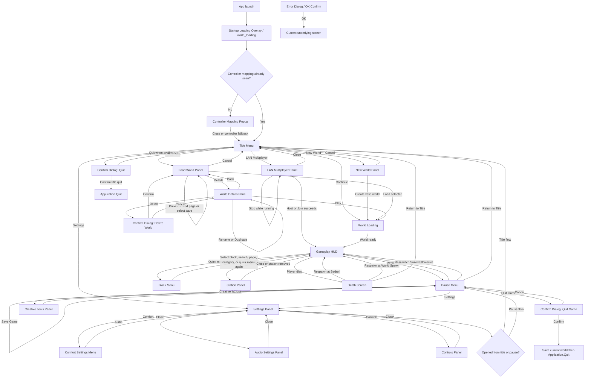

# Blockiverse-VR Current Menu Flow

Project directory: `/Users/ericslutz/Developer/Code/Blockiverse/Blockiverse-VR`

This report covers the implemented in-game menu surfaces in the current Unity project. It is based on the live Boot scene plus source review of `MenuActions`, `BlockiverseMenuController`, `BlockiverseWorldSessionController`, the generated UGUI menu bootstrapper files, and the concrete panel presenters. Unity MCP was connected to the current project and reported active scene `Assets/Blockiverse/Scenes/Boot.unity`; Unity Skills confirmed UGUI menu surfaces, no UITK files, one XR Origin, XR UI input, controller rays, and the Android URP graphics stack.

## High-Level Shape

- The current project uses explicit UGUI canvases/panels registered into `BlockiverseMenuController`.
- `MenuActions.cs` is the canonical route/action map for title, world creation/load/details, gameplay HUD, pause, settings, death, LAN, station, and confirmation screens.
- The startup overlay, controller mapping popup, world loading overlay, and gameplay HUD are first-class routed screens in this project.
- Survival inventory/crafting/shared-crate UI exists inside `Survival HUD` rather than as independent router destinations.
- `docs/rulesets/voxel_survival_menus.md` describes a broader long-term menu suite, but this file lists the implemented runtime surfaces present in Boot scene/source.

## Complete Flow Diagram

## Menu Inventory

| Menu | Purpose | Options/buttons and purpose |
| --- | --- | --- |
| Startup Loading Overlay | Full-screen startup/loading screen shown while the app boots or transitions into a world. | No user buttons. Shows Blockiverse title/art/status while the router disables normal menu input. |
| Controller Mapping Popup | First-run controller reference overlay before the title screen. | Close: marks/dismisses the mapping screen and proceeds to title. Controller fallback close: lets a controller ray over the close target dismiss it if direct button activation is not available. |
| Title Menu | Entry point for saved worlds, creation, LAN, settings, and quit when the platform allows it. | Continue: loads the most recent save and enters gameplay on success. New World: opens the New World panel. Load World: opens saved-world selection when saves exist. LAN Multiplayer: opens the LAN panel. Settings: opens the Settings hub. Quit: opens a confirmation modal and then quits when accepted. |
| New World Panel | Creates a new save/world from user-selected generation settings. | World Name input: display/save name. Seed input: deterministic generation seed. Game Mode previous/next: cycles Survival/Creative. Difficulty previous/next: cycles difficulty. World Size previous/next: cycles generated bounds. World Preset previous/next: cycles terrain/preset. Starting Biome previous/next: cycles starting biome. Texture Set previous/next: cycles texture set. Create World: starts generation, writes initial save, then enters gameplay. Cancel: returns to title. |
| World Loading | Transitional screen during world generation/load. | No direct buttons. It blocks normal input while `BlockiverseWorldSessionController` loads or generates the world. |
| Load World Panel | Selects an existing save, loads it, or opens details. | Save 1-6 row buttons: select a save on the visible page. Previous Page / Next Page: page through saves. Load: loads the selected save. Details: opens World Details for the selected save. Cancel: returns to title. |
| World Details Panel | Save metadata and management for the selected world. | Play: loads the save. Rename Field: edit display name. Rename: applies pending rename. Duplicate: creates a copy of the save. Delete: opens delete confirmation. Back: returns to Load World. |
| Confirm Dialog | Reusable modal for destructive or terminal actions. | Confirm/Accept: runs the pending action, such as delete or quit. Cancel: closes the modal and returns to the underlying screen. OK: single-button variant used for error/info dialogs. |
| LAN Multiplayer Panel | Starts/stops LAN host/client sessions and enters multiplayer gameplay on connection. | Address Input: target host address for join. Host: suspends active single-player if needed and starts hosting. Join: connects to the address. Stop: stops a running LAN session. Close: returns to the previous menu, normally title. |
| Settings Panel | Hub for user-facing configuration panels. | Comfort: opens locomotion/comfort settings. Audio: opens audio/feedback settings. Controls: opens controller reference/settings. Close: returns to the screen that opened Settings. |
| Comfort Settings Menu | VR locomotion and comfort configuration. | Teleport: enables teleport locomotion mode. Smooth Turn: enables continuous turning and disables snap-turn pairing as appropriate. Glide: enables glide locomotion behavior. Vignette: toggles comfort vignette. Turn Around: toggles quick turn-around behavior. Left Hand: toggles dominant-hand preference. Toggle To Mine: toggles mining interaction mode. Snap Turn slider: sets snap-turn degrees. Vignette slider: sets vignette strength. Move Speed slider: sets continuous move speed. Smooth Turn Speed slider: sets continuous turn speed. Eye Height slider: sets standing eye height. UI Scale slider: sets world-space UI scale. Height Reset: resets calibrated height. Close: returns to Settings. |
| Audio Settings Panel | Audio, haptics, and reduced-effect preferences. | Master Volume slider: global audio level. Effects Volume slider: SFX level. UI Volume slider: UI cue level. Weather Volume slider: weather loop level. Music Volume slider: music level. Haptic Strength slider: vibration intensity. Mute All: toggles global mute. Haptics: toggles haptics. Reduced Flash: lowers flash effects. Reduced Particles: lowers particle effects. Close: returns to Settings. |
| Controls Panel | Controller mapping/reference screen reachable from Settings. | Close: returns to Settings. The panel body describes controller-neutral controls. |
| Gameplay HUD | In-world survival surface while playing. | Health slider/status: shows vitals. Mining progress: shows current mining action. Inventory Slot 1-10: selects hotbar/page slots. Previous/Next Page: pages inventory slots. Crafting Recipe 1-5: selects/crafts visible recipes. Previous/Next Recipes: pages recipe list. Repair: runs repair flow when available. Shared Crate Slot 1-4: selects shared crate items. Deposit: deposits into shared crate. |
| Block Menu | Quick creative block browser shown only while Gameplay HUD is active and no modal is open. | Category: cycles block category. Search Field: filters blocks. Prev Page / Next Page: pages result grid. Entry Button 0-11: selects a visible block for creative hotbar/block placement. Quick menu button again: hides the menu. |
| Pause Menu | In-game pause/session menu. | Resume: closes pause and returns to gameplay. Save Game: saves current session and leaves the pause menu open with status. Switch Survival/Creative: toggles mode when allowed, refreshes menu, and returns to gameplay. Creative Tools: opens the live creative tools panel when creative mode is available. Settings: opens Settings. Return to Title: saves and returns to title. Quit Game: opens confirmation; accepting triggers save and `Application.Quit()` when quit is available. |
| Creative Tools Panel | Live creative/world-edit tool surface. | Set A / Set B: captures region corners from aim. Pick Block: picks aimed block. Fill: fills selected region. Replace: replaces selected blocks in region. Delete: deletes region. Copy: copies region. Paste: pastes copied region. Undo / Redo: traverses edit history. Spawn Tree / Spawn Ruin: places generated structures. Time Of Day slider: sets world time. Day Speed slider: sets time-cycle speed. Toggle Cycle: pauses/resumes time cycle. Cycle Weather: advances weather. Close: returns to Pause. |
| Station Panel | Timed-station interaction surface for smelting-style stations such as Clay Kiln and Bellows Forge. | Deposit Input: moves selected player input item into station. Deposit Fuel: moves fuel into station. Collect Output: transfers completed output. Withdraw Input: removes station input. Withdraw Fuel: removes station fuel. Close: returns to Gameplay HUD. |
| Death Screen | Blocks gameplay after death until respawn or title return. | Respawn at Bedroll: respawns at bedroll when available. Respawn at World Spawn: respawns at world spawn. Return to Title: respawns internally for save integrity, saves, and returns to title. |

## Folded Or Spec-Only Surfaces

| Surface | Current implementation status |
| --- | --- |
| Inventory Menu | Folded into `Survival HUD` inventory slot/page controls rather than routed as a separate screen. |
| Crafting Menu | Folded into `Survival HUD` recipe controls and station-specific panels rather than routed as a separate screen. |
| Container Menu | The shared crate controls are in `Survival HUD`; general container interactions are not a separate registered screen in the current router. |
| Campfire / Clay Kiln / Bellows Forge / Prep Board / Mend Bench | The current routed station UI is the generic `Station Panel`; it does not split each station into its own route. |
| Map / Wayflag, Item Details Popover, Recipe Pin Overlay | Present in the broader ruleset vocabulary, but not registered as implemented Boot-scene menu screens in the current router. |

## Contrast With Legacy Project

- Current has a more explicit app shell: startup loading, controller mapping, world loading, title, gameplay HUD, and death are router screens.
- Legacy has richer diagnostic/status/player-panel routing, including Avatar Status, Policy Status, Diagnostics, Network Command Status, and Survival Rejection surfaces.
- Current has more concrete world creation controls: world size, starting biome, texture set rows, and explicit create/cancel buttons.
- Legacy exposes many survival panels as world-space route panels; current folds inventory/crafting/crate into the HUD and keeps station as a focused interaction panel.
- Current's pause menu has explicit Return to Title and Quit Game options; legacy's pause menu has Main Menu but no app quit button.
