# Blockiverse VR Legacy Menu Flow

Project directory compared: `/Users/ericslutz/Developer/Code/Blockiverse VR`

This report covers the in-game menu surfaces in the legacy Unity project. It is based on source review of `BlockiverseWorldSpaceMenuRuntimeRouter`, `BlockiverseMenuPresenterModels`, `BlockiverseWorldDetailsModel`, `BlockiverseSettingsModel`, `BlockiverseNetworkStatusModels`, `BlockiverseWorldSpacePanelPresenter`, `BlockiverseSurvivalPanelPresenter`, `BlockiverseCreativePanelPresenter`, and `BlockiverseRuntimeBootstrap`.

## High-Level Shape

- The legacy project uses a generic `BlockiverseWorldSpacePanelModel` and `BlockiverseWorldSpacePanelPresenter` for most routed menus.
- Most routed panels support up to five action buttons plus optional text-input buttons.
- Survival, death, creative catalog, and farming action panels are specialized presenters/panels that sit beside the world-space router.
- The initial runtime binding shows `Main Menu` directly; there is no current-project equivalent of a routed startup loading overlay or first-run controller mapping screen in this legacy menu flow.

## Complete Flow Diagram

```mermaid
flowchart TD
    Launch["Runtime bootstrap"] --> Main["Main Menu"]

    Main -->|Continue latest save| WorldSession["World Session Panel"]
    Main -->|New World| NewWorld["New World Panel"]
    Main -->|Load| LoadWorld["Load World Panel"]
    Main -->|Settings| Settings["Settings Panel"]

    NewWorld -->|Create| WorldSession
    NewWorld -->|Settings| Settings
    NewWorld -->|Text field focus/apply| NewWorld

    LoadWorld -->|Load selected| WorldSession
    LoadWorld -->|Details| WorldDetails["World Details Panel"]
    LoadWorld -->|Previous / Next| LoadWorld

    WorldDetails -->|Load| WorldSession
    WorldDetails -->|Delete| ConfirmDelete["Confirm Dialog: Delete World"]
    WorldDetails -->|Close action| WorldDetailsNoOp["Close modeled as failed/no-op command"]
    ConfirmDelete -->|Delete| LoadWorld
    ConfirmDelete -->|Cancel| WorldDetails

    WorldSession -->|Details| WorldDetails
    WorldSession -->|Diagnostics| Diagnostics["Diagnostics Panel"]
    WorldSession -->|Mode| ModeSwitch["Mode Switch Panel"]
    WorldSession -->|LAN| Lan["LAN Multiplayer Panel"]
    WorldSession -->|Player| PlayerPrimary["Player Panels: Primary"]

    ModeSwitch -->|Switch| WorldSession
    ModeSwitch -->|Close| WorldSession

    PlayerPrimary -->|Inventory| Inventory["Inventory Panel"]
    PlayerPrimary -->|Vitals| Vitals["Vitals Panel"]
    PlayerPrimary -->|Craft| Crafting["Crafting Panel"]
    PlayerPrimary -->|Context| PlayerContext["Player Panels: Context"]
    PlayerPrimary -->|Status| PlayerStatus["Player Panels: Status"]

    PlayerContext -->|Container| Container["Container Panel"]
    PlayerContext -->|Farming| Farming["Farming Summary Panel"]
    PlayerContext -->|Station| Station["Station Panel"]
    PlayerContext -->|Creative| Creative["Creative Tools Panel"]
    PlayerContext -->|Back| PlayerPrimary

    PlayerStatus -->|Avatar| Avatar["Avatar Status Panel"]
    PlayerStatus -->|LAN| Lan
    PlayerStatus -->|Diagnostics| Diagnostics
    PlayerStatus -->|Policy| Policy["Meta Policy Status Panel"]
    PlayerStatus -->|Back| PlayerPrimary

    Inventory -->|Back / Craft / Vitals / Context / Status| PlayerPrimary
    Vitals -->|Back / Inventory / Craft / Context / Status| PlayerPrimary
    Crafting -->|Back / Inventory / Vitals / Context / Status| PlayerPrimary
    Container -->|Back / Inventory / Craft / Primary / Status| PlayerContext
    Farming -->|Back / Inventory / Craft / Primary / Status| PlayerContext
    Station -->|Back / Inventory / Craft / Primary / Status| PlayerContext

    Creative -->|Undo / Redo / hotbar/catalog actions| Creative
    Creative -->|Player panel routing| PlayerContext

    Lan -->|Host / Join / Stop| Lan
    Lan -->|Diagnostics| Diagnostics
    Lan -->|Avatar| Avatar
    Lan -->|Status| PlayerStatus
    Lan -->|Player/context routes| PlayerPrimary

    Diagnostics -->|Refresh| Diagnostics
    Diagnostics -->|LAN| Lan
    Diagnostics -->|Avatar| Avatar
    Diagnostics -->|Policy| Policy
    Diagnostics -->|Close| DiagnosticsReturn{"Return to captured source"}
    DiagnosticsReturn --> WorldSession
    DiagnosticsReturn --> PlayerPrimary
    DiagnosticsReturn --> Avatar
    DiagnosticsReturn --> Policy

    Avatar -->|Refresh| Avatar
    Avatar -->|Policy / Diagnostics / LAN / Player| PlayerStatus
    Avatar -->|Close| AvatarReturn{"Return to captured source"}
    Policy -->|Refresh| Policy
    Policy -->|Avatar / Diagnostics / LAN| PlayerStatus
    Policy -->|Close| AvatarReturn
    AvatarReturn --> Settings
    AvatarReturn --> WorldSession
    AvatarReturn --> PlayerPrimary
    AvatarReturn --> Diagnostics

    Settings -->|Texture| Settings
    Settings -->|Audio| Audio["Audio Settings Panel"]
    Settings -->|Comfort| Comfort["Comfort Settings Panel"]
    Settings -->|Controls| Controls["Controls Settings Panel"]
    Settings -->|Close| SettingsReturn{"Return to captured source"}
    Audio -->|Mute / SFX / Ambience / Music / Close| Settings
    Comfort -->|Vignette / Teleport / Snap / Move / Close| Settings
    Controls -->|Primary / Haptics / Toasts / Subtitles / Close| Settings
    SettingsReturn --> Main
    SettingsReturn --> WorldSession
    SettingsReturn --> NewWorld
    SettingsReturn --> WorldDetails

    WorldSession -->|Menu button in active world| Pause["Pause Menu"]
    Pause -->|Resume| WorldSession
    Pause -->|Save| WorldSession
    Pause -->|Load| LoadWorld
    Pause -->|Settings| Settings
    Pause -->|Main Menu| ConfirmQuit["Confirm Dialog: Main Menu"]
    ConfirmQuit -->|Main Menu| Main
    ConfirmQuit -->|Stay| Pause

    WorldSession -->|Survival death| Death["Survival Death Panel"]
    Death -->|Respawn at Bedroll| WorldSession
    Death -->|Respawn at World Spawn / Respawn| WorldSession

    WorldSession -->|Network command accepted/rejected| NetworkStatus["Network Command Status or Survival Rejection Panel"]
    NetworkStatus -->|Dismiss| WorldSession
    NetworkStatus -->|Retry| Lan
    NetworkStatus -->|Open hinted panel| Inventory
    NetworkStatus -->|Open hinted panel| Crafting
    NetworkStatus -->|Open hinted panel| Container
    NetworkStatus -->|Open hinted panel| Farming
    NetworkStatus -->|Open hinted panel| Station

    WorldSession -->|Farming target/action| FarmingAction["Farming Action Popup"]
    FarmingAction -->|Till / Plant / Harvest| WorldSession
    FarmingAction -->|Close| WorldSession
```

## Menu Inventory

| Menu | Purpose | Options/buttons and purpose |
| --- | --- | --- |
| Main Menu | Entry point for the legacy world-space runtime. | Continue: loads the latest save if one exists. New World: opens world creation. Load: opens saved-world browser when saves exist. Settings: opens settings. |
| New World Panel | Creates a saved world from text inputs and current settings. | Save ID field: stable save identifier. World Name field: display name. Seed field: numeric world seed. Create: validates and creates the world. Settings: opens Settings so texture/comfort can be changed before creation. |
| Load World Panel | Selects among saves and loads or inspects one. | Load: loads the selected save. Details: opens World Details. Previous: selects previous save. Next: selects next save. |
| World Details Panel | Save inspection and destructive save management. | Load: loads the displayed save. Delete: opens Delete World confirmation. Close: present in the panel model, but the router models it as a failed/no-op command rather than a clean back route. |
| Confirm Dialog | Generic two-button confirmation. | Confirm label varies by caller, such as Delete or Main Menu. Cancel/Stay: dismisses and returns to the captured source screen. |
| World Session Panel | Active-world hub after create/load/resume. | Details: opens World Details for active save. Diagnostics: opens Diagnostics. Mode: opens Mode Switch. LAN: opens LAN Multiplayer. Player: opens Player Panels. |
| Pause Menu | Active-world pause/session panel. | Resume: returns to active world. Save: saves active world. Load: opens Load World. Settings: opens Settings. Main Menu: asks for confirmation, then returns to Main Menu. |
| Mode Switch Panel | Switches active world between survival/creative modes. | Switch: commits mode switch with preserve/clear inventory state. Close: returns to World Session. |
| Settings Panel | Settings hub and texture selector. | Texture: cycles texture set. Audio: opens audio panel. Comfort: opens comfort panel. Controls: opens controls panel. Close: returns to captured source screen. |
| Audio Settings Panel | Audio volume quick controls. | Mute: toggles master volume between zero and one. SFX: cycles SFX volume. Ambience: cycles ambience volume. Music: cycles music volume. Close: returns to Settings. |
| Comfort Settings Panel | Movement and comfort quick controls. | Vignette: toggles comfort vignette. Teleport: toggles teleport locomotion. Snap: toggles snap turn. Move: toggles smooth movement. Close: returns to Settings. |
| Controls Settings Panel | Controller-neutral preference surface. | Primary: cycles Automatic/Left/Right primary controller. Haptics: toggles haptics. Toasts: toggles feedback toasts. Subtitles: toggles subtitles. Close: returns to Settings. |
| LAN Multiplayer Panel | Host/client LAN session control with editable endpoint fields. | Host Address field: target host for client join. Listen Address field: local listen bind for host. Port field: LAN port. Player ID field: local player identifier. Host: starts LAN host. Join: joins LAN host. Stop: stops running session. Diagnostics: opens Diagnostics. Avatar: opens Avatar Status. Status: opens Player Status Panels. |
| Diagnostics Panel | Runtime diagnostics for trace, scene-backed sessions, policy, and performance evidence. | Refresh: rebuilds diagnostic body. Close: returns to captured source. LAN: opens LAN. Avatar: opens Avatar Status. Policy: opens Meta Policy Status. |
| Player Panels: Primary | Hub for player-facing gameplay panels. | Inventory: opens Inventory Panel. Vitals: opens Vitals Panel. Craft: opens Crafting Panel. Context: opens context hub. Status: opens status hub. |
| Player Panels: Context | Hub for contextual world/survival panels. | Container: opens Container Panel. Farming: opens Farming Summary Panel. Station: opens Station Panel. Creative: opens Creative Tools. Back: returns to Player Panels primary. |
| Player Panels: Status | Hub for status/network/platform surfaces. | Avatar: opens Avatar Status. LAN: opens LAN Multiplayer. Diagnostics: opens Diagnostics. Back: returns to Player Panels primary. Policy: opens Meta Policy Status. |
| Inventory Panel | Summarizes active player inventory and links to related player panels. | Back: returns to Player Panels primary. Craft: opens Crafting. Vitals: opens Vitals. Context: opens context hub. Status: opens status hub. |
| Vitals Panel | Shows health, hunger, thirst, and stamina. | Back: returns to Player Panels primary. Inventory: opens Inventory. Craft: opens Crafting. Context: opens context hub. Status: opens status hub. |
| Crafting Panel | Summarizes recipes and craftability for active inventory/station context. | Back: returns to Player Panels primary. Inventory: opens Inventory. Vitals: opens Vitals. Context: opens context hub. Status: opens status hub. Crafting recipe rows are summarized by the presenter, but this world-space route does not expose per-recipe button rows. |
| Container Panel | Summarizes first available container and transfer affordances. | Back: returns to context hub. Inventory: opens Inventory. Craft: opens Crafting. Primary: opens player primary hub. Status: opens status hub. |
| Farming Summary Panel | Summarizes saved crops, ready crops, wild plants, and selected crop state. | Back: returns to context hub. Inventory: opens Inventory. Craft: opens Crafting. Primary: opens player primary hub. Status: opens status hub. |
| Station Panel | Summarizes station count, active recipe, station slots, and transfer hints. | Back: returns to context hub. Inventory: opens Inventory. Craft: opens Crafting. Primary: opens player primary hub. Status: opens status hub. |
| Creative Tools Panel | Dedicated creative catalog/hotbar/preview presenter. | Hotbar selection: chooses hotbar slot. Catalog assignment: assigns a catalog block to the selected slot. Undo: undoes latest creative edit when available. Redo: reapplies undone edit when available. Preview: shows aimed placement validity; it is display-only. |
| Avatar Status Panel | Shows avatar session, policy, fallback, remote roster, and stream status. | Refresh: rebuilds avatar status. Close: returns to captured source. Diagnostics: opens Diagnostics. LAN: opens LAN. Player: opens Player Panels. |
| Meta Policy Status Panel | Shows social/avatar policy decisions. | Refresh: rebuilds policy status. Close: returns to captured source. Avatar: opens Avatar Status. Diagnostics: opens Diagnostics. LAN: opens LAN. |
| Network Command Status Panel | Non-blocking status after accepted/duplicate/rejected network commands. | Dismiss: returns to LAN or active world depending context. |
| Survival Rejection Panel | Blocking panel for rejected survival/network commands. | Retry: returns to LAN/session command path when retryable. Dismiss: returns to active world/session. Open: opens the hinted panel, such as Inventory, Crafting, Container, Farming, Station, Survival HUD, or LAN. |
| Farming Action Popup | Context popup for direct farming interactions. | Till: tills target soil when suggested. Plant: plants selected seed when suggested. Harvest: harvests ready crop when suggested. Close: dismisses without action. |
| Survival Death Panel | Specialized survival panel shown when vitals are dead. | Respawn at Bedroll: respawns at bedroll if available. Respawn or Respawn at World Spawn: respawns at world spawn if available. |

## Contrast With Current Project

- Legacy centralizes most screens in one reusable world-space panel model; current has many explicit UGUI panel components and concrete screen presenters.
- Legacy includes diagnostics, avatar status, policy status, player-panel hubs, network command status, and survival rejection panels as menu surfaces; current does not register those as menu screens.
- Current includes startup loading, controller mapping, and world loading routed screens; legacy starts directly at Main Menu and uses active-world/session panels after load.
- Legacy exposes Inventory, Vitals, Crafting, Container, Farming, and Station as routed player/context panels. Current folds most survival UI into `Survival HUD` and keeps only `Station Panel` as a routed contextual panel.
- Current has richer New World controls (game mode, difficulty, size, preset, biome, texture set, seed/name), while legacy New World exposes Save ID, World Name, Seed, and a Settings shortcut.
