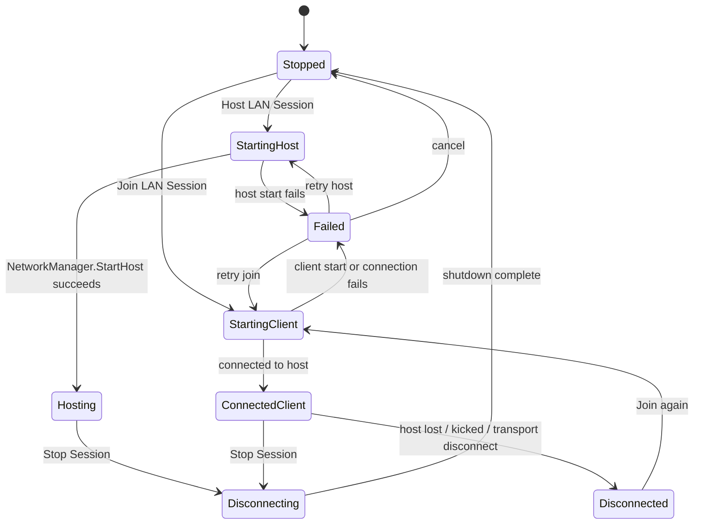

# Voxel Multiplayer and Networking Ruleset

**Document status:** Proposed implementation ruleset
**Project:** Blockiverse VR
**Primary target:** Meta Quest 3 / Quest 3S
**Engine/runtime target:** Unity 6, C#, URP, OpenXR, Meta XR SDK, Netcode for GameObjects, Unity Transport
**Primary multiplayer scope:** Local LAN co-op first; cloud-hosted persistent private worlds later

This document defines the multiplayer/networking rules for the canonical Blockiverse VR world. The runtime should reuse proven Unity/C# patterns such as host-authoritative mutation validation, compact custom messages, and Meta avatar integration while replacing temporary world data with the registries and schemas defined in the ruleset documents.

---

## 1. Design goals

| Goal | Rule |
|---|---|
| VR comfort first | Local head/controller tracking and locomotion must remain responsive and should not wait on network round trips. |
| Host-authoritative world | The host owns world generation, block mutation validation, authoritative world state, survival command validation, and multiplayer save state. |
| LAN-first release | The first shippable multiplayer mode is LAN host/client co-op. No public matchmaking or cloud persistence is required for the initial release. |
| Two-player first | The implementation target is host + one client. Protocols should not hard-code assumptions that prevent later 3–4 player testing. |
| Command-based gameplay | Clients send intent commands. The host validates commands and broadcasts accepted authoritative state changes. |
| Comfort-preserving prediction | Clients may locally predict their own actions for responsiveness while the host remains authoritative. |
| Deterministic correction | Rejected or stale client commands must produce explicit rejection/correction messages and client reconciliation. |
| Bounded world first | Multiplayer sync assumes fixed-size worlds. Infinite streaming terrain is out of scope for the first multiplayer version. |
| Meta identity for players | Local and remote players should use Meta Horizon avatars when available, with a simple fallback proxy for development or unavailable avatar data. |
| No in-app voice in initial release | Voice communication is handled by Meta Quest party chat, not by Blockiverse-owned voice capture or transmission. |

---

## 2. Networking stack

| Layer | Rule |
|---|---|
| Unity networking | Use Netcode for GameObjects for session lifecycle, NetworkObjects, NetworkVariables, RPCs, and custom messages. |
| Transport | Use Unity Transport for LAN host/client transport. |
| Session prefab | A single network session object should own `NetworkManager`, `UnityTransport`, and the Blockiverse session wrapper. |
| Gameplay sync | Use custom named messages for high-frequency or compact gameplay commands where explicit payload control is useful. |
| Avatar fallback sync | Use owner-written `NetworkVariable` pose data for fallback proxy avatars. |
| Meta avatar stream | Use owner-to-server-to-client avatar stream relay when Meta Horizon avatar data is available. |
| Voice | Do not create an in-app microphone transport for the initial LAN release. Use platform party chat outside the game protocol. |

### Default LAN config

```txt
Default join address: 127.0.0.1
Default listen address: 0.0.0.0
Default port: 7777
Initial max players: 2
Recommended protocol headroom: 4 players
```

### Session modes

```ts
enum NetworkSessionMode {
  Offline = 0,
  Host = 1,
  Client = 2
}
```

### Session states

```ts
enum BlockiverseConnectionState {
  Stopped = 0,
  StartingHost = 1,
  Hosting = 2,
  StartingClient = 3,
  ConnectedClient = 4,
  Disconnecting = 5,
  Disconnected = 6,
  Failed = 7
}
```

---

## 3. Session flow



### Host start rules

```ts
function StartLanHost(): bool {
  if networkManager.IsListening || networkManager.ShutdownInProgress:
    return false

  if !RunHostStartPreparation():
    state = Failed
    return false

  state = StartingHost
  transport.SetConnectionData(config.address, config.port, config.listenAddress)
  return networkManager.StartHost()
}
```

Host-start preparation must run before `StartHost`. It may load a saved host world, initialize the default world, validate registry compatibility, or reject host start if authoritative save state cannot be restored.

### Client start rules

```ts
function StartLanClient(address): bool {
  if networkManager.IsListening || networkManager.ShutdownInProgress:
    return false

  state = StartingClient
  target = IsNullOrWhitespace(address) ? DefaultAddress : Trim(address)
  transport.SetConnectionData(target, config.port)
  return networkManager.StartClient()
}
```

### Stop rules

| Current Mode | Stop Action |
|---|---|
| Offline | Set state to `Stopped`; no network action. |
| Host | Run host-shutdown preparation, save world if allowed, then call `NetworkManager.Shutdown()`. |
| Client | Call `NetworkManager.Shutdown()` and discard pending commands. |
| Shutdown preparation fails | Leave session in `Hosting` and show the failure reason. |
| Transport failure | Set state to `Failed` with disconnect reason. |
| Host lost by client | Set client state to `Disconnected`; show reconnect UI. |

---

## 4. Authority model

### Authority roles

```ts
enum ChunkAuthorityRole {
  Host,
  Client
}
```

| Capability | Host | Client |
|---|---:|---:|
| Generate authoritative world | Yes | No |
| Validate block mutations | Yes | No |
| Commit authoritative mutations | Yes | No |
| Broadcast chunk deltas | Yes | No |
| Serve late-join snapshots | Yes | No |
| Save multiplayer world | Yes | No |
| Request block mutations | Yes, local direct path | Yes, request host |
| Update local HMD/controller pose | Yes | Yes |
| Publish fallback avatar pose | Owner only | Owner only |
| Play local audio/VFX | Yes | Yes |

### Single-player rule

Single-player should use the same validation path as the host path:

```ts
singlePlayerBoundary = ChunkAuthorityBoundary.ForHost(localClientId: 0)
```

This prevents single-player logic from diverging from multiplayer host validation.

---

## 5. Connection handshake

The first production-ready multiplayer handshake should include this data before gameplay commands are accepted:

```json
{
  "protocolVersion": 1,
  "gameVersion": "0.0.0-dev",
  "rulesetVersion": "voxel-networking-1",
  "worldSaveSchemaVersion": 1,
  "blockRegistryHash": "sha256:<hash>",
  "itemRegistryHash": "sha256:<hash>",
  "recipeRegistryHash": "sha256:<hash>",
  "maxPlayers": 2,
  "sessionMode": "lan_host_authoritative",
  "voiceMode": "meta_quest_party_chat_external"
}
```

### Handshake validation

| Condition | Result |
|---|---|
| Protocol version mismatch | Reject join with `ProtocolMismatch`. |
| Block registry mismatch | Reject join with `BlockRegistryMismatch`. |
| Item/recipe registry mismatch | Reject survival commands until compatible; preferably reject join before gameplay starts. |
| World save schema too new | Reject join with `UnsupportedWorldVersion`. |
| Session full | Reject join with `SessionFull`. |
| Host not ready | Client waits for snapshot; mutation/survival commands are rejected locally as `AwaitingHostWorldSnapshot`. |

A LAN-only implementation may start with a compact handshake, but the save/versioning schema should reserve the full compatibility fields now.

---

## 6. World synchronization

### Authoritative world initialization

```ts
function PrepareHostWorldBeforeStart(): bool {
  if savedMultiplayerWorldExists:
    load save
    validate saved metadata equals initialized world metadata
    apply saved changes
  else:
    initialize default world

  return world != null
}
```

### Host world metadata

The host snapshot header must include:

```json
{
  "generationPreset": "survival_lite | flat_creative",
  "width": 128,
  "height": 64,
  "depth": 128,
  "chunkSize": 16,
  "seed": 6401,
  "groundHeight": 32,
  "lastChunkDeltaSequence": 0,
  "changedBlockCount": 0
}
```

Canonical world presets:

| Preset | Width | Height | Depth | Chunk Size | Seed | Ground Height | Purpose |
|---|---:|---:|---:|---:|---:|---:|---|
| `flat_creative` | 32 | 16 | 32 | 16 | 1001 | 2 | Small editor/dev validation world. |
| `survival_lite` | 128 | 64 | 128 | 16 | 6401 | 32 | Default creative validation and survival-lite world. |

### Late-join snapshot

When a client connects after the host already has changed blocks:

1. Host sends the world snapshot header.
2. Host sends all changed block positions and their authoritative block IDs.
3. Client initializes/generated local world from the header.
4. Client applies changed blocks with `trackChange = false`.
5. Client records the host's latest chunk delta sequence.
6. Client applies any buffered chunk deltas newer than the snapshot sequence.
7. Client marks `HasHostGenerationSnapshotForSession = true`.

---

## 7. Block mutation protocol

### Message names

| Message | Direction | Reliability | Purpose |
|---|---|---|---|
| `Blockiverse.ChunkAuthority.MutationRequest` | Client → Host | Reliable sequenced | Request a block edit. |
| `Blockiverse.ChunkAuthority.MutationDelta` | Host → Clients | Reliable sequenced | Broadcast accepted authoritative edit. |
| `Blockiverse.ChunkAuthority.ChunkSnapshot` | Host → Client | Reliable sequenced | Send changed blocks to late joiner. |
| `Blockiverse.ChunkAuthority.MutationResult` | Host → Client | Reliable sequenced | Report rejection or correction. |

### Mutation request payload

```json
{
  "requestId": 1,
  "position": { "x": 42, "y": 31, "z": 77 },
  "newBlockId": 0,
  "hasExpectedCurrentBlock": true,
  "expectedCurrentBlockId": 3
}
```

The sender client ID comes from the transport/network layer, not from trusted client payload.

### Mutation request rules

```ts
function SubmitMutation(position, newBlock): MutationResult {
  if isClientOnly:
    if !hasHostSnapshot:
      return Reject(AwaitingHostWorldSnapshot)

    requestId = AllocateRequestId()
    expected = world.Bounds.Contains(position) ? world.GetBlock(position) : None
    send MutationRequest(requestId, position, newBlock, expected)
    return Pending(requestId)

  return hostAuthority.TryCommit(request)
}
```

### Host validation rules

| Rule | Rejection Reason |
|---|---|
| Client tries to commit directly | `ClientCannotCommitAuthoritativeState` |
| Position outside world bounds | `PositionOutOfBounds` |
| Requested block ID is not registered | `UnknownBlock` |
| Expected current block does not match host state | `ExpectedBlockMismatch` |
| Requested new block equals current block | `NoChange` |
| Block editing disabled | `BlockEditingDisabled` |
| Client runs host-only validation locally | `HostOnlyAuthorityOperation` |

### Accepted mutation delta payload

```json
{
  "requestingClientId": 1,
  "requestId": 12,
  "sequenceId": 55,
  "chunk": { "x": 2, "y": 1, "z": 4 },
  "change": {
    "position": { "x": 42, "y": 31, "z": 77 },
    "previousBlockId": 3,
    "newBlockId": 0
  }
}
```

### Client delta application

```ts
function ApplyDelta(delta): DeltaApplyState {
  if delta.sequenceId == lastAppliedSequence + 1:
    world.SetBlock(delta.position, delta.newBlock, trackChange: false)
    lastAppliedSequence = delta.sequenceId
    completePendingRequestIfOwned(delta.requestingClientId, delta.requestId)
    return Applied

  if delta.sequenceId <= lastAppliedSequence:
    return IgnoredStale

  buffer(delta)
  return WaitingForEarlierDelta
}
```

### Rejection/correction payload

```json
{
  "requestId": 12,
  "position": { "x": 42, "y": 31, "z": 77 },
  "rejectionReason": "ExpectedBlockMismatch",
  "hasAuthoritativeBlock": true,
  "authoritativeBlockId": 8
}
```

On rejection, the client must:

1. Clear the matching pending request.
2. Apply the authoritative block if provided.
3. Show a non-blocking UI/audio failure cue only if the action was locally initiated.
4. Avoid replaying the failed command automatically.

---

## 7.5 Client Prediction and Reconciliation

### Goals

Prediction exists to improve VR comfort and responsiveness while preserving host authority.

The host remains authoritative for:

- Block state
- Chunk state
- Inventory state
- Survival progression
- Shared containers
- Multiplayer save data

Clients may predict:

- Local block placement previews
- Local block removal previews
- Controller interactions
- Hand interactions
- Audio feedback
- Visual feedback

Clients must not predict authoritative gameplay state for inventory, crafting, shared containers, progression, or persistence.

### Prediction flow

1. Client performs local validation.
2. Client creates a predicted local result.
3. Client sends mutation request to host.
4. Host validates request.
5. Host broadcasts authoritative mutation delta or rejection result.
6. Client reconciles prediction against authoritative result.

### Prediction limits

| Rule | Value |
|---|---:|
| Maximum pending predicted edits | 16 |
| Prediction warning timeout | 500 ms |
| Prediction rollback timeout | 1500 ms |
| Prediction before snapshot received | Not allowed |
| Prediction for inventory commands | Not allowed |
| Prediction for shared crate commands | Not allowed |
| Prediction for crafting commands | Not allowed |
| Prediction for batch/fill/world-edit tools | Not allowed |

### Predicted block state rules

Predicted edits must use dedicated prediction state instead of directly mutating authoritative chunk data.

A predicted block edit must track:

```json
{
  "requestId": 12,
  "position": { "x": 42, "y": 31, "z": 77 },
  "expectedCurrentBlockId": 3,
  "predictedNewBlockId": 0,
  "createdAtMs": 123456,
  "state": "PendingHostResult"
}
```

Predicted edits:

- exist only in local client state
- are never saved
- are never transmitted as authoritative state
- must be replaced by the authoritative host delta
- must be rolled back if rejected
- must be cleared on disconnect, reconnect, or snapshot reload

### Accepted prediction reconciliation

If the authoritative delta matches the prediction:

1. Convert prediction to committed state.
2. Clear pending request.
3. Remove prediction markers.

If the authoritative delta differs from the prediction:

1. Apply the authoritative delta.
2. Clear pending request.
3. Remove prediction markers.
4. Show correction feedback only if the visual difference is player-noticeable.

### Rejected prediction reconciliation

If the authoritative result rejects the request:

1. Remove predicted state.
2. Apply authoritative correction if provided.
3. Clear pending request.
4. Show subtle local failure feedback.
5. Do not automatically replay the failed command.

### Timeout handling

If a prediction exceeds the warning timeout:

1. Keep the predicted state visible.
2. Mark the request as delayed.
3. Avoid sending duplicate mutation requests unless explicitly retried by protocol logic.

If a prediction exceeds the rollback timeout:

1. Remove the predicted state.
2. Clear the pending request.
3. Request a chunk or world resync if repeated timeouts occur.
4. Show subtle degraded-connection feedback.

### Missing sequence recovery

If a sequence gap is detected:

1. Buffer newer deltas.
2. Request missing deltas or a chunk resync.
3. Apply buffered deltas once gaps are resolved.
4. Request a broader world resync if recovery fails.

### Prediction implementation rule

Prediction is a presentation and responsiveness layer. It must not weaken host validation, save ownership, inventory authority, registry compatibility checks, or survival command authority.

## 8. Creative editing rules in multiplayer

| Action | Host | Client |
|---|---|---|
| Place selected block | Validate and commit directly. | Send mutation request to host. |
| Break block | Validate and commit directly. | Send mutation request with `newBlockId = Air`. |
| Undo | Host-only unless undo is converted into a normal mutation request. | Disabled or request-based only; must never directly rewrite authoritative state. |
| Toggle block editing | Local setting; suppresses local edit requests. | Local setting; suppresses local edit requests. |
| World edit/fill/replace | Host-only by default. | Disabled unless promoted to explicit host-validated batch command. |
| Creative catalog selection | Local UI state only. | Local UI state only. |

### Placement validation

Client and host may both run local preview validation for responsiveness, but the host is final authority.

```ts
canPlacePreview =
  blockEditingEnabled &&
  world.Bounds.Contains(position) &&
  world.GetBlock(position) == Air &&
  !IntersectsPlayerBounds(position)
```

A client preview result is not authoritative and must not create a real block until the host delta arrives.

Clients may create temporary predicted edits for responsiveness.

Predicted edits:

- exist only in local client state
- are never saved
- are never transmitted as authoritative state
- must be replaced by the authoritative host delta
- must be rolled back if rejected

Predicted edits should use dedicated prediction state rather than modifying authoritative chunk data directly.

---

## 9. Survival command protocol

Survival commands use host-authoritative validation just like block edits.

### Message names

| Message | Direction | Purpose |
|---|---|---|
| `Blockiverse.Survival.HarvestRequest` | Client → Host | Request harvest of a block with equipped item. |
| `Blockiverse.Survival.CraftRequest` | Client → Host | Request recipe craft with an available station. |
| `Blockiverse.Survival.CrateTransferRequest` | Client → Host | Request shared crate deposit/withdraw. |
| `Blockiverse.Survival.CommandResult` | Host → Client | Accepted/rejected survival command result. |
| `Blockiverse.Survival.InventorySnapshot` | Host → Client | Full per-player inventory state. |
| `Blockiverse.Survival.SharedCrateSnapshot` | Host → Client(s) | Full shared crate state. |

### Survival command kinds

```ts
enum SurvivalCommandKind {
  None,
  HarvestResource,
  CraftRecipe,
  SharedCrateDeposit,
  SharedCrateWithdraw
}
```

### General command rules

| Rule | Description |
|---|---|
| Request ID | Each client allocates nonzero sequential `uint` request IDs. |
| Duplicate handling | Host tracks processed request IDs per client and rejects/resends snapshots for duplicates. |
| Per-player inventory | Host stores one authoritative inventory per connected client ID. |
| Shared crate | Host owns shared crate inventory; canonical slot count comes from container rules. |
| Client snapshots | Clients replace local inventory/crate views from host snapshots. |
| Command result | Clients clear pending request when matching result is received. |

### Harvest processing

```ts
function ProcessHostHarvest(clientId, requestId, position, equippedItem): SurvivalCommandResult {
  if duplicate(clientId, requestId):
    resendSnapshots()
    return Duplicate

  inventory = GetInventory(clientId)
  harvest = HarvestService.TryPreviewHarvest(world, inventory, position, equippedItem)
  if !harvest.Succeeded:
    return Reject(HarvestRejected, harvest.failureReason)

  mutation = ChunkAuthority.TrySubmitMutation(
    requestingClientId: clientId,
    position: position,
    newBlock: Air,
    expectedCurrentBlock: harvest.blockId)

  if !mutation.Accepted:
    return Reject(MutationRejected)

  inventory.TryAddAll(harvest.drop)
  SendInventorySnapshot(clientId)
  return Accept(HarvestResource, harvest.drop)
}
```

### Craft processing

```ts
function ProcessHostCraft(clientId, requestId, outputItemId, station): SurvivalCommandResult {
  if !recipeBook.TryGetByOutput(outputItemId):
    return Reject(MissingRecipe)

  result = CraftingService.TryCraft(GetInventory(clientId), recipe, station)
  if !result.Succeeded:
    return Reject(CraftingRejected, result.failureReason)

  SendInventorySnapshot(clientId)
  return Accept(CraftRecipe, recipe.output)
}
```

### Shared crate processing

```ts
function ProcessCrateTransfer(clientId, itemId, count, direction): SurvivalCommandResult {
  if itemId == None || count <= 0:
    return Reject(InvalidTransfer)

  player = GetInventory(clientId)
  crate = SharedCrateInventory

  if direction == Deposit:
    require player.CountOf(itemId) >= count
    require crate.AvailableCapacity(itemId) >= count
    player.Remove(itemId, count)
    crate.TryAddAll(itemId, count)

  if direction == Withdraw:
    require crate.CountOf(itemId) >= count
    require player.AvailableCapacity(itemId) >= count
    crate.Remove(itemId, count)
    player.TryAddAll(itemId, count)

  SendInventorySnapshot(clientId)
  BroadcastSharedCrateSnapshot()
  return Accept(direction)
}
```

---

## 10. Player representation and avatar sync

### Player representation rules

| Player Type | Representation |
|---|---|
| Local player | Meta Horizon avatar in first-person when available. |
| Remote player | Meta Horizon avatar in third-person when available. |
| Avatar unavailable | Use Blockiverse fallback proxy avatar. |
| NPC/mob | Original Blockiverse voxel character; never Meta Horizon avatar. |

### Fallback proxy pose sync

| Field | Rule |
|---|---|
| Authority | Owner writes pose; everyone reads. |
| Send rate | 30 Hz target. |
| Pose fields | Root position/rotation, head local pose, left hand local pose, right hand local pose. |
| Source | HMD/camera, left controller, right controller. |
| Remote smoothing | Interpolate remote pose over `50–100 ms`; do not delay local owner tracking. |

### Meta avatar stream sync

| Field | Rule |
|---|---|
| Stream source | Owner records local first-person avatar stream. |
| Send rate | 15 Hz target. |
| Relay | Owner sends to server; server relays to remote clients. |
| Owner display | Hide fallback proxy when Meta avatar is ready. |
| Failure mode | Continue showing fallback proxy when avatar stream is unavailable. |

### Gameplay authority separation

Avatar pose and visual streams are presentation data only. They must not authorize block edits, inventory state, collision, or damage.

---

## 11. Movement and interaction sync

| System | Networking Rule |
|---|---|
| Head tracking | Local only for immediate rendering; replicated only as avatar pose. |
| Controller tracking | Local only for immediate interaction; replicated only as avatar pose. |
| Continuous movement | Local client simulation for comfort; no server correction for cooperative building unless later gameplay requires it. |
| Snap/continuous turn | Local comfort setting; no gameplay authority. |
| Teleport movement | Local locomotion provider; remote players see pose update. |
| Block ray interaction | Local ray can preview; only host delta commits world state. |
| UI interaction | Local only; no network sync except resulting gameplay command. |
| Block editing disabled | Local safety switch; prevents sending edit requests. |

For cooperative LAN building, players are trusted for their own position because there is no competitive scoring. When combat, hazards, or progression enforcement are added, player position should become server-validated or at least host-audited.

---

## 12. Multiplayer persistence

### Host-only save ownership

```ts
canSaveMultiplayerWorld = currentBoundary.Role == Host
```

| Action | Rule |
|---|---|
| Host start | Load saved multiplayer world before opening the LAN session. |
| Host shutdown | Save world before disconnecting clients. |
| Client shutdown | Do not save authoritative world. |
| Client disconnect | Clear pending requests and keep only local settings. |
| Save mismatch | Refuse to host if saved world metadata does not match initialized world metadata. |

### Default multiplayer save path

```txt
Application.persistentDataPath/Saves/multiplayer-world.json
```

### Required save metadata match

A multiplayer save may be restored only when these fields match the initialized host world:

```txt
width
height
depth
chunkSize
seed
```

Recommended future additions:

```txt
generationPreset
rulesetVersion
blockRegistryHash
itemRegistryHash
recipeRegistryHash
worldSaveSchemaVersion
```

---

## 13. Voice and social features

| Feature | Initial LAN Rule |
|---|---|
| Voice chat | Use Meta Quest party chat. |
| In-app microphone capture | Not implemented. |
| In-app voice moderation | Not implemented because the app does not transmit voice. |
| Player invites | Use platform-level flow later; LAN join by IP for the initial LAN release. |
| Player identity | Use Meta account/platform identity only when needed for avatars/platform features. |
| Privacy | LAN devices exchange IP addresses and gameplay state only to maintain the active session. |

If Blockiverse later adds in-app voice, this document must be updated before implementation. Required additions would include microphone permission flow, mute/block UI, moderation/reporting rules, voice privacy disclosures, parental controls, platform policy review, and packet-level voice transport rules.

---

## 14. Bandwidth and rate limits

### Current application-payload estimates

| Message | Current Writer Capacity |
|---|---:|
| Client mutation request | 128 bytes |
| Host mutation delta broadcast | 160 bytes |
| Host rejection/result response | 128 bytes |
| Late-join snapshot | 80 byte header + 32 bytes per changed block |

For a two-player accepted client edit:

```txt
client -> host request:       ~128 bytes
host -> remote delta:         ~160 bytes
approximate total payload:    ~288 bytes
```

| Accepted Client Edits | Approximate Payload |
|---:|---:|
| 10 edits/sec | 2.88 KB/s |
| 20 edits/sec | 5.76 KB/s |

These estimates exclude Netcode headers, Unity Transport headers, retransmits, connection management, avatar updates, and external Quest party-chat traffic.

### Recommended edit-rate limits

| Source | Limit |
|---|---:|
| Manual block edits | 20 accepted edits/sec/client hard cap |
| Held-trigger repeat edits | 10 accepted edits/sec/client default |
| Batch world edit | Host-only; max 512 blocks per command for the initial LAN release |
| Late-join snapshot | Warn or compact if changed blocks exceed 10,000 |
| Pending commands | Max 64 pending per client, then reject new commands until responses arrive |

### Reliability choices

| Data Type | Recommended Delivery |
|---|---|
| Block mutation requests | Reliable sequenced |
| Block mutation deltas | Reliable sequenced |
| Snapshot data | Reliable fragmented/sequenced if available; otherwise chunk payloads manually |
| Survival commands | Reliable sequenced |
| Inventory snapshots | Reliable sequenced |
| Fallback avatar pose | NetworkVariable/unreliable-friendly owner updates acceptable |
| Meta avatar stream | Unreliable or sequenced stream acceptable when SDK supports it; tolerate dropped frames |

---

## 15. Error handling and reconnect

### Host disconnect behavior

Initial LAN implementation:

When a client loses the host:

1. Set state to `Disconnected`.
2. Clear pending mutation and survival command request dictionaries.
3. Clear all predicted edit state.
4. Keep the last entered join address.
5. Show reconnect/session-ended UI.
6. Prevent further gameplay commands.
7. Preserve local client settings only.

The initial LAN implementation does not support host migration.

### Future host migration support

Host migration is a future enhancement and is not required for the first multiplayer milestone.

Goals:

- Allow a multiplayer session to continue after host departure.
- Preserve world state without disconnecting remaining players.
- Maintain host-authoritative gameplay.

Required capabilities:

- Periodic authoritative world checkpoints.
- Transferable save metadata.
- Host election or explicit host promotion.
- Ownership rebinding.
- Inventory ownership transfer.
- Pending request cleanup.
- Full world resynchronization after migration.

Migration rules:

- Correctness is preferred over seamlessness.
- A short gameplay pause is acceptable.
- In-flight commands may be discarded during migration.
- Remaining clients must not continue simulation until a new authoritative host is established.
- A promoted host must serve a fresh authoritative snapshot before gameplay resumes.
- Divergent client-local world state must be discarded in favor of the promoted host's authoritative checkpoint.

Recommended host selection order:

1. Explicitly designated backup host.
2. Lowest latency connected player.
3. Longest connected player.
4. Manual host selection.

Host migration should not be implemented until:

- LAN co-op is stable.
- Late join is stable.
- Reconnect is stable.
- Save/load is stable.
- Prediction/reconciliation is stable.

### Client reconnect behavior

```ts
function RejoinPreviousHost(): void {
  state = StartingClient
  clearPendingRequests()
  startClient(lastJoinAddress)
  waitForHostSnapshot()
}
```

The reconnecting client must be treated like a late joiner and receive a fresh authoritative snapshot.

### Host stop behavior

When the host intentionally stops:

1. Run host shutdown preparation.
2. Save authoritative world.
3. Shutdown NetworkManager.
4. Disconnect clients.
5. Clients show session-ended message.

### Failure status strings

| Failure | Player-Facing Message |
|---|---|
| Host unavailable | `Unable to reach LAN session. Check that the host is on the same LAN and try Join again.` |
| Host disconnected | `LAN session ended because the host disconnected. Use Join to reconnect when the LAN host is available again.` |
| Save failed on host shutdown | `Unable to stop LAN session because the multiplayer world could not be saved.` |
| Transport failure | `LAN session failed due to a transport error.` |
| Snapshot pending | `Waiting for host world state...` |

---

## 16. Security and cheat-resistance rules

LAN co-op is not a hostile competitive environment, but the host must still validate client input.

| Risk | Rule |
|---|---|
| Client sends out-of-bounds block edit | Reject and optionally rate-limit client. |
| Client sends unknown block ID | Reject. |
| Client sends stale expected block | Reject with authoritative correction. |
| Client sends impossible inventory transfer | Reject and send inventory snapshot. |
| Client sends duplicate request | Return duplicate result and snapshots; do not execute twice. |
| Client sends too many commands | Rate-limit and drop/reject excess. |
| Client registry mismatch | Reject join or disable gameplay commands. |
| Client modifies save locally | Ignored in multiplayer; host save is authoritative. |

Recommended additional host checks before public/cloud multiplayer:

```txt
max edit distance from player hand/head
line-of-sight check for block edits
role/permission check for creative edits
region protection check
cooldowns per command type
server-side inventory stack validation
signed or hashed registry manifest
```

---

## 17. Permissions and roles

### Initial LAN role model

| Role | Can Host | Can Join | Can Edit Blocks | Can Use Survival Commands | Can Save World | Can Stop Host Session |
|---|---:|---:|---:|---:|---:|---:|
| Host Player | Yes | — | Yes | Yes | Yes | Yes |
| LAN Client | No | Yes | Yes, host-validated | Yes, host-validated | No | Client disconnect only |

### Future role model

| Role | Permission Set |
|---|---|
| Owner | Full control, save, permissions, world settings. |
| Builder | Place/break blocks and use shared containers. |
| Survivor | Harvest, craft, use containers, limited block edits. |
| Visitor | Move, view, use non-mutating interactions. |

Creative world edit tools, structure placement, weather overrides, and registry-changing commands should be host/owner-only by default.

---

## 18. Cloud private worlds upgrade path

Cloud-hosted persistent private worlds are a later milestone. The current protocol should evolve without rewriting gameplay logic.

| Current LAN Host | Future Cloud Host |
|---|---|
| Player device owns authoritative world. | Dedicated cloud process owns authoritative world. |
| Join by LAN IP. | Join by invite/world ID. |
| Host saves to local persistent data. | Cloud saves to server storage. |
| Host stop ends session. | World spins down after idle timeout. |
| Quest party chat for voice. | Quest party chat may remain; in-app voice still optional. |

Required future additions:

```txt
world ownership records
invite/member list
cloud save snapshots
server authentication
session discovery
NAT traversal or relay if non-LAN
server process health checks
automatic spin-up/spin-down
moderation/reporting if public social features expand
```

---

## 19. Testing and validation

### EditMode tests

| Test Area | Required Assertions |
|---|---|
| Block mutation authority | Host accepts valid edits, rejects invalid/stale edits, clients cannot commit directly. |
| Chunk delta log | Sequence IDs are nonzero, increasing, replayable, and wrap safely. |
| Client prediction | Predicted edits are isolated from authoritative chunk state and clear correctly on accept, reject, timeout, disconnect, and resync. |
| Survival commands | Harvest/craft/crate commands are validated and do not duplicate on repeated request ID. |
| Inventory snapshots | Snapshot shape and contents round-trip. |
| Save metadata | Multiplayer save refuses mismatched dimensions/chunk size/seed. |
| Registry hash | Stable hash changes when registry definitions change. |

### PlayMode tests

| Test Area | Required Assertions |
|---|---|
| Host/client lifecycle | Host starts, client joins, both stop cleanly. |
| Client block edit | Client request is host-validated and converges on host/client. |
| Host block edit | Host edit broadcasts to connected clients. |
| Late join | Late join receives generated world + changed blocks. |
| Conflict | Competing edits converge to host-authoritative winner. |
| 100 ms simulated latency | Active block edit converges with no pending request left open. |
| Prediction reconciliation | Client prediction commits on matching delta, corrects on mismatched delta, and rolls back on rejection. |
| Simulated packet loss | Ordered deltas eventually converge or trigger resync. |
| Host disconnect | Client sees session-ended/reconnect UI. |
| Host shutdown save | Saved edits reload before next hosted session. |

### Quest-device validation

Before store candidate:

```txt
Quest 3 host + Quest 3S client LAN smoke test
Quest 3S host + Quest 3 client LAN smoke test
same-router Wi-Fi test
blocked/unavailable host test
host disconnect/reconnect test
OVR Metrics or equivalent frame pacing capture
bandwidth capture for active block editing
avatar fallback test without Meta avatar availability
Meta avatar test when platform account support is configured
Quest party chat coexistence test
```

---

## 20. Implementation checklist

```txt
NetworkManager prefab
UnityTransport config
BlockiverseNetworkSession wrapper
LAN Host/Join/Stop menu
Session state status text
Host start preparation hook
Host shutdown preparation hook
BlockMutationAuthority pure C# validation
Client mutation request sender
Host mutation request handler
Host chunk delta broadcaster
Client ordered delta applier
Late-join snapshot sender/applier
Survival command request/result protocol
Per-player host inventory map
Shared crate host inventory
Inventory and crate snapshots
Duplicate request tracking
Host-only save/load hooks
Fallback proxy avatar sync
Meta avatar stream relay
Reconnect/session-ended UX
Simulator latency tests
Prediction/reconciliation tests
Simulator packet loss tests
Quest LAN smoke test plan
```
