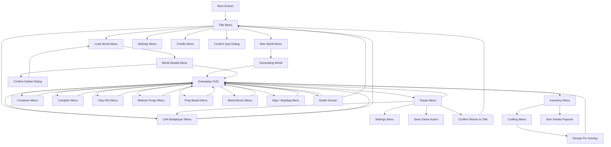
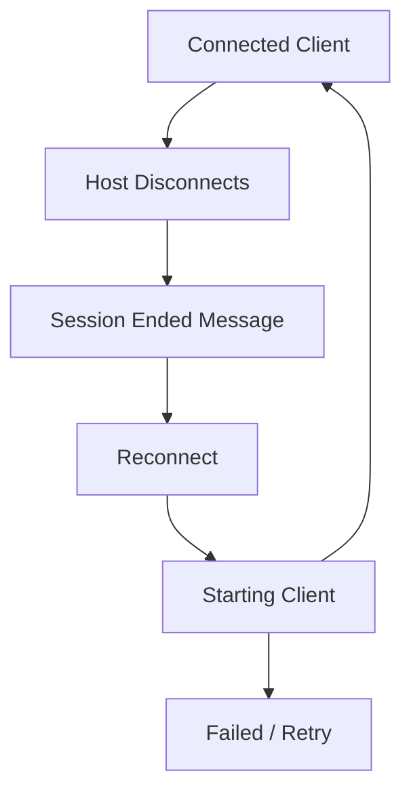

# Voxel Survival/Crafting Game Menu Specification

This document defines the game menus, screen-to-screen flows, menu actions, UI state rules, and implementation-ready menu behavior for the voxel survival/crafting game.

The goal is to keep menus data-driven and easy to convert into game logic.

---

## 1. UI Design Principles

- Menus should be navigable by keyboard, mouse, controller, and touch.
- Every menu element should map to one explicit action ID.
- Game simulation pauses in full-screen menus unless the screen is explicitly marked `simulationContinues = true`.
- Inventory, crafting, and station screens should be usable without leaving the game world.
- Menu screens should use a consistent layout model:
  - Header area
  - Main content area
  - Detail/preview panel
  - Footer actions/help bar
- Confirmation dialogs should be used for destructive actions, including deleting worlds, dropping all items, overwriting saves, resetting settings, or quitting without saving.

---

## 2. Global UI Input Rules

### 2.1 Common Inputs

| Input | Action ID | Result |
|---|---|---|
| `Esc` / Menu button | `ui.back_or_pause` | Goes back one screen; opens Pause Menu from gameplay |
| `Enter` / Confirm | `ui.confirm` | Activates selected element |
| `Backspace` / Cancel | `ui.cancel` | Cancels modal or returns to previous screen |
| Arrow keys / D-pad | `ui.navigate` | Moves focus between elements |
| Mouse click / Tap | `ui.pointer_select` | Selects or activates element |
| Mouse hover / Focus | `ui.focus_changed` | Updates detail panel |
| Number keys `1–0` | `hotbar.select_slot` | Selects hotbar slot |
| Shift-click | `inventory.quick_transfer` | Transfers stack to opposite inventory area |
| Right-click | `inventory.split_stack_or_alt_use` | Splits stack in UI; alternate use in world |
| Ctrl-click | `inventory.transfer_all_matching` | Transfers all stacks with matching `itemId` |

### 2.2 Modal Priority

If a modal is open, all input goes to the modal first.

```ts
if (ui.modalStack.length > 0) {
    routeInputTo(ui.modalStack.top());
} else {
    routeInputTo(ui.activeScreen);
}
```

### 2.3 Screen Stack Rules

Use a stack-based UI router.

```ts
type ScreenRoute = {
  screenId: string;
  params?: Record<string, unknown>;
  pauseGame: boolean;
  allowWorldInput: boolean;
};

pushScreen(route);
popScreen();
replaceScreen(route);
clearToRoot(screenId);
```

Recommended behavior:

| Screen Type | Stack Behavior |
|---|---|
| Main Menu screens | Replace current screen |
| Pause Menu submenus | Push onto stack |
| Inventory/Crafting tabs | Same screen, change active tab |
| Station menus | Push screen over gameplay |
| Confirmation dialogs | Push modal, not full screen |
| Death screen | Replace gameplay menu state |

---

## 3. Complete Menu List

| Screen Name | Screen ID | Opened From | Pauses Game? | Purpose |
|---|---|---|---|---|
| Boot Screen | `boot` | App launch | Yes | Shows logo/loading status |
| Title Menu | `title_menu` | Boot, Return to Title | Yes | Main entry point |
| New World Menu | `new_world` | Title Menu | Yes | Configure and create world |
| Load World Menu | `load_world` | Title Menu | Yes | Select existing save |
| World Details Menu | `world_details` | Load World | Yes | Load, rename, duplicate, delete selected world |
| Settings Menu | `settings` | Title, Pause | Yes | Game, controls, audio, video, accessibility |
| Controls Menu | `controls` | Settings | Yes | View/remap controls |
| Credits Menu | `credits` | Title Menu | Yes | Credits and licenses |
| Gameplay HUD | `gameplay_hud` | World loaded | No | Health/status, hotbar, crosshair, prompts |
| Pause Menu | `pause_menu` | Gameplay | Yes | Resume, settings, save, quit |
| Inventory Menu | `inventory` | Gameplay | Yes by default | Player inventory, equipment, quick crafting |
| Crafting Menu | `crafting` | Inventory, Build Table | Yes | Recipe browsing and crafting |
| Container Menu | `container` | Interacting with container block | Yes | Move items between player and container |
| Campfire Menu | `campfire` | Interacting with campfire | No or Yes | Fuel/cook/output slots |
| Clay Kiln Menu | `clay_kiln` | Interacting with Clay Kiln | Yes | Smelting with fuel |
| Bellows Forge Menu | `bellows_forge` | Interacting with Bellows Forge | Yes | Alloying, advanced smelting, advanced tools |
| Prep Board Menu | `prep_board` | Interacting with Prep Board | Yes | Food and utility recipes |
| Mend Bench Menu | `mend_bench` | Interacting with Mend Bench | Yes | Repair damaged tools |
| Map / Wayflag Menu | `map` | Keybind or Wayflag interaction | Yes | View discovered areas and markers |
| LAN Multiplayer Menu | `lan_multiplayer` | Pause, Title, World loaded | Yes | Host, join, stop, or reconnect a LAN co-op session |
| Death Screen | `death_screen` | Player death | Yes | Respawn or return to title |
| Confirmation Dialog | `confirm_dialog` | Any risky action | Inherits parent | Confirm/cancel destructive actions |
| Item Details Popover | `item_details` | Inventory hover/focus | Inherits parent | Stats, description, actions |
| Recipe Pin Overlay | `recipe_pin_overlay` | Crafting menu | No | Shows tracked recipe materials on HUD |

---

## 4. High-Level Menu Flow Diagram



---

## 5. Screen Flow Table

| From Screen | User Action | Condition | To Screen / Result |
|---|---|---|---|
| `boot` | Loading complete | Assets and save index loaded | `title_menu` |
| `title_menu` | Continue | At least one valid save exists | Load most recent world, then `gameplay_hud` |
| `title_menu` | New World | Always | `new_world` |
| `title_menu` | Load World | At least one save exists | `load_world` |
| `title_menu` | Settings | Always | `settings` |
| `title_menu` | Multiplayer | Always | `lan_multiplayer` |
| `title_menu` | Credits | Always | `credits` |
| `title_menu` | Quit | Desktop/platform supports quit | `confirm_dialog` then exit app |
| `new_world` | Create | Valid name and settings | Generate world, save metadata, then `gameplay_hud` |
| `new_world` | Back | Always | `title_menu` |
| `load_world` | Select world | Save exists | `world_details` |
| `load_world` | Back | Always | `title_menu` |
| `world_details` | Play | Save valid | Load world, then `gameplay_hud` |
| `world_details` | Rename | Save not locked | Inline rename field |
| `world_details` | Duplicate | Enough storage | Duplicate save, refresh list |
| `world_details` | Delete | Always | `confirm_dialog`; on confirm delete save |
| `gameplay_hud` | Pause input | Always | `pause_menu` |
| `gameplay_hud` | Inventory input | Player alive | `inventory` |
| `gameplay_hud` | Interact with station | Targeted station block | Matching station menu |
| `gameplay_hud` | Interact with container | Targeted container block | `container` |
| `gameplay_hud` | Map input | Player has map or wayflag discovered | `map` |
| `gameplay_hud` | Multiplayer input | LAN co-op enabled | `lan_multiplayer` |
| `pause_menu` | Resume | Always | Pop to `gameplay_hud` |
| `pause_menu` | Save Game | World allows saving | Save world, stay on `pause_menu` |
| `pause_menu` | Settings | Always | `settings` |
| `pause_menu` | Multiplayer | Always | `lan_multiplayer` |
| `pause_menu` | Return to Title | Unsaved changes | `confirm_dialog`; on confirm `title_menu` |
| `pause_menu` | Quit Game | Unsaved changes | `confirm_dialog`; on confirm exit app |
| `inventory` | Open Crafting tab | Always | Same screen with `activeTab = crafting` or `crafting` |
| `inventory` | Close | Always | `gameplay_hud` |
| `crafting` | Craft recipe | Ingredients available | Consume inputs, add outputs |
| `crafting` | Pin recipe | Always | Add or remove recipe from HUD tracker |
| `container` | Close | Always | Save container state, return to HUD |
| `clay_kiln` | Start smelt | Valid input and fuel | Begin station job |
| `bellows_forge` | Start forge | Valid input and fuel | Begin station job |
| `mend_bench` | Repair | Tool and material valid | Increase durability, consume material |
| `death_screen` | Respawn | Valid spawn exists | Restore player at spawn, then HUD |
| `death_screen` | Return to Title | Always | `title_menu` |
| `lan_multiplayer` | Host LAN Session | Valid local world and no active session | Start host, remain on `lan_multiplayer` |
| `lan_multiplayer` | Join LAN Session | Address valid and no active session | Start client, remain on `lan_multiplayer` until connected |
| `lan_multiplayer` | Stop Session | Active host/client session | Shutdown session; host saves before stopping |
| `lan_multiplayer` | Reconnect | Previous address exists after host disconnect | Join previous host address |
| `lan_multiplayer` | Back | Always | Previous screen |

---

## 6. Screen Specifications and Mockups

### 6.1 Boot Screen

**Purpose:** Load assets, registries, settings, save index, and user profile.

**State fields:**

```ts
type BootScreenState = {
  loadStep: "assets" | "registries" | "settings" | "saves" | "done";
  progress01: number;
  errorMessage?: string;
};
```

**Mockup:**

```txt
+--------------------------------------------------+
|                                                  |
|                  VOXEL SURVIVAL                 |
|                                                  |
|                 [ loading... 72% ]              |
|                                                  |
|            Loading item and block data           |
|                                                  |
+--------------------------------------------------+
```

**Actions:**

| Element | Action ID | Logic |
|---|---|---|
| Loading progress | `boot.update_progress` | Updates progress bar as systems load |
| Retry button | `boot.retry_after_error` | Restarts failed load step |
| Continue after error | `boot.continue_safe_mode` | Starts game with defaults where possible |

---

### 6.2 Title Menu

**Purpose:** Entry point for starting, loading, configuring, or quitting the game.

**Mockup:**

```txt
+--------------------------------------------------+
|                  VOXEL SURVIVAL                 |
|        Build, delve, craft, endure.              |
|                                                  |
|                 [ Continue ]                     |
|                 [ New World ]                    |
|                 [ Load World ]                   |
|                 [ Settings ]                     |
|                 [ Credits ]                      |
|                 [ Quit ]                         |
|                                                  |
|  v0.1.0-alpha                         Profile: P1|
+--------------------------------------------------+
```

**Actions:**

| Element | Action ID | Enabled When | Logic |
|---|---|---|---|
| Continue | `title.continue_latest_save` | Latest save exists | Loads most recently played world |
| New World | `title.open_new_world` | Always | Opens `new_world` |
| Load World | `title.open_load_world` | Any save exists | Opens `load_world` |
| Settings | `title.open_settings` | Always | Opens `settings` with `returnTo = title_menu` |
| Credits | `title.open_credits` | Always | Opens `credits` |
| Quit | `title.quit_requested` | Platform allows app quit | Opens quit confirmation dialog |

---

### 6.3 New World Menu

**Purpose:** Configure a new generated world.

**Default values:**

```ts
worldName = "New World";
seed = randomUInt64().toString();
gameMode = "survival";
difficulty = "normal";
worldSize = "small";
worldPreset = "survival_terrain";
startingBiomePreference = "balanced";
allowExperimentalRules = false;
```

**Mockup:**

```txt
+------------------------------------------------------------+
| New World                                                  |
+--------------------------+---------------------------------+
| World Name              | New World                       |
| Seed                    | 918273645                       |
| Game Mode               | < Survival >                    |
| Difficulty              | < Normal >                      |
| World Size              | < Small >                       |
| World Preset            | < Survival Terrain >            |
| Starting Biome          | < Balanced >                    |
| Experimental Rules      | [ ] Enabled                     |
+--------------------------+---------------------------------+
| [ Create World ]                         [ Back ]          |
+------------------------------------------------------------+
```

**Actions:**

| Element | Action ID | Logic |
|---|---|---|
| World Name field | `new_world.set_name` | Updates pending world name; validates non-empty and unique display name |
| Seed field | `new_world.set_seed` | Accepts text or number; hashes text seeds into numeric seed |
| Random Seed | `new_world.randomize_seed` | Generates new seed value |
| Game Mode selector | `new_world.cycle_game_mode` | Cycles `survival`, `creative` |
| Difficulty selector | `new_world.cycle_difficulty` | Cycles `easy`, `normal`, `hard` |
| World Size selector | `new_world.cycle_world_size` | Cycles `small`, `medium`, `large`, `infinite` |
| World Preset selector | `new_world.cycle_world_preset` | Cycles `survival_terrain`, `flat_builder`, `void_builder`; advanced presets may unlock later |
| Starting Biome selector | `new_world.cycle_starting_biome` | Changes spawn-biome preference |
| Experimental Rules toggle | `new_world.toggle_experimental` | Enables optional test systems |
| Create World | `new_world.create` | Validates settings, creates save, starts generation |
| Back | `new_world.back` | Returns to Title Menu |

**Create world logic:**

```ts
function createWorld(config) {
  assert(config.name.trim().length > 0);
  const seed = hashSeed(config.seed);
  const saveId = createSaveRecord(config.name, seed, config);
  generateSpawnRegion(saveId, seed, radiusChunks = 6);
  setActiveWorld(saveId);
  replaceScreen({ screenId: "gameplay_hud", pauseGame: false, allowWorldInput: true });
}
```

---

### 6.4 Load World Menu

**Purpose:** Browse saved worlds.

**Mockup:**

```txt
+----------------------------------------------------------------+
| Load World                                                     |
+-------------------------------+--------------------------------+
| > Meadow Home                 | Name: Meadow Home              |
|   Day 18 - Normal - Survival  | Seed: 918273645                |
|                               | Last Played: 2026-06-06        |
|   Salt Flats Test             | Progression: Bronze            |
|   Day 4 - Easy - Survival     | Biome: Meadow                  |
|                               |                                |
|   Deep Cave Run               | [ Play ] [ Details ] [ Delete ]|
|   Day 33 - Hard - Survival    |                                |
+-------------------------------+--------------------------------+
| [ Back ]                 Sort: Last Played v                  |
+----------------------------------------------------------------+
```

**Actions:**

| Element | Action ID | Logic |
|---|---|---|
| World list item | `load_world.select_save` | Updates selected save and preview panel |
| Play | `load_world.play_selected` | Loads selected save if compatible |
| Details | `load_world.open_details` | Opens `world_details` for selected save |
| Delete | `load_world.delete_selected_requested` | Opens delete confirmation dialog |
| Sort selector | `load_world.set_sort` | Sorts by last played, name, day, mode, created date |
| Search field | `load_world.search` | Filters save list by name/seed/mode |
| Back | `load_world.back` | Returns to Title Menu |

---

### 6.5 World Details Menu

**Purpose:** Show save metadata and management actions for the save selected on the Load World
menu (opened with its Details button).

**Mockup:**

```txt
+------------------------------------------------------------+
| World Details                                              |
+------------------------------------------------------------+
| Mode: Survival              Difficulty: Normal             |
| Day: 18                     Seed: 918273645                |
| Created: 2026-06-02         Last Played: 2026-06-06        |
|                                                            |
| Name                                                       |
| [ Meadow Home                                          ]   |
|                                                            |
| [ Play ] [ Rename ] [ Duplicate ]                          |
| [ Delete ] [ Back ]                                        |
+------------------------------------------------------------+
```

The name field uses the system keyboard; Rename applies its text. Renaming and duplicating
uniquify clashing names (" (2)", " (3)", …); deleting opens the shared confirmation dialog.

**Actions:**

| Element | Action ID | Logic |
|---|---|---|
| Details (on Load World) | `load_world.open_details` | Opens this screen for the selected save |
| Play | `world_details.play` | Loads the shown save |
| Rename | `world_details.rename` | Renames the save to the name field's text |
| Duplicate | `world_details.duplicate` | Copies the save folder under a unique name |
| Delete | `world_details.delete_requested` | Opens the confirmation dialog, then deletes |
| Back | `world_details.back` | Returns to Load World Menu |

---

### 6.6 Gameplay HUD

**Purpose:** In-world overlay for survival, hotbar, crosshair, tool state, and contextual prompts.

**Mockup:**

```txt
+------------------------------------------------------------+
| Day 18  14:32                         Biome: Meadow        |
|                                                            |
|                         +                                  |
|                                                            |
|                                                            |
| Target: Rosycopper Bloom                                   |
| Tool: Knapped Flint Delver    Mine Time: 2.0s              |
|                                                            |
| Health: ████████░░  Stamina: ██████░░░░  Heat: OK          |
| [1]Delver [2]Spade [3]Feller [4]Glowwick [5]Food [6]...    |
+------------------------------------------------------------+
```

**HUD elements:**

| Element | Action / Update ID | Logic |
|---|---|---|
| Crosshair | `hud.target_update` | Raycasts target block/entity each frame |
| Target prompt | `hud.show_context_prompt` | Shows block name, usable action, tool warning, mine time |
| Hotbar | `hotbar.render` | Shows 10 quick slots and selected slot |
| Status bars | `hud.status_update` | Displays health, stamina, hunger/thirst/temperature if enabled |
| Recipe pins | `hud.recipe_pin_update` | Shows tracked recipe requirements |
| Damage indicators | `hud.damage_feedback` | Shows directional hit/heat/fall feedback |
| Pickup feed | `hud.pickup_feed` | Shows recently collected item stacks |

**Gameplay inputs that open menus:**

| Input | Action ID | Target Screen |
|---|---|---|
| Inventory key | `gameplay.open_inventory` | `inventory` |
| Pause/Menu key | `gameplay.open_pause` | `pause_menu` |
| Interact with container | `gameplay.open_container` | `container` |
| Interact with station | `gameplay.open_station` | Station-specific screen |
| Map key | `gameplay.open_map` | `map` |

---

### 6.7 Pause Menu

**Purpose:** Suspend gameplay and expose save/settings/quit actions.

**Mockup:**

```txt
+--------------------------------------+
| Paused                               |
+--------------------------------------+
| [ Resume ]                           |
| [ Save Game ]                        |
| [ Settings ]                         |
| [ Controls ]                         |
| [ Return to Title ]                  |
| [ Quit Game ]                        |
+--------------------------------------+
| World: Meadow Home       Unsaved: 03m|
+--------------------------------------+
```

**Actions:**

| Element | Action ID | Logic |
|---|---|---|
| Resume | `pause.resume` | Closes Pause Menu and resumes simulation |
| Save Game | `pause.save_game` | Serializes world/player state; shows result toast |
| Settings | `pause.open_settings` | Opens Settings Menu, return target is Pause Menu |
| Controls | `pause.open_controls` | Opens Controls Menu |
| Return to Title | `pause.return_to_title_requested` | Confirms if unsaved changes exist; unloads world |
| Quit Game | `pause.quit_requested` | Confirms if unsaved changes exist; exits app |

---

### 6.8 Inventory Menu

**Purpose:** Manage hotbar, backpack, equipment, held items, and quick crafting.

**Mockup:**

```txt
+--------------------------------------------------------------------+
| Inventory                                                [X Close] |
+-----------------------------+--------------------------------------+
| Equipment                   | Character                            |
| Head:   [      ]            | Health: 80/100                       |
| Body:   [      ]            | Stamina: 65/100                      |
| Charm:  [      ]            | Tool Tier: Flint                     |
| Satchel:[Reed Basket]       |                                      |
+-----------------------------+--------------------------------------+
| Backpack                                                           |
| [Loam 64] [Fiber 22] [Flint 8] [Coal 4] [Clay 12] [      ]         |
| [Log 18 ] [Pole 16 ] [Food 3 ] [      ] [      ] [      ]          |
| [      ] [      ] [      ] [      ] [      ] [      ]              |
|                                                                    |
| Hotbar                                                             |
| [1 Delver] [2 Spade] [3 Feller] [4 Glowwick] [5 Food] ...          |
+-----------------------------+--------------------------------------+
| Quick Craft                 | Details                              |
| > Work Plank x6             | Branchwood Log                       |
|   Stout Pole x4             | Common tree trunk.                   |
|   Fiber Cord x2             | Actions: Use / Split / Drop / Pin    |
+--------------------------------------------------------------------+
```

**Slot actions:**

| Element | Action ID | Logic |
|---|---|---|
| Item slot click | `inventory.pickup_or_place_stack` | Picks up stack, places held stack, swaps, or merges |
| Right-click slot | `inventory.split_or_place_one` | Splits stack or places one item from cursor stack |
| Shift-click slot | `inventory.quick_transfer` | Moves stack to preferred destination |
| Ctrl-click slot | `inventory.transfer_all_matching` | Moves all stacks with same item ID |
| Drag over slots | `inventory.distribute_stack` | Evenly distributes held stack across target slots |
| Drop button | `inventory.drop_selected` | Drops selected item or held cursor stack into world |
| Drop all | `inventory.drop_all_selected` | Requires confirmation for full stack or locked item |
| Lock slot | `inventory.toggle_slot_lock` | Prevents crafting from consuming that slot |
| Sort backpack | `inventory.sort_backpack` | Sorts by category, tier, name, stack fullness |
| Quick stack | `inventory.quick_stack_to_nearby_containers` | Moves matching items to open/nearby containers |
| Use/equip | `inventory.use_or_equip_selected` | Equips gear, consumes food, places block if allowed |
| Inspect | `inventory.inspect_selected` | Opens `item_details` popover |
| Close | `inventory.close` | Returns to Gameplay HUD |

**Quick transfer destinations:**

```ts
if sourceArea === "hotbar" or "backpack":
    if targetContainerOpen: destination = targetContainer
    else if itemIsEquipment: destination = equipmentSlot
    else destination = firstCompatibleInventorySlot

if sourceArea === "container":
    destination = playerInventory
```

---

### 6.9 Item Details Popover

**Purpose:** Show item description, stats, compatible recipes, and available actions.

**Mockup:**

```txt
+------------------------------------------+
| Knapped Flint Delver                     |
| Tool Class: Delver                       |
| Tier: 2 - Flint                          |
| Durability: 64 / 90                      |
| Speed: 1.5                               |
|                                          |
| Used for stone, ore, and crystal.        |
|                                          |
| [ Equip ] [ Repair Info ] [ Drop ]       |
+------------------------------------------+
```

**Actions:**

| Element | Action ID | Logic |
|---|---|---|
| Equip | `item_details.equip` | Moves item to appropriate slot or hotbar |
| Use | `item_details.use` | Applies item use action if available |
| Repair Info | `item_details.show_repair_info` | Shows needed repair material and station |
| Recipes Using This | `item_details.show_related_recipes` | Filters crafting menu to recipes using selected item |
| Drop | `item_details.drop` | Drops selected stack after confirmation if needed |
| Close | `item_details.close` | Closes popover |

---

### 6.10 Crafting Menu

**Purpose:** Browse recipes, check requirements, craft items, and pin recipes.

**Mockup:**

```txt
+------------------------------------------------------------------------+
| Crafting: Build Table                                        [X Close] |
+----------------------+-----------------------------+-------------------+
| Categories           | Recipes                     | Recipe Details    |
| > Basics             | > Glowwick x4               | Glowwick x4       |
|   Blocks             |   Campfire x1               | Placeable light   |
|   Tools              |   Storage Crate x1          |                   |
|   Stations           |   Clay Kiln x1              | Requires:         |
|   Food               |   Reed Basket x1            | ✓ Stout Pole x1   |
|   Utility            |                             | ✓ Embercoal x1    |
|                      |                             | ✓ Fiber Cord x1   |
+----------------------+-----------------------------+-------------------+
| [ Craft 1 ] [ Craft 5 ] [ Craft Max ] [ Pin Recipe ] [ Back ]          |
+------------------------------------------------------------------------+
```

**Recipe visibility rules:**

```ts
recipe.visible =
  recipe.station === activeStation &&
  recipe.unlocked === true &&
  recipe.matchesSearch(searchText) &&
  recipe.category === selectedCategory;
```

**Craftability states:**

| State | UI Treatment | Logic |
|---|---|---|
| Craftable | Normal text, enabled craft buttons | Player has all ingredients |
| Missing ingredients | Dimmed recipe, disabled craft buttons | Ingredient count insufficient |
| Wrong station | Hidden or labeled with station requirement | `recipe.station !== activeStation` |
| Locked | Hidden by default | Unlock condition not met |

**Actions:**

| Element | Action ID | Logic |
|---|---|---|
| Category tab | `crafting.select_category` | Filters recipes |
| Recipe row | `crafting.select_recipe` | Updates recipe detail panel |
| Search field | `crafting.search` | Filters recipe list by name, tag, ingredient |
| Craft 1 | `crafting.craft_one` | Crafts selected recipe once |
| Craft 5 | `crafting.craft_five` | Crafts selected recipe up to 5 times |
| Craft Max | `crafting.craft_max` | Crafts as many as inventory allows |
| Pin Recipe | `crafting.toggle_pin_recipe` | Adds/removes recipe from HUD tracker |
| Show Missing Only | `crafting.toggle_missing_filter` | Shows needed items for selected recipe |
| Back | `crafting.back` | Returns to previous screen |

**Craft action logic:**

```ts
function craft(recipeId, countRequested) {
  const recipe = getRecipe(recipeId);
  const maxCount = getMaxCraftableCount(playerInventory, recipe);
  const count = Math.min(countRequested, maxCount);

  if (count <= 0) return showToast("Missing ingredients");
  consumeIngredients(playerInventory, recipe.inputs, count);
  addOutputsOrDropOverflow(playerInventory, recipe.outputs, count);
  updateRecipeDetails(recipeId);
}
```

---

### 6.11 Container Menu

**Purpose:** Move items between player inventory and a container.

**Mockup:**

```txt
+--------------------------------------------------------------------+
| Storage Crate                                           [X Close]  |
+--------------------------------+-----------------------------------+
| Crate                          | Player Backpack                   |
| [Stone 64] [Loam 48] [Coal 12] | [Fiber 22] [Flint 8] [Clay 12]    |
| [Copper 9] [Tin 3] [      ]    | [Log 18] [Pole 16] [Food 3]       |
| [      ] [      ] [      ]     | [      ] [      ] [      ]        |
+--------------------------------+-----------------------------------+
| Hotbar                                                             |
| [1 Delver] [2 Spade] [3 Feller] [4 Glowwick] [5 Food] ...          |
+--------------------------------------------------------------------+
| [ Sort Crate ] [ Quick Stack ] [ Take All ] [ Rename ] [ Close ]   |
+--------------------------------------------------------------------+
```

**Actions:**

| Element | Action ID | Logic |
|---|---|---|
| Container slot | `container.slot_interact` | Same pickup/place/swap rules as player inventory |
| Player slot | `container.player_slot_interact` | Same as inventory slot rules |
| Sort Crate | `container.sort` | Sorts only container contents |
| Quick Stack | `container.quick_stack` | Moves matching player items into container partial stacks |
| Take All | `container.take_all` | Moves all container items to player inventory; overflow remains |
| Rename | `container.rename` | Updates display name if container supports naming |
| Close | `container.close` | Persists container inventory and returns to HUD |

---

### 6.12 Campfire Menu

**Purpose:** Manage simple cooking, boiling, and fuel.

**Mockup:**

```txt
+------------------------------------------------------------+
| Campfire                                          [X Close] |
+------------------------------------------------------------+
| Fuel       [ Embercoal x1 ]      Burn: █████░░░  42s       |
| Cook Input [ Grain Bundle x2 ]   Cook: ███░░░░░  4s        |
| Output     [ Flatbread x1 ]                                |
|                                                            |
| Valid Recipes:                                             |
| > Grain Bundle x2 -> Flatbread x1                          |
|   Berry Cluster x3 -> Berry Mash x1                        |
|   Freshwater Bucket x1 -> Clean Water Flask x3             |
+------------------------------------------------------------+
| [ Add Fuel ] [ Take Output ] [ Pin Recipe ] [ Close ]      |
+------------------------------------------------------------+
```

**Actions:**

| Element | Action ID | Logic |
|---|---|---|
| Fuel slot | `campfire.set_fuel` | Accepts items with fuel value |
| Cook input slot | `campfire.set_input` | Accepts valid cook recipe input |
| Output slot | `campfire.take_output` | Moves completed output to player inventory |
| Add Fuel | `campfire.quick_add_fuel` | Moves best available fuel from inventory |
| Pin Recipe | `campfire.pin_recipe` | Pins selected campfire recipe to HUD |
| Close | `campfire.close` | Returns to HUD; campfire continues while chunk is active |

**Station tick logic:**

```ts
if fuelRemainingSeconds <= 0 and fuelSlot.hasFuel():
    consumeOneFuelItem();
    fuelRemainingSeconds += getFuelValue(fuelItem);

if fuelRemainingSeconds > 0 and inputMatchesRecipe():
    fuelRemainingSeconds -= deltaTime;
    craftProgress += deltaTime;

if craftProgress >= recipe.time:
    consumeRecipeInput();
    addToOutputSlot(recipe.output);
    craftProgress = 0;
```

---

### 6.13 Clay Kiln Menu

**Purpose:** Smelt clay, glass, copper, tin-like ore, salt, and crystal dust.

**Mockup:**

```txt
+------------------------------------------------------------+
| Clay Kiln                                        [X Close] |
+------------------------------------------------------------+
| Input      [ Raw Rosycopper x2 ]                           |
| Fuel       [ Embercoal x1       ]  Burn: ███████░ 61s      |
| Output     [ Rosycopper Bar x1  ]                          |
|                                                            |
| Smelt Progress: █████░░░░░  7s / 12s                       |
|                                                            |
| Recipe: Raw Rosycopper x2 -> Rosycopper Bar x1             |
+------------------------------------------------------------+
| [ Add Fuel ] [ Take Output ] [ Recipe List ] [ Close ]     |
+------------------------------------------------------------+
```

**Actions:**

| Element | Action ID | Logic |
|---|---|---|
| Input slot | `kiln.set_input` | Accepts item matching kiln recipe |
| Fuel slot | `kiln.set_fuel` | Accepts fuel item |
| Output slot | `kiln.take_output` | Transfers output to player inventory |
| Add Fuel | `kiln.quick_add_fuel` | Adds highest-priority fuel from inventory |
| Recipe List | `kiln.open_recipe_list` | Opens Crafting Menu filtered to kiln recipes |
| Close | `kiln.close` | Saves station state and returns to HUD |

---

### 6.14 Bellows Forge Menu

**Purpose:** Alloy metals, smelt iron and advanced ores, and create advanced tool components.

**Mockup:**

```txt
+----------------------------------------------------------------+
| Bellows Forge                                        [X Close] |
+----------------------------------------------------------------+
| Input A [ Rosycopper Bar x3 ]                                  |
| Input B [ Paletin Bar x1    ]       Heat: ██████░░  Hot         |
| Input C [                  ]       Fuel: Embercoal x2           |
| Output  [ Bronze Bar x4    ]       Progress: ████░░░ 9s/16s    |
|                                                                |
| Selected Recipe: Bronze Bar x4                                 |
| Requires: Rosycopper Bar x3, Paletin Bar x1                    |
+----------------------------------------------------------------+
| [ Add Fuel ] [ Start ] [ Take Output ] [ Recipes ] [ Close ]   |
+----------------------------------------------------------------+
```

**Actions:**

| Element | Action ID | Logic |
|---|---|---|
| Input A/B/C slots | `forge.set_input_slot` | Accepts valid forge ingredients |
| Fuel slot | `forge.set_fuel` | Accepts fuel item; forge burns fuel at `2×` speed |
| Start | `forge.start_recipe` | Locks matching recipe while processing |
| Take Output | `forge.take_output` | Moves completed output to player inventory |
| Recipes | `forge.open_recipe_list` | Opens recipe list filtered to forge recipes |
| Auto-fill | `forge.autofill_recipe` | Moves required inputs from player inventory if available |
| Close | `forge.close` | Saves station state and returns to HUD |

**Forge recipe selection logic:**

```ts
const matchingRecipes = recipes.filter(r =>
  r.station === "bellows_forge" &&
  inputsMatchIgnoringOrder(forge.inputSlots, r.inputs)
);

selectedRecipe = matchingRecipes[0] ?? null;
```

---

### 6.15 Prep Board Menu

**Purpose:** Craft food, bandages, and small utility items.

**Mockup:**

```txt
+------------------------------------------------------------+
| Prep Board                                       [X Close] |
+-----------------------+------------------------------------+
| Recipes               | Details                            |
| > Trail Ration x2     | Grain Bundle x2                    |
|   Berry Mash x1       | Berry Cluster x2                   |
|   Field Bandage x2    | Brightsalt x1                      |
|                       |                                    |
|                       | Output: Trail Ration x2            |
+-----------------------+------------------------------------+
| [ Craft 1 ] [ Craft Max ] [ Pin Recipe ] [ Close ]         |
+------------------------------------------------------------+
```

**Actions:**

| Element | Action ID | Logic |
|---|---|---|
| Recipe row | `prep_board.select_recipe` | Selects recipe and updates detail panel |
| Craft 1 | `prep_board.craft_one` | Crafts once if ingredients exist |
| Craft Max | `prep_board.craft_max` | Crafts until ingredients or inventory space run out |
| Pin Recipe | `prep_board.pin_recipe` | Pins recipe to HUD tracker |
| Close | `prep_board.close` | Returns to HUD |

---

### 6.16 Mend Bench Menu

**Purpose:** Repair damaged tools using matching materials.

**Mockup:**

```txt
+------------------------------------------------------------+
| Mend Bench                                       [X Close] |
+------------------------------------------------------------+
| Tool Slot      [ Knapped Flint Delver 64/90 ]              |
| Material Slot  [ Flint Shard x1             ]              |
|                                                            |
| Repair Preview:                                            |
| Durability: 64/90 -> 87/90                                 |
| Cost: Flint Shard x1                                       |
| Prior Repairs: 1                                           |
|                                                            |
| [ Repair ] [ Auto-Fill Material ] [ Close ]                |
+------------------------------------------------------------+
```

**Actions:**

| Element | Action ID | Logic |
|---|---|---|
| Tool slot | `mend.set_tool` | Accepts damaged tools only |
| Material slot | `mend.set_material` | Accepts matching repair ingredient |
| Repair | `mend.repair` | Applies repair formula and consumes material |
| Auto-fill Material | `mend.autofill_material` | Finds matching repair item in inventory |
| Close | `mend.close` | Returns to HUD |

**Repair validation:**

```ts
canRepair =
  toolSlot.item?.category === "tool" &&
  toolSlot.item.durability < toolSlot.item.maxDurability &&
  materialSlot.item?.itemId === toolSlot.item.repairItem;
```

---

### 6.17 Map / Wayflag Menu

**Purpose:** Show discovered terrain, player position, placed wayflags, and notes.

**Mockup:**

```txt
+----------------------------------------------------------------+
| Map                                                 [X Close]  |
+-------------------------------+--------------------------------+
|                               | Markers                        |
|        ^ North                | > Home Base                    |
|                               |   Copper Cave                  |
|    ~~~~~ River                |   Salt Flats                   |
|   TTTTT Pinewild              |                                |
|   ...@ Player                 | Selected: Home Base            |
|                               | X: 122  Z: -44                 |
+-------------------------------+--------------------------------+
| [ Add Marker ] [ Rename ] [ Remove ] [ Center Player ] [Back] |
+----------------------------------------------------------------+
```

**Actions:**

| Element | Action ID | Logic |
|---|---|---|
| Pan map | `map.pan` | Moves map viewport |
| Zoom | `map.zoom` | Changes map scale |
| Marker row | `map.select_marker` | Selects marker and centers preview |
| Add Marker | `map.add_marker` | Creates marker at player position or cursor position |
| Rename | `map.rename_marker` | Edits selected marker label |
| Remove | `map.remove_marker_requested` | Opens confirmation dialog |
| Center Player | `map.center_player` | Centers view on current player position |
| Close | `map.close` | Returns to previous screen |

---


### 6.18 LAN Multiplayer Menu

**Purpose:** Host, join, stop, or reconnect a local LAN co-op session while keeping the host authoritative over world state.

**State fields:**

```ts
type LanMultiplayerMenuState = {
  sessionMode: "offline" | "host" | "client";
  connectionState: "stopped" | "starting_host" | "hosting" | "starting_client" | "connected_client" | "disconnecting" | "disconnected" | "failed";
  address: string;        // default: 127.0.0.1
  listenAddress: string;  // default: 0.0.0.0
  port: number;           // default: 7777
  lastDisconnectReason?: string;
  lastHostSaveError?: string;
  previousJoinAddress?: string;
};
```

**Mockup:**

```txt
+------------------------------------------------+
| LAN Multiplayer                                |
|------------------------------------------------|
| Status: LAN session stopped.                   |
|                                                |
| Host Address: [ 127.0.0.1                 ]    |
| Port: 7777                                     |
|                                                |
| [ Host LAN Session ] [ Join LAN Session ]      |
| [ Stop Session ] [ Reconnect ]                 |
|                                                |
| Voice: Use Meta Quest party chat.              |
| Host owns world save state and validation.      |
+------------------------------------------------+
```

**Actions:**

| Element | Action ID | Enabled When | Logic |
|---|---|---|---|
| Host LAN Session | `multiplayer.host_lan` | No active session; local world can load/generate | Loads or initializes canonical world state, then starts host session. |
| Join LAN Session | `multiplayer.join_lan` | No active session; address is valid | Starts client connection to `address:port`. |
| Stop Session | `multiplayer.stop_session` | Host/client session active or disconnecting | Host attempts save-on-shutdown, then stops session; client disconnects. |
| Reconnect | `multiplayer.reconnect` | Previous join address exists and session is stopped/disconnected | Attempts to join the previous address. |
| Address input | `multiplayer.set_address` | No active session | Updates pending join address. |
| Back | `multiplayer.back` | Always | Returns to previous screen. |

**Status text rules:**

| Session State | Status Text |
|---|---|
| `stopped` | `LAN session stopped.` |
| `starting_host` | `Starting LAN host...` |
| `hosting` | `Hosting LAN session on 0.0.0.0:7777.` |
| `starting_client` | `Joining LAN session at <address>:7777...` |
| `connected_client` | `Connected to LAN session at <address>:7777.` |
| `disconnecting` | `Stopping LAN session...` |
| `disconnected` | `LAN session ended. Reconnect when the host is available.` |
| `failed` | Show failure reason if available; otherwise `LAN session failed.` |

**Session-ended / reconnect flow:**



Voice communication uses Meta Quest party chat. Blockiverse VR does not capture or transmit microphone audio in the LAN protocol.

---

### 6.19 Settings Menu

**Purpose:** Configure game, video, audio, controls, and accessibility options.

In VR the Settings menu is a hub of focused panels rather than a tabbed desktop dialog: each
entry opens its own world-space screen, and every control applies immediately (settings persist
via the player-prefs snapshot — there is no pending Apply/Reset flow).

**Mockup:**

```txt
+------------------------------+
| Settings                     |
+------------------------------+
| [ Comfort  ]                 |
| [ Audio    ]                 |
| [ Controls ]                 |
| [ Close    ]                 |
+------------------------------+
```

**Sections:**

| Section | Settings |
|---|---|
| Comfort | Locomotion mode (glide/teleport), move speed, smooth/snap turn, snap-turn degrees, standing eye height, vignette toggle/strength |
| Audio | Master, effects, UI, and weather volume; haptic strength; mute all; haptics toggle; reduced flash; reduced particles |
| Controls | Read-only controller mapping reference (shared with the first-launch popup) |

**Actions:**

| Element | Action ID | Logic |
|---|---|---|
| Comfort | `settings.open_comfort` | Shows the comfort settings panel |
| Audio | `settings.open_audio` | Pushes the audio & feedback screen |
| Controls | `settings.open_controls` | Pushes the controls reference screen |
| Close | `settings.close` | Returns to the previous screen |
| Audio close | `settings_audio.close` | Returns from the audio screen |
| Controls close | `controls.close` | Returns from the controls screen |

---

### 6.20 Controls Menu

**Purpose:** View the canonical controller mapping. Bindings are fixed to the Quest controller
layout (no remapping); the same mapping text backs the first-launch controller popup so the two
can never drift apart.

**Mockup:**

```txt
+------------------------------------------------------------+
| Controls                                                   |
+------------------------------------------------------------+
| Left stick: move                                           |
| Right stick: snap turn                                     |
| Right stick hold up: teleport aim, release to land         |
| Right trigger: press UI or break blocks                    |
| Right grip: place or use                                   |
| Left grip: blocks menu                                     |
| Right A: jump                                              |
| Right B: toggle block editing                              |
| Menu: pause                                                |
|                                                            |
| [ Close ]                                                  |
+------------------------------------------------------------+
```

**Actions:**

| Element | Action ID | Logic |
|---|---|---|
| Close | `controls.close` | Returns to the Settings menu |

---

### 6.21 Death Screen

**Purpose:** Resolve player death.

**Mockup:**

```txt
+----------------------------------------------+
|                  You Fell                    |
+----------------------------------------------+
| Day 18 - Meadow                              |
| Dropped items at: X 118, Y 44, Z -39         |
|                                              |
| [ Respawn at Bedroll ]                       |
| [ Respawn at World Spawn ]                   |
| [ Return to Title ]                          |
+----------------------------------------------+
```

**Actions:**

| Element | Action ID | Logic |
|---|---|---|
| Respawn at Bedroll | `death.respawn_bedroll` | Restores player at valid bedroll spawn |
| Respawn at World Spawn | `death.respawn_world_spawn` | Restores player at world spawn |
| Return to Title | `death.return_to_title` | Saves death state if autosave enabled, unloads world |

**Respawn logic:**

```ts
function respawn(target) {
  const spawn = resolveSpawnPoint(target);
  player.health = player.maxHealth;
  player.stamina = player.maxStamina;
  player.position = findSafeNearbyPosition(spawn);
  replaceScreen({ screenId: "gameplay_hud", pauseGame: false, allowWorldInput: true });
}
```

---

### 6.22 Confirmation Dialog

**Purpose:** Confirm risky or irreversible actions.

**Mockup:**

```txt
+----------------------------------------------+
| Delete World?                                |
+----------------------------------------------+
| This will permanently delete "Meadow Home".  |
|                                              |
| [ Delete ]                      [ Cancel ]   |
+----------------------------------------------+
```

**Actions:**

| Element | Action ID | Logic |
|---|---|---|
| Confirm button | `confirm.accept` | Executes supplied callback/action payload |
| Cancel button | `confirm.cancel` | Closes modal and returns to parent screen |
| Close input | `confirm.cancel` | Same as Cancel |

**Suggested dialog payload:**

```ts
type ConfirmDialogParams = {
  title: string;
  message: string;
  confirmLabel: string;
  cancelLabel: string;
  danger: boolean;
  onConfirmActionId: string;
  onConfirmPayload?: Record<string, unknown>;
};
```

---

## 7. Menu Actions Reference

### 7.1 Navigation Actions

| Action ID | Payload | Result |
|---|---|---|
| `nav.push` | `{ screenId, params }` | Pushes new screen onto stack |
| `nav.pop` | None | Returns to previous screen |
| `nav.replace` | `{ screenId, params }` | Replaces current screen |
| `nav.clear_to_root` | `{ screenId }` | Clears stack and opens root screen |
| `nav.open_modal` | `{ modalId, params }` | Opens modal over current screen |
| `nav.close_modal` | None | Closes top modal |

### 7.2 World and Save Actions

| Action ID | Payload | Result |
|---|---|---|
| `world.create` | New world config | Creates save record and generates spawn region |
| `world.load` | `{ saveId }` | Loads world and player state |
| `world.save` | `{ saveId }` | Serializes active world |
| `world.unload` | None | Unloads active world and returns to title/menu |
| `save.rename` | `{ saveId, name }` | Renames save display name |
| `save.duplicate` | `{ saveId }` | Creates copy of save |
| `save.delete` | `{ saveId }` | Deletes save after confirmation |

### 7.3 Inventory Actions

| Action ID | Payload | Result |
|---|---|---|
| `inventory.pickup_stack` | `{ inventoryId, slotIndex }` | Moves stack to cursor |
| `inventory.place_stack` | `{ inventoryId, slotIndex }` | Places cursor stack into slot |
| `inventory.swap_stack` | `{ sourceSlot, targetSlot }` | Swaps two stacks |
| `inventory.merge_stack` | `{ sourceSlot, targetSlot }` | Merges compatible stacks |
| `inventory.split_stack` | `{ slot, amount }` | Splits stack into cursor |
| `inventory.drop_stack` | `{ slot, amount }` | Drops item entity into world |
| `inventory.sort` | `{ inventoryId, sortMode }` | Sorts inventory slots |
| `inventory.lock_slot` | `{ slot, locked }` | Prevents crafting consumption |
| `inventory.quick_transfer` | `{ source, destinationHint }` | Moves stack to preferred destination |

### 7.4 Crafting Actions

| Action ID | Payload | Result |
|---|---|---|
| `crafting.select_recipe` | `{ recipeId }` | Updates details panel |
| `crafting.craft` | `{ recipeId, count }` | Consumes ingredients and adds output |
| `crafting.craft_max` | `{ recipeId }` | Crafts maximum possible count |
| `crafting.pin_recipe` | `{ recipeId }` | Adds recipe to HUD tracker |
| `crafting.unpin_recipe` | `{ recipeId }` | Removes recipe from HUD tracker |
| `crafting.filter` | `{ category, searchText, showCraftableOnly }` | Filters recipe list |

### 7.5 Station Actions

| Action ID | Payload | Result |
|---|---|---|
| `station.open` | `{ stationEntityId }` | Opens matching station screen |
| `station.set_input` | `{ stationEntityId, slotIndex, itemStack }` | Places item into station input |
| `station.set_fuel` | `{ stationEntityId, itemStack }` | Places fuel into fuel slot |
| `station.start_job` | `{ stationEntityId, recipeId }` | Starts processing recipe |
| `station.take_output` | `{ stationEntityId }` | Moves output to player inventory |
| `station.close` | `{ stationEntityId }` | Saves station state and closes screen |

### 7.6 Settings Actions

| Action ID | Payload | Result |
|---|---|---|
| `settings.set_value` | `{ key, value }` | Updates pending setting |
| `settings.apply` | Pending settings diff | Applies and persists settings |
| `settings.discard` | None | Discards pending changes |
| `settings.reset_tab` | `{ tabId }` | Restores tab defaults |
| `settings.reset_all` | None | Restores all defaults |


### 7.7 Multiplayer Actions

| Action ID | Payload | Result |
|---|---|---|
| `multiplayer.host_lan` | None | Starts a host-authoritative LAN session after host world load/validation |
| `multiplayer.join_lan` | `{ address, port }` | Starts a LAN client connection to the entered address |
| `multiplayer.stop_session` | None | Stops an active host/client session; host saves before shutdown |
| `multiplayer.reconnect` | `{ previousAddress, port }` | Attempts to rejoin the previous LAN host address |
| `multiplayer.set_address` | `{ address }` | Updates pending join address |
| `multiplayer.back` | None | Returns to the previous screen |

---

## 8. UI State Models

### 8.1 Root UI State

```ts
type UiState = {
  activeScreen: ScreenRoute;
  screenStack: ScreenRoute[];
  modalStack: ModalRoute[];
  cursorStack?: ItemStack;
  focusedElementId?: string;
  selectedItemRef?: SlotRef;
  selectedRecipeId?: string;
  pinnedRecipeIds: string[];
  pendingSettings: Partial<GameSettings>;
};
```

### 8.2 Inventory State

```ts
type InventoryScreenState = {
  playerInventoryId: string;
  activeTab: "items" | "crafting" | "equipment";
  selectedSlot?: SlotRef;
  cursorStack?: ItemStack;
  sortMode: "category" | "name" | "tier" | "quantity";
  showDetailsPanel: boolean;
};
```

### 8.3 Crafting State

```ts
type CraftingScreenState = {
  activeStation: "handcraft" | "build_table" | "clay_kiln" | "bellows_forge" | "prep_board" | "mend_bench";
  selectedCategory: string;
  searchText: string;
  selectedRecipeId?: string;
  showCraftableOnly: boolean;
  showMissingOnly: boolean;
};
```

### 8.4 Station State

```ts
type StationState = {
  stationEntityId: string;
  stationType: "campfire" | "clay_kiln" | "bellows_forge" | "prep_board" | "mend_bench";
  inputSlots: ItemStack[];
  fuelSlot?: ItemStack;
  outputSlots: ItemStack[];
  activeRecipeId?: string;
  progressSeconds: number;
  requiredSeconds: number;
  fuelRemainingSeconds: number;
};
```

---

## 9. Menu Element Schema

Use a declarative schema for UI screens.

```ts
type MenuElement = {
  id: string;
  type: "button" | "label" | "slot" | "list" | "tabs" | "slider" | "toggle" | "text_field" | "progress";
  text?: string;
  enabled?: boolean;
  visible?: boolean;
  value?: unknown;
  actionId?: string;
  actionPayload?: Record<string, unknown>;
  focusOrder?: number;
  tooltip?: string;
};
```

Example:

```json
{
  "id": "btn_create_world",
  "type": "button",
  "text": "Create World",
  "enabled": true,
  "actionId": "new_world.create",
  "actionPayload": {}
}
```

---

## 10. Menu Implementation Notes

### 10.1 Pause Behavior

| Screen | Pause Game? | Notes |
|---|---|---|
| Title/New/Load/Settings | Yes | No active world simulation |
| Pause Menu | Yes | Freezes world update loop |
| Inventory | Yes by default | Optional hardcore mode can keep world running |
| Container | Yes by default | Safer for item transfer |
| Campfire | Optional | Can remain unpaused because station continues over time |
| Kiln/Forge | Yes by default | Station progress can continue after closing |
| Death Screen | Yes | World waits for respawn choice |

### 10.2 Autosave Rules

```ts
autosaveIntervalSeconds = settings.autosaveMinutes * 60;

if worldLoaded && timeSinceLastSave >= autosaveIntervalSeconds:
    saveWorldAsync();
```

Autosave should not trigger while a destructive confirmation dialog is open.


### 10.3 Accessibility Requirements

- Every action must have a visible text label or accessible name.
- Color must not be the only indicator of craftability, danger, rarity, or selection.
- Text size and UI scale should be configurable.
- Hold-to-mine and toggle-to-mine should both be supported.
- Recipe requirements should use symbols and text:
  - `✓` available
  - `✗` missing
  - `!` wrong station

### 10.4 Error and Toast Messages

| Situation | Message |
|---|---|
| Missing recipe ingredients | `Missing required materials.` |
| Inventory full | `Inventory full. Dropped overflow nearby.` |
| Save successful | `Game saved.` |
| Save failed | `Could not save game.` |
| Tool cannot mine target | `This tool is not strong enough.` |
| Wrong station | `Use a different station for this recipe.` |
| Invalid world name | `Enter a world name.` |
| Cannot delete active world | `Exit the world before deleting this save.` |

---

## 11. Recommended First Playable Menu Set

For a first playable build, implement only these screens:

```txt
title_menu
new_world
load_world
gameplay_hud
pause_menu
inventory
crafting
container
campfire
clay_kiln
bellows_forge
mend_bench
settings
lan_multiplayer
confirm_dialog
death_screen
```

Minimum usable loop:

```txt
Title Menu
  -> New World
  -> Gameplay HUD
  -> Inventory
  -> Crafting
  -> Station Menus
  -> Pause Menu
  -> Save / Return to Title
```

---

## 12. Developer Checklist

Implement these systems in order:

1. UI router with `push`, `pop`, `replace`, and modal stack.
2. Global input mapping and focus navigation.
3. Title, New World, Load World, Pause, and Confirm Dialog screens.
4. HUD with hotbar and target prompt.
5. Inventory slot interaction rules.
6. Crafting recipe filtering and craft execution.
7. Container transfer rules.
8. Station screens for Campfire, Kiln, Forge, and Mend Bench.
9. Settings persistence and controls remapping.
10. LAN multiplayer session menu and reconnect flow.
11. Death and respawn flow.
