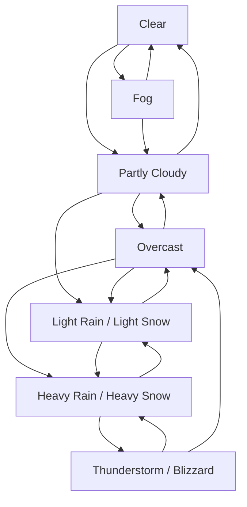

# Voxel World Environment Effects Ruleset

Version: 1.0
Companion documents: `voxel_survival_ruleset.md`, `voxel_creative_ruleset.md`, `voxel_structure_generation_ruleset.md`, `voxel_biome_vegetation_ruleset.md`, `voxel_save_versioning_schema.md`, `voxel_multiplayer_networking_ruleset.md`, and `voxel_audio_vfx_ruleset.md`

This document defines the world environment systems: day/night cycle, lighting, cloud coverage, rain, thunderstorms and lightning, fog, and snow. Rules are written so they can be converted directly into game logic.

---

## 1. Environment system goals

The environment system should:

1. Make the world feel alive through changing light, sky, clouds, and weather.
2. Affect gameplay in simple, predictable ways.
3. Remain deterministic from world seed where possible.
4. Avoid expensive per-block updates by using chunk-level and column-level state.
5. Provide clear hooks for rendering, farming, survival effects, fluids, and block updates.

---

## 2. Core constants

The base game runs at `20 ticks/second`.

```ts
TICKS_PER_SECOND = 20;
TICKS_PER_MINUTE = 1200;
TICKS_PER_DAY = 24000;        // 20 real minutes
DAYS_PER_SEASON = 12;         // Optional seasonal layer
WORLD_SEA_LEVEL = 96;
MAX_LIGHT_LEVEL = 15;
MIN_LIGHT_LEVEL = 0;
```

Recommended time scale:

| Game Time | Real Time |
|---:|---:|
| 1 game tick | 1/20 second |
| 1 game hour | 50 seconds |
| 1 game day | 20 minutes |
| 1 game season | 4 hours |
| 1 game year, if seasons enabled | 16 hours |

---

## 3. Environment state schema

```ts
type EnvironmentState = {
  worldTimeTicks: number;
  dayIndex: number;
  timeOfDayTicks: number;          // 0..23999
  normalizedTimeOfDay: number;     // 0.0..1.0

  dayPhase: DayPhase;
  moonPhase: MoonPhase;

  skyLightLevel: number;           // 0..15
  moonLightLevel: number;          // 0..4
  ambientLightLevel: number;       // final outdoor ambient light

  cloudCoverage: number;           // 0.0 clear, 1.0 overcast
  cloudAltitude: number;
  windDirectionDegrees: number;
  windSpeed: number;

  weatherState: WeatherState;
  precipitationType: PrecipitationType;
  precipitationIntensity: number;  // 0.0..1.0
  stormIntensity: number;          // 0.0..1.0
  fogDensity: number;              // 0.0..1.0

  baseTemperatureC: number;
  currentTemperatureC: number;
};

type DayPhase =
  | "PRE_DAWN"
  | "DAWN"
  | "DAY"
  | "DUSK"
  | "NIGHT";

type MoonPhase =
  | "NEW"
  | "WAXING_CRESCENT"
  | "FIRST_QUARTER"
  | "WAXING_GIBBOUS"
  | "FULL"
  | "WANING_GIBBOUS"
  | "LAST_QUARTER"
  | "WANING_CRESCENT";

type WeatherState =
  | "CLEAR"
  | "PARTLY_CLOUDY"
  | "OVERCAST"
  | "LIGHT_RAIN"
  | "HEAVY_RAIN"
  | "THUNDERSTORM"
  | "LIGHT_SNOW"
  | "HEAVY_SNOW"
  | "BLIZZARD"
  | "FOG";

type PrecipitationType = "NONE" | "RAIN" | "SNOW";
```

---

## 4. Time and day/night cycle

### 4.1 Time update

```ts
worldTimeTicks += deltaTicks;
dayIndex = floor(worldTimeTicks / TICKS_PER_DAY);
timeOfDayTicks = worldTimeTicks % TICKS_PER_DAY;
normalizedTimeOfDay = timeOfDayTicks / TICKS_PER_DAY;
```

### 4.2 Day phases

| Phase | Tick Range | Normalized Range | Description |
|---|---:|---:|---|
| Pre-Dawn | `22000–23999` | `0.916–0.999` | Coldest part of the day; light slowly increases near the end |
| Dawn | `0–1999` | `0.000–0.083` | Sunrise; warm tint; light ramps up |
| Day | `2000–9999` | `0.083–0.416` | Brightest outdoor light |
| Dusk | `10000–11999` | `0.416–0.499` | Sunset; orange tint; light ramps down |
| Night | `12000–21999` | `0.500–0.916` | Dark sky; moonlight and artificial light dominate |

Implementation:

```ts
function getDayPhase(timeOfDayTicks) {
  if (timeOfDayTicks < 2000) return "DAWN";
  if (timeOfDayTicks < 10000) return "DAY";
  if (timeOfDayTicks < 12000) return "DUSK";
  if (timeOfDayTicks < 22000) return "NIGHT";
  return "PRE_DAWN";
}
```

### 4.3 Outdoor sky light by time

Sky light uses the `0–15` light scale.

| Phase | Sky Light Rule |
|---|---|
| Dawn | Interpolate from `5` to `15` |
| Day | `15` |
| Dusk | Interpolate from `15` to `5` |
| Night | Moon-dependent, usually `1–4` |
| Pre-Dawn | Interpolate from night value to `5` during final 1000 ticks |

```ts
function lerp(a, b, t) {
  return a + (b - a) * clamp01(t);
}

function getBaseSkyLight(timeOfDayTicks, moonLight) {
  if (timeOfDayTicks < 2000) {
    return round(lerp(5, 15, timeOfDayTicks / 2000));
  }
  if (timeOfDayTicks < 10000) {
    return 15;
  }
  if (timeOfDayTicks < 12000) {
    return round(lerp(15, 5, (timeOfDayTicks - 10000) / 2000));
  }
  if (timeOfDayTicks < 22000) {
    return moonLight;
  }
  return round(lerp(moonLight, 5, (timeOfDayTicks - 22000) / 2000));
}
```

### 4.4 Moon phase

Moon phase cycles every 8 game days.

```ts
moonPhaseIndex = dayIndex % 8;
```

| Index | Phase | Night Sky Light |
|---:|---|---:|
| 0 | New | 1 |
| 1 | Waxing Crescent | 2 |
| 2 | First Quarter | 3 |
| 3 | Waxing Gibbous | 3 |
| 4 | Full | 4 |
| 5 | Waning Gibbous | 3 |
| 6 | Last Quarter | 3 |
| 7 | Waning Crescent | 2 |

---

## 5. Lighting rules

Lighting has two channels:

```ts
type LightState = {
  skyLight: number;    // sunlight/moonlight from open sky
  blockLight: number;  // light from blocks such as lamps and emberflow
};
```

Final visible light:

```ts
visibleLight = max(skyLight, blockLight);
```

### 5.1 Sky light propagation

Sky light enters a column from the top of the world.

```ts
for y = WORLD_MAX_Y down to WORLD_MIN_Y:
    block = getBlock(x, y, z)
    if block.blocksSkyLight:
        currentSkyLight = 0
    else:
        currentSkyLight = max(0, currentSkyLight - block.skyLightAttenuation)
    setSkyLight(x, y, z, currentSkyLight)
```

Block sky-light behavior:

| Block Type | Blocks Sky Light | Attenuation |
|---|---:|---:|
| Air | No | 0 |
| Freshwater | No | 1 per block depth |
| Brine | No | 1 per block depth |
| Frostglass | No | 1 |
| Clearpane Glass | No | 1 |
| Leafmoss | Partial | 2 |
| Snowpack | Partial | 1 |
| Solid terrain | Yes | Full block |
| Stone/crafted blocks | Yes | Full block |
| Doors/hatches | Depends on open state | 0 if open, full if closed |

### 5.2 Horizontal sky light spread

When sky light enters caves or overhangs, spread it sideways with attenuation.

```ts
for each sky-lit air block:
    floodFill neighbors where not opaque
    neighbor.skyLight = max(neighbor.skyLight, current - 1 - neighbor.skyLightAttenuation)
    stop when current <= 1
```

Limit propagation updates by chunk to avoid spikes.

```ts
MAX_LIGHT_UPDATES_PER_TICK = 4096;
```

### 5.3 Block light sources

| Light Source | ID | Light Level | Special Rules |
|---|---|---:|---|
| Glowwick | `glowwick` | 9 | Extinguished if waterlogged |
| Campfire | `campfire` | 12 | Requires fuel; exposed rain can extinguish it |
| Lumen Lamp | `lumen_lamp` | 14 | Permanent unless broken |
| Spark Flare | `spark_flare` | 15 | Lasts 45 seconds |
| Emberflow | `emberflow` | 10 | Fluid light; also emits heat |
| Lumen Quartz Cluster | `lumen_quartz_cluster` | 7 | Natural cave light |
| Staropal Geode | `staropal_geode` | 5 | Faint natural deep light |

Block light propagation:

```ts
for each light source:
    queue source position with source light level
    while queue not empty:
        pos, light = queue.pop()
        for each neighbor:
            nextLight = light - 1 - neighbor.blockLightAttenuation
            if nextLight > neighbor.blockLight:
                neighbor.blockLight = nextLight
                queue.push(neighbor, nextLight)
```

### 5.4 Weather light reduction

Weather reduces outdoor ambient light, not indoor block light.

```ts
weatherLightPenalty = round(cloudCoverage * 3 + precipitationIntensity * 2 + stormIntensity * 2);
ambientLightLevel = clamp(baseSkyLight - weatherLightPenalty, 0, 15);
```

Minimums:

| Condition | Minimum Outdoor Ambient Light |
|---|---:|
| Day, clear | 15 |
| Day, overcast | 12 |
| Day, heavy rain | 10 |
| Day, thunderstorm | 8 |
| Full-moon clear night | 4 |
| New-moon storm night | 0 |

---

## 6. Temperature rules

Temperature determines whether precipitation falls as rain or snow and whether snow or ice can accumulate.

### 6.1 Biome base temperatures

| Biome | Base Temperature C |
|---|---:|
| Dunes | 34 |
| Drybrush | 26 |
| Meadow | 18 |
| Wetland | 16 |
| Pinewild | 10 |
| Highlands | 8 |
| Tundra | -8 |

### 6.2 Temperature modifiers

```ts
altitudeModifier = -0.08 * max(0, y - 96);
nightModifier = isNight(timeOfDayTicks) ? -5 : 0;
preDawnModifier = dayPhase == "PRE_DAWN" ? -2 : 0;
rainModifier = precipitationType == "RAIN" ? -2 * precipitationIntensity : 0;
snowModifier = precipitationType == "SNOW" ? -4 * precipitationIntensity : 0;
seasonModifier = getSeasonModifier(dayIndex); // optional
```

Final temperature:

```ts
currentTemperatureC =
    biomeBaseTemperatureC
  + altitudeModifier
  + nightModifier
  + preDawnModifier
  + rainModifier
  + snowModifier
  + seasonModifier;
```

Optional season modifiers:

| Season | Modifier C |
|---|---:|
| Spring | 0 |
| Summer | +6 |
| Autumn | -2 |
| Winter | -8 |

### 6.3 Precipitation type

```ts
if precipitationIntensity <= 0:
    precipitationType = "NONE"
else if currentTemperatureC <= 0:
    precipitationType = "SNOW"
else:
    precipitationType = "RAIN"
```

Mixed precipitation can be ignored for the first implementation. Use either rain or snow per chunk based on local temperature.

---

## 7. Cloud coverage

Cloud coverage is a value from `0.0` to `1.0`.

| Coverage | Name | Visual Result | Gameplay Effect |
|---:|---|---|---|
| `0.00–0.20` | Clear | Few or no clouds | No light penalty |
| `0.21–0.45` | Scattered | Small cloud groups | Minor sky variation only |
| `0.46–0.70` | Partly Cloudy | Frequent clouds | Light penalty up to 2 |
| `0.71–0.90` | Overcast | Most sky covered | Light penalty 2–3 |
| `0.91–1.00` | Storm Cover | Dark heavy clouds | Light penalty 3–5; enables storms |

### 7.1 Cloud update

Update weather and cloud coverage every `6000 ticks` by default.

```ts
WEATHER_UPDATE_INTERVAL = 6000; // 5 real minutes
```

Cloud coverage moves gradually toward a target.

```ts
cloudCoverage = moveToward(cloudCoverage, targetCloudCoverage, 0.002 * deltaTicks);
```

Target cloud coverage comes from biome humidity, current weather state, and random variation.

```ts
targetCloudCoverage = clamp01(
    biomeHumidity
  + weatherCloudBonus
  + noise2D(seed + dayIndex, regionX * 0.02, regionZ * 0.02) * 0.25
);
```

Biome humidity values:

| Biome | Humidity |
|---|---:|
| Dunes | 0.10 |
| Drybrush | 0.25 |
| Meadow | 0.50 |
| Pinewild | 0.65 |
| Wetland | 0.85 |
| Highlands | 0.45 |
| Tundra | 0.45 |

Weather cloud bonuses:

| Weather State | Bonus |
|---|---:|
| Clear | -0.20 |
| Partly Cloudy | +0.05 |
| Overcast | +0.25 |
| Light Rain / Light Snow | +0.35 |
| Heavy Rain / Heavy Snow | +0.50 |
| Thunderstorm / Blizzard | +0.65 |
| Fog | +0.20 |

### 7.2 Cloud altitude and movement

```ts
cloudAltitude = 176;
windDirectionDegrees = noise2D(seed + 77, dayIndex * 0.2, 0) * 180 + 180;
windSpeed = lerp(0.2, 1.2, cloudCoverage);
```

Cloud rendering offset:

```ts
cloudOffset += windVector * windSpeed * deltaSeconds;
```

Gameplay effect:

```ts
if cloudCoverage > 0.75:
    outdoorSolarLightPenalty = 2 or 3
```

---

## 8. Weather state machine

Weather runs per climate region, not per block. A climate region can be `8 × 8 chunks`.

```ts
CLIMATE_REGION_SIZE_CHUNKS = 8;
```

Each region stores:

```ts
type ClimateRegionState = {
  regionX: number;
  regionZ: number;
  weatherState: WeatherState;
  targetWeatherState: WeatherState;
  weatherAgeTicks: number;
  nextWeatherRollTick: number;
  precipitationIntensity: number;
  stormIntensity: number;
  fogDensity: number;
};
```

### 8.1 Weather transitions

Roll a transition every `6000 ticks`.

```ts
if worldTimeTicks >= region.nextWeatherRollTick:
    region.targetWeatherState = rollNextWeather(region)
    region.nextWeatherRollTick += WEATHER_UPDATE_INTERVAL
```

Base transition table:

| Current State | Possible Next States |
|---|---|
| Clear | Clear, Partly Cloudy, Fog |
| Partly Cloudy | Clear, Partly Cloudy, Overcast, Light Rain/Snow |
| Overcast | Partly Cloudy, Overcast, Light Rain/Snow, Heavy Rain/Snow |
| Light Rain/Snow | Overcast, Light Rain/Snow, Heavy Rain/Snow |
| Heavy Rain/Snow | Light Rain/Snow, Heavy Rain/Snow, Thunderstorm/Blizzard |
| Thunderstorm | Heavy Rain, Light Rain, Overcast |
| Light Snow | Overcast, Light Snow, Heavy Snow |
| Heavy Snow | Light Snow, Heavy Snow, Blizzard |
| Blizzard | Heavy Snow, Light Snow, Overcast |
| Fog | Clear, Partly Cloudy, Overcast |

### 8.2 Transition weights

Start with biome climate weights:

| Biome | Clear | Cloudy | Rain/Snow | Storm/Fog |
|---|---:|---:|---:|---:|
| Dunes | 65 | 25 | 3 | 7 fog/sand-haze equivalent |
| Drybrush | 50 | 30 | 10 | 10 |
| Meadow | 35 | 35 | 20 | 10 |
| Pinewild | 25 | 35 | 28 | 12 |
| Wetland | 18 | 32 | 35 | 15 |
| Highlands | 30 | 35 | 22 | 13 |
| Tundra | 25 | 35 | 30 | 10 |

Then apply current-state inertia:

```ts
weight[currentWeatherState] *= 2.0;
```

Apply time-of-day fog bonus:

```ts
if dayPhase == "PRE_DAWN" or dayPhase == "DAWN":
    fogWeight *= 1.6
```

Apply temperature precipitation conversion:

```ts
if rolled precipitation and currentTemperatureC <= 0:
    use snow state
else:
    use rain state
```

### 8.3 Weather intensity smoothing

Weather should not change instantly.

```ts
precipitationIntensity = moveToward(precipitationIntensity, targetPrecipitationIntensity, 0.0015 * deltaTicks);
stormIntensity = moveToward(stormIntensity, targetStormIntensity, 0.0010 * deltaTicks);
fogDensity = moveToward(fogDensity, targetFogDensity, 0.0015 * deltaTicks);
```

Target values:

| Weather State | Target Cloud | Target Precipitation | Target Storm | Target Fog |
|---|---:|---:|---:|---:|
| Clear | 0.10 | 0.00 | 0.00 | 0.00 |
| Partly Cloudy | 0.45 | 0.00 | 0.00 | 0.00 |
| Overcast | 0.80 | 0.00 | 0.00 | 0.05 |
| Light Rain | 0.85 | 0.35 | 0.00 | 0.10 |
| Heavy Rain | 0.95 | 0.75 | 0.05 | 0.15 |
| Thunderstorm | 1.00 | 0.90 | 1.00 | 0.20 |
| Light Snow | 0.85 | 0.30 | 0.00 | 0.12 |
| Heavy Snow | 0.95 | 0.70 | 0.00 | 0.25 |
| Blizzard | 1.00 | 0.85 | 0.70 | 0.55 |
| Fog | 0.65 | 0.00 | 0.00 | 0.65 |

---

## 9. Rain rules

Rain occurs when:

```ts
weatherState in ["LIGHT_RAIN", "HEAVY_RAIN", "THUNDERSTORM"]
and currentTemperatureC > 0
```

Rain only reaches blocks with sky exposure.

```ts
isRainedOn(pos) = hasOpenSky(pos) && precipitationType == "RAIN" && precipitationIntensity > 0
```

### 9.1 Rain intensity

| Weather State | Intensity | Visual | Gameplay |
|---|---:|---|---|
| Light Rain | `0.20–0.45` | Thin rainfall | Moistens soil slowly |
| Heavy Rain | `0.60–0.85` | Dense rainfall | Extinguishes exposed weak flames |
| Thunderstorm | `0.75–1.00` | Dense rainfall, dark sky | Enables lightning strikes |

### 9.2 Rain effects

| Target | Effect |
|---|---|
| `tended_soil` | Sets `moisture = max(moisture, 0.75)` if sky-exposed |
| Crops | Growth chance `×1.15` if soil is moist and not flooded |
| Campfire | 10% chance every 5 seconds to extinguish if exposed and intensity > 0.5 |
| Glowwick | No effect unless block becomes waterlogged |
| Emberflow | Rain particles only; no direct conversion unless adjacent freshwater forms |
| Exposed cauldron/jar block, if added | Fills slowly with freshwater |
| Loose snow | Rain increases melt rate if temperature > 0 |
| Player | Optional wetness status if survival temperature system is enabled |

### 9.3 Soil moisture

```ts
type SoilMoistureState = {
  moisture: number; // 0.0 dry, 1.0 saturated
};
```

Moisture update every 60 seconds:

```ts
if isRainedOn(pos):
    moisture = min(1.0, moisture + 0.25 * precipitationIntensity)
else if freshwaterWithin4Blocks(pos):
    moisture = min(1.0, moisture + 0.10)
else:
    moisture = max(0.0, moisture - 0.05)
```

Crop growth uses:

```ts
soilIsMoist = moisture >= 0.35;
```

### 9.4 Rain sound zones

Sound should be based on whether the listener is exposed.

| Listener Condition | Sound Rule |
|---|---|
| Under open sky | Full rain volume |
| Under leaves/glass | Muffled rain volume |
| Underground | Very low or no rain volume |
| Near opening/cave mouth | Low distant rain volume |

---

## 10. Thunderstorm and lightning rules

Thunderstorms occur when:

```ts
weatherState == "THUNDERSTORM"
```

Lightning should be rare but impactful.

### 10.1 Lightning attempt rate

Every `100 ticks`, each active thunderstorm climate region may attempt a strike.

```ts
LIGHTNING_CHECK_INTERVAL = 100;
baseStrikeChance = 0.015; // per climate region per check
strikeChance = baseStrikeChance * stormIntensity;
```

For a higher-drama setting:

```ts
strikeChance *= 1.5 if cloudCoverage > 0.95
strikeChance *= 1.3 during night
```

### 10.2 Strike target selection

```ts
function chooseLightningTarget(region) {
  let xz = randomColumnInRegion(region);
  let y = highestSkyExposedBlockY(xz);
  let candidates = getColumnsWithinRadius(xz, 8);
  return weightedHighestCandidate(candidates);
}
```

Target weighting:

| Target Feature | Weight Multiplier |
|---|---:|
| Highest exposed block in local area | ×2.0 |
| Tree/log/leaf canopy | ×1.8 |
| Water or brine surface | ×1.4 |
| Sunmetal block/item, if placed as block | ×3.0 |
| Lumen Lamp | ×1.4 |
| Player holding metal tool | ×1.2 if exposed and not Creative |
| Stormspire Rod, if added | ×8.0 |
| Underground/covered block | ×0.0 |

Minimum condition:

```ts
if !hasOpenSky(targetPos): reject target
```

### 10.3 Lightning impact

Lightning impact has three zones.

| Zone | Radius | Effect |
|---|---:|---|
| Direct hit | 0 blocks | Major damage, ignition, block transformation checks |
| Shock zone | 1–2 blocks | Medium damage, temporary light, entity knockback |
| Flash zone | 3–6 blocks | Visual flash, thunder sound, minor fear/status effect if implemented |

Damage values for Survival players/entities:

```ts
directDamage = 20;
shockDamage = 8;
flashDamage = 0;
```

Creative players take no lightning damage by default.

### 10.4 Block effects

| Block | Lightning Effect |
|---|---|
| Branchwood Log | 60% chance to become `charred_log`; 25% chance to ignite adjacent air |
| Leafmoss | 40% chance to ignite or disappear if dry |
| Thornbrush | 70% chance to ignite |
| Pale Sand | 15% chance to become `stormglass` if direct hit |
| Clearpane Glass | 20% chance to crack into `glass_shard ×1–2` |
| Freshwater/Brine | Creates splash particles; conducts shock to nearby entities |
| Lumen Lamp | 5% chance to overload and turn off for 60 seconds if powered state exists |
| Lumen Quartz Cluster | 15% chance to emit boosted light level `10` for 120 seconds |
| Campfire | Relights if unlit and fuel exists |
| Emberflow | No change |

Optional blocks introduced by this ruleset:

| Block | ID | Description | Drops |
|---|---|---|---|
| Charred Log | `charred_log` | Lightning-burned wood. Decorative and useful as weak fuel. | `charred_log ×1` |
| Stormglass | `stormglass` | Rare lightning-fused glassy sand block. Decorative. | `stormglass ×1` with Mallet tier 3+; otherwise `glass_shard ×1–3` |

### 10.5 Thunder timing

Thunder delay is based on distance from camera to strike.

```ts
thunderDelaySeconds = distanceBlocks / 34.0;
thunderVolume = clamp01(1.0 - distanceBlocks / 256.0);
```

Lightning flash lights the sky briefly.

```ts
flashDurationTicks = 6;
flashLightBoost = 4;
```

---

## 11. Fog rules

Fog is both a weather state and a local visual effect. It can occur during clear weather in valleys, wetlands, caves, and cold mornings.

### 11.1 Fog density

Fog density ranges from `0.0` to `1.0`.

| Density | Name | Visibility Distance |
|---:|---|---:|
| `0.00–0.10` | None | Normal render distance |
| `0.11–0.30` | Haze | 80% render distance |
| `0.31–0.55` | Light Fog | 60% render distance |
| `0.56–0.75` | Dense Fog | 40% render distance |
| `0.76–1.00` | Heavy Fog | 20% render distance |

```ts
visibilityMultiplier = lerp(1.0, 0.2, fogDensity);
visibleDistance = baseRenderDistance * visibilityMultiplier;
```

### 11.2 Fog generation conditions

Fog chance increases with moisture and low temperature difference.

```ts
fogChance = 0.02;
fogChance += biomeHumidity * 0.08;
if dayPhase == "PRE_DAWN" or dayPhase == "DAWN": fogChance += 0.10;
if biome == "Wetland": fogChance += 0.12;
if precipitationIntensity > 0.5: fogChance += 0.04;
if windSpeed > 0.9: fogChance -= 0.08;
```

Fog cannot become heavy in Dunes unless using a sand-haze variant.

```ts
if biome == "Dunes":
    maxFogDensity = 0.35
else:
    maxFogDensity = 1.0
```

### 11.3 Height-based fog

Valley fog forms below nearby terrain height.

```ts
localValleyDepth = averageNeighborHeight(radius=12) - currentY;
valleyFogBonus = clamp01(localValleyDepth / 32) * 0.25;
```

Cave fog forms underground near water or brine.

```ts
if !hasOpenSky(pos) and fluidWithinRadius(pos, 8):
    localFogDensity += 0.15
```

### 11.4 Fog gameplay effects

| System | Effect |
|---|---|
| Visibility | Reduces render/far-clip distance |
| Navigation | Map remains available; distant wayflags may be hidden visually |
| Lighting | Does not reduce block light; scatters visible light for rendering |
| Sound | Optional muffling above density `0.6` |
| AI, if added | Detection range `× (1.0 - fogDensity * 0.5)` |
| Crops | No direct effect |
| Snow/rain | Heavy precipitation adds local haze/fog |

---

## 12. Snow rules

Snow occurs when precipitation is active and local temperature is at or below freezing.

```ts
if precipitationIntensity > 0 and currentTemperatureC <= 0:
    precipitationType = "SNOW"
```

Snow only accumulates on blocks with sky exposure.

```ts
canAccumulateSnow(pos) =
    hasOpenSky(pos.above)
    and blockAt(pos).hasSolidTopFace
    and !blockAt(pos.above).isFluid
    and currentTemperatureC <= 0
```

### 12.1 Snow intensity

| Weather State | Intensity | Visual | Gameplay |
|---|---:|---|---|
| Light Snow | `0.20–0.45` | Gentle snowfall | Slow accumulation |
| Heavy Snow | `0.60–0.85` | Dense snowfall | Faster accumulation, reduced visibility |
| Blizzard | `0.75–1.00` | Wind-driven snow | Fast accumulation, heavy fog, reduced movement if enabled |

### 12.2 Snow layers

Represent snow as a block with depth metadata.

```ts
type SnowLayerBlock = {
  id: "snowpack";
  depth: number; // 1..8
};
```

Accumulation update every 60 seconds:

```ts
if canAccumulateSnow(pos):
    chance = precipitationIntensity * biomeSnowModifier
    if random() < chance:
        increaseSnowDepth(pos.above, 1)
```

Depth behavior:

| Current State | Accumulation Result |
|---|---|
| No snow | Place `snowpack` depth 1 |
| Snow depth 1–7 | Increase depth by 1 |
| Snow depth 8 | Optional: convert to full `snow_block` if added, or stay depth 8 |

Biome snow modifiers:

| Biome | Snow Modifier |
|---|---:|
| Tundra | 1.5 |
| Highlands | 1.3 |
| Pinewild | 1.0 |
| Meadow | 0.8 |
| Wetland | 0.7 |
| Drybrush | 0.2 |
| Dunes | 0.0 unless extreme cold event enabled |

### 12.3 Snow melting

Snow melts when temperature rises above freezing or strong light reaches it.

Update every 60 seconds:

```ts
meltChance = 0;
if currentTemperatureC > 0:
    meltChance += clamp01(currentTemperatureC / 12) * 0.4;
if visibleLight >= 12:
    meltChance += 0.2;
if isRainedOn(pos):
    meltChance += 0.3;

if random() < meltChance:
    decreaseSnowDepth(pos, 1);
```

If depth reaches `0`, remove the `snowpack` block.

### 12.4 Snow effects

| Target | Effect |
|---|---|
| Exposed terrain | Accumulates snow layers |
| Crops | Growth paused if covered by snow |
| Tended soil | Moisture preserved under snow |
| Leaves | Snow can rest on top but not inside leaf blocks |
| Glass | Snow can accumulate on top unless heat/light source prevents it |
| Campfire | Snow within radius 2 melts if campfire is lit |
| Lumen Lamp | Snow within radius 1 melts if lamp light level is 14 |
| Player movement | Optional 5–15% slowdown for snow depth 6+ |
| Sound | Footstep sound changes on snowpack |

### 12.5 Blizzard effects

Blizzard is heavy snow plus high wind and fog.

```ts
if weatherState == "BLIZZARD":
    precipitationType = "SNOW"
    precipitationIntensity >= 0.75
    fogDensity = max(fogDensity, 0.55)
    windSpeed = max(windSpeed, 1.2)
```

Optional survival effects:

| System | Rule |
|---|---|
| Cold exposure | Increases if player is sky-exposed during blizzard |
| Movement | Horizontal movement speed `×0.90` outdoors |
| Visibility | Render distance `×0.35` outdoors |
| Torch-like items | Spark Flare duration reduced by 25% if exposed |

---

## 13. Ice and freezing rules

Freshwater can freeze in cold conditions. Brine freezes only in extreme cold.

```ts
canFreezeWater(pos) =
    blockAt(pos).id == "freshwater"
    and hasOpenSky(pos)
    and currentTemperatureC <= -4
    and fluidIsStillSource(pos)
```

Brine rule:

```ts
canFreezeBrine(pos) =
    blockAt(pos).id == "brine"
    and hasOpenSky(pos)
    and currentTemperatureC <= -14
    and fluidIsStillSource(pos)
```

Freeze update every 120 seconds:

```ts
if canFreezeWater(pos) and random() < 0.25:
    setBlock(pos, "frostglass")
```

Thaw rule:

```ts
if blockAt(pos).id == "frostglass" and currentTemperatureC > 4 and visibleLight >= 12:
    if random() < 0.15 per 120-second update:
        setBlock(pos, "freshwater")
```

---

## 14. Weather interaction with existing blocks and items

| Block or Item | Rain | Thunderstorm | Fog | Snow |
|---|---|---|---|---|
| `meadow_turf` | Darkens visually; no drop change | No special effect | Partially obscured | Can receive snow layer |
| `dry_turf` | Temporarily darkens; may grow small grass if system added | Can ignite less easily while wet | No special effect | Rare snow only if below freezing |
| `loose_loam` | Increases moisture | No special effect | No special effect | Can receive snow layer |
| `rootsoil` | Holds moisture longer | No special effect | Common in misty forests | Can receive snow layer |
| `river_silt` | Becomes saturated quickly | Conducts lightning shock if flooded | Increases local fog | Can receive snow layer if frozen biome |
| `pale_sand` | Rain drains quickly | Direct lightning may create `stormglass` | Dune haze possible | No snow by default |
| `shingle_gravel` | No special effect | No special effect | No special effect | Can receive snow layer |
| `branchwood_log` | Wet visual state | Can become `charred_log` | No special effect | Can receive snow layer on top |
| `leafmoss` | Drips water particles | Can ignite if dry | Adds forest mist | Catches snow on top |
| `thornbrush` | Reduced fire chance while wet | High ignition chance | No special effect | Snow can cover top |
| `reedgrass` | Grows faster near rain-fed soil | Can be destroyed by nearby strike | Wetland fog bonus | Dies back if covered too long |
| `freshwater` | Rain ripple particles | Conducts shock | Adds local fog | Can freeze into `frostglass` |
| `brine` | Rain ripple particles | Conducts shock | Adds low coastal fog | Freezes only in extreme cold |
| `emberflow` | Steam particles if rain-exposed | No special effect | Heat haze | Melts nearby snow |
| `glowwick` | No effect unless waterlogged | No special effect | Visible through fog at shorter distance | Snow does not extinguish |
| `campfire` | May extinguish if exposed | Can relight if fuel exists | Smoke blends with fog | Melts nearby snow |
| `lumen_lamp` | No effect | Small overload chance | Light scatters in fog | Melts nearby snow radius 1 |
| `spark_flare` | Shorter visibility in heavy rain | Strong visibility during flashes | Reduced range | Reduced duration in blizzard |

---

## 15. Environment-driven gameplay hooks

### 15.1 Crop growth hook

Existing crop growth rule can include environment modifiers.

```ts
cropGrowthChance = crop.baseGrowthChance;

if soilIsMoist:
    cropGrowthChance *= 1.10;
if precipitationType == "RAIN" and isRainedOn(cropPos):
    cropGrowthChance *= 1.15;
if precipitationType == "SNOW" and snowCovers(cropPos):
    cropGrowthChance = 0;
if ambientLightLevel < crop.minLight:
    cropGrowthChance *= 0.25;
```

### 15.2 Light-sensitive block hook

```ts
if block.requiresLight and visibleLight < block.minLight:
    block.growthPaused = true
```

### 15.3 Fire and wetness hook

```ts
if block.isWet:
    ignitionChance *= 0.25
else:
    ignitionChance *= 1.0
```

Rain wetness decay:

```ts
if isRainedOn(pos):
    wetness = min(1.0, wetness + 0.25)
else:
    wetness = max(0.0, wetness - 0.05)
```

### 15.4 Player exposure hook

```ts
playerIsExposedToWeather = hasOpenSky(player.blockPos) && precipitationIntensity > 0;
```

Optional status effects:

| Condition | Status |
|---|---|
| Exposed to heavy rain for 60 seconds | Wet |
| Exposed to blizzard for 30 seconds | Chilled |
| Near emberflow | Warmed |
| Under roof | Weather exposure removed |

---

## 16. Environment update schedule

Use staggered updates to avoid per-tick cost.

| System | Update Rate | Scope |
|---|---:|---|
| World time | Every tick | Global |
| Sky light level | Every tick or when time bucket changes | Global/chunk |
| Block light propagation | On block change | Local chunk area |
| Weather transition roll | Every 6000 ticks | Climate region |
| Cloud smoothing | Every tick | Climate region/rendering |
| Precipitation particles | Every render frame | Client-side |
| Soil moisture | Every 1200 ticks | Loaded chunks only |
| Snow accumulation | Every 1200 ticks | Loaded exposed columns only |
| Snow melt | Every 1200 ticks | Loaded exposed columns only |
| Ice freeze/thaw | Every 2400 ticks | Loaded exposed fluid columns only |
| Lightning check | Every 100 ticks during thunderstorm | Climate region |
| Fog smoothing | Every tick | Climate region/rendering |

---

## 17. Chunk and column caches

To keep environment effects efficient, store column-level cached values.

```ts
type ColumnEnvironmentCache = {
  x: number;
  z: number;
  highestSolidY: number;
  highestMotionBlockingY: number;
  skyVisibleFromY: number;
  biomeId: string;
  baseTemperatureC: number;
  humidity: number;
  snowDepthTop: number;
  moistureTop: number;
};
```

Update cache when:

```txt
A block is placed or removed in the column
A fluid source is placed or removed in the column
A tree grows or is removed
Terrain generation completes
A world edit operation modifies the column
```

Exposure check:

```ts
function hasOpenSky(pos) {
  return pos.y >= columnCache.skyVisibleFromY;
}
```

---

## 18. Weather state flow diagram



---

## 19. Rendering notes

These rules are not required for simulation but help keep visuals consistent.

### 19.1 Sky color by phase

| Phase | Visual Direction |
|---|---|
| Dawn | Blue-purple horizon shifting to warm gold |
| Day | Bright blue sky |
| Dusk | Orange-pink horizon, darker zenith |
| Night | Dark blue-black, stars visible when cloud coverage < 0.55 |
| Pre-Dawn | Cold blue, low fog more common |

### 19.2 Weather visual intensity

| Variable | Visual Use |
|---|---|
| `cloudCoverage` | Cloud density and sky dimming |
| `precipitationIntensity` | Rain/snow particle count and sound volume |
| `stormIntensity` | Lightning frequency, thunder volume, sky flashes |
| `fogDensity` | Visibility distance and atmospheric blending |
| `windSpeed` | Cloud movement, rain angle, snow angle |

### 19.3 Indoor/outdoor transitions

When the player moves indoors, reduce precipitation and fog effects gradually.

```ts
indoorBlend = hasOpenSky(player.pos) ? 0.0 : 1.0;
precipitationRenderAmount *= 1.0 - indoorBlend;
fogDensity = lerp(outdoorFogDensity, indoorFogDensity, indoorBlend);
```

---

## 20. Save data

Global environment state should be saved with the world.

```ts
type SavedEnvironmentData = {
  worldTimeTicks: number;
  weatherSeed: number;
  climateRegions: ClimateRegionState[];
  seasonIndex?: number;
};
```

Snow depth, soil moisture, and wetness are block or chunk data.

```ts
type SavedChunkEnvironmentData = {
  chunkX: number;
  chunkZ: number;
  snowLayers: SerializedSnowLayer[];
  soilMoisture: SerializedMoistureCell[];
  wetnessCells?: SerializedWetnessCell[];
};
```

Do not save transient render-only values such as current raindrop particles, thunder audio delay queues, or cloud mesh offsets unless needed for visual continuity.

---

## 21. Example environment config

```json
{
  "time": {
    "ticksPerDay": 24000,
    "startTimeOfDayTicks": 1000,
    "enableMoonPhases": true,
    "enableSeasons": false
  },
  "lighting": {
    "maxLightLevel": 15,
    "weatherLightReduction": true,
    "maxLightUpdatesPerTick": 4096
  },
  "clouds": {
    "enabled": true,
    "altitude": 176,
    "coverageSmoothingRate": 0.002
  },
  "weather": {
    "enabled": true,
    "climateRegionSizeChunks": 8,
    "weatherUpdateIntervalTicks": 6000,
    "precipitationSmoothingRate": 0.0015,
    "stormSmoothingRate": 0.001,
    "fogSmoothingRate": 0.0015
  },
  "rain": {
    "moistensSoil": true,
    "canExtinguishCampfires": true,
    "campfireExtinguishChancePerCheck": 0.10
  },
  "lightning": {
    "enabled": true,
    "checkIntervalTicks": 100,
    "baseStrikeChance": 0.015,
    "allowBlockTransformations": true
  },
  "fog": {
    "enabled": true,
    "maxDuneFogDensity": 0.35,
    "affectsVisibility": true,
    "affectsAiDetection": true
  },
  "snow": {
    "enabled": true,
    "accumulationIntervalTicks": 1200,
    "meltIntervalTicks": 1200,
    "maxSnowDepth": 8,
    "canFreezeWater": true
  }
}
```

---


## 22. Audio and VFX presentation hooks

Environment simulation should raise state changes and impact events; presentation systems should subscribe without changing world simulation. See `voxel_audio_vfx_ruleset.md` for cue budgets, pooling, accessibility settings, and multiplayer playback rules.

| Environment Feature | Audio Hook | VFX Hook | Accessibility Rule |
|---|---|---|---|
| Day/night | Blend biome ambience, night insects/wind, dawn/dusk stingers if music exists. | Sky color, sun/moon intensity, light color transition. | Keep transitions gradual; no sudden brightness jumps. |
| Cloud coverage | Optional wind layer and muffled ambience at high coverage. | Cloud layer density, movement speed, sky-light dimming. | Do not use fast cloud motion near the player. |
| Rain | Rain loop with exposed/sheltered/underground volume zones. | Camera-relative rain streaks, ground splashes, water ripples. | Allow weather volume reduction and lower particle density. |
| Thunderstorm | Thunder delay by strike distance. | Lightning bolt, sky flash, temporary light pulse, impact sparks. | Reduced-flash mode clamps flash intensity and removes full-screen flashes. |
| Fog | Ambience muffling and low wind layer. | Distance fog, valley fog, cave wisps, wetland haze. | Maintain readable near-field contrast for VR interaction. |
| Snow | Soft wind/snow loop with sheltered volume reduction. | Snowflakes, accumulation sparkle, reduced particles under cover. | Lower snow density option for visual comfort. |
| Lightning impact | Strike crack, surface sizzle, delayed thunder. | Impact flash, splash/sparks, char/smoke particles. | Reduced-flash mode replaces strong flash with localized glow. |

Multiplayer rule: the host owns environment state and lightning/block transformation results. Clients may render local precipitation particles from synced environment state, but block changes caused by weather must arrive as authoritative world deltas.

---

## 23. Minimal implementation checklist

Required for a first environment pass:

```txt
World time counter
Day phase calculation
Moon phase calculation
Outdoor sky light value
Block light source registry
Simple block light propagation
Cloud coverage value
Weather state per climate region
Rain and snow precipitation type
Rain soil moisture hook
Snow layer accumulation and melting
Fog density and visibility multiplier
Thunderstorm state
Lightning strike selection and effects
Chunk column open-sky cache
Environment save/load data
```

Recommended second pass:

```txt
Weather transitions by biome humidity
Cloud movement by wind vector
Indoor/outdoor weather audio blending
Valley fog
Cave fog near fluids
Ice freeze/thaw
Stormglass and charred log transformations
Crop growth weather modifiers
Player wet/chilled exposure hooks
Region-based weather smoothing
Client-side particle optimization
```
