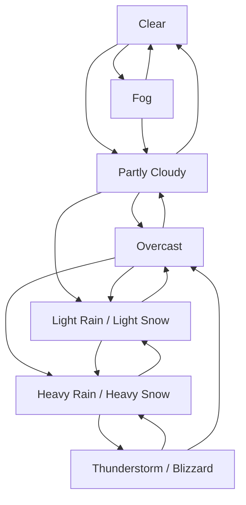

# Voxel World Environment Effects Ruleset

Version: 1.0
Companion documents: `voxel_survival_ruleset.md`, `voxel_creative_ruleset.md`, `voxel_structure_generation_ruleset.md`, `voxel_biome_vegetation_ruleset.md`, `voxel_save_versioning_schema.md`, `voxel_multiplayer_networking_ruleset.md`, and `voxel_audio_vfx_ruleset.md`

This document defines the world environment systems: day/night cycle, lighting, cloud coverage, rain, thunderstorms and lightning, fog, and snow. Rules are written so they can be converted directly into game logic.

---

## 1. Environment system goals

The environment system should:

1. Make the world feel alive through changing light, sky, clouds, and weather.
2. Affect gameplay in simple, predictable ways.
3. Remain deterministic from world seed where possible.
4. Avoid expensive per-block updates by using chunk-level and column-level state.
5. Provide clear hooks for rendering, farming, survival effects, fluids, and block updates.

---

## 2. Core constants

The base game runs at `20 ticks/second`.

```ts
TICKS_PER_SECOND = 20;
TICKS_PER_MINUTE = 1200;
TICKS_PER_DAY = 24000;        // 20 real minutes
DAYS_PER_SEASON = 12;         // Optional seasonal layer
WORLD_SEA_LEVEL = 64;        // 128-tall world; see WorldConstants.SeaLevel
MAX_LIGHT_LEVEL = 15;
MIN_LIGHT_LEVEL = 0;
```

Recommended time scale:

| Game Time | Real Time |
|---:|---:|
| 1 game tick | 1/20 second |
| 1 game hour | 50 seconds |
| 1 game day | 20 minutes |
| 1 game season | 4 hours |
| 1 game year, if seasons enabled | 16 hours |

---

## 3. Environment state schema

```ts
type EnvironmentState = {
  worldTimeTicks: number;
  dayIndex: number;
  timeOfDayTicks: number;          // 0..23999
  normalizedTimeOfDay: number;     // 0.0..1.0

  dayPhase: DayPhase;
  moonPhase: MoonPhase;

  skyLightLevel: number;           // 0..15
  moonLightLevel: number;          // 0..4
  ambientLightLevel: number;       // final outdoor ambient light

  cloudCoverage: number;           // 0.0 clear, 1.0 overcast
  cloudAltitude: number;
  windDirectionDegrees: number;
  windSpeed: number;

  weatherState: WeatherState;
  precipitationType: PrecipitationType;
  precipitationIntensity: number;  // 0.0..1.0
  stormIntensity: number;          // 0.0..1.0
  fogDensity: number;              // 0.0..1.0

  baseTemperatureC: number;
  currentTemperatureC: number;
};

type DayPhase =
  | "PRE_DAWN"
  | "DAWN"
  | "DAY"
  | "DUSK"
  | "NIGHT";

type MoonPhase =
  | "NEW"
  | "WAXING_CRESCENT"
  | "FIRST_QUARTER"
  | "WAXING_GIBBOUS"
  | "FULL"
  | "WANING_GIBBOUS"
  | "LAST_QUARTER"
  | "WANING_CRESCENT";

type WeatherState =
  | "CLEAR"
  | "PARTLY_CLOUDY"
  | "OVERCAST"
  | "LIGHT_RAIN"
  | "HEAVY_RAIN"
  | "THUNDERSTORM"
  | "LIGHT_SNOW"
  | "HEAVY_SNOW"
  | "BLIZZARD"
  | "FOG";

type PrecipitationType = "NONE" | "RAIN" | "SNOW";
```

---

## 4. Time and day/night cycle

### 4.1 Time update

```ts
worldTimeTicks += deltaTicks;
dayIndex = floor(worldTimeTicks / TICKS_PER_DAY);
timeOfDayTicks = worldTimeTicks % TICKS_PER_DAY;
normalizedTimeOfDay = timeOfDayTicks / TICKS_PER_DAY;
```

### 4.2 Day phases

| Phase | Tick Range | Normalized Range | Description |
|---|---:|---:|---|
| Pre-Dawn | `22000–23999` | `0.916–0.999` | Coldest part of the day; light slowly increases near the end |
| Dawn | `0–1999` | `0.000–0.083` | Sunrise; warm tint; light ramps up |
| Day | `2000–9999` | `0.083–0.416` | Brightest outdoor light |
| Dusk | `10000–11999` | `0.416–0.499` | Sunset; orange tint; light ramps down |
| Night | `12000–21999` | `0.500–0.916` | Dark sky; moonlight and artificial light dominate |

Implementation:

```ts
function getDayPhase(timeOfDayTicks) {
  if (timeOfDayTicks < 2000) return "DAWN";
  if (timeOfDayTicks < 10000) return "DAY";
  if (timeOfDayTicks < 12000) return "DUSK";
  if (timeOfDayTicks < 22000) return "NIGHT";
  return "PRE_DAWN";
}
```

### 4.3 Outdoor sky light by time

Sky light uses the `0–15` light scale.

| Phase | Sky Light Rule |
|---|---|
| Dawn | Interpolate from `5` to `15` |
| Day | `15` |
| Dusk | Interpolate from `15` to `5` |
| Night | Moon-dependent, usually `1–4` |
| Pre-Dawn | Interpolate from night value to `5` during final 1000 ticks |

```ts
function lerp(a, b, t) {
  return a + (b - a) * clamp01(t);
}

function getBaseSkyLight(timeOfDayTicks, moonLight) {
  if (timeOfDayTicks < 2000) {
    return round(lerp(5, 15, timeOfDayTicks / 2000));
  }
  if (timeOfDayTicks < 10000) {
    return 15;
  }
  if (timeOfDayTicks < 12000) {
    return round(lerp(15, 5, (timeOfDayTicks - 10000) / 2000));
  }
  if (timeOfDayTicks < 22000) {
    return moonLight;
  }
  return round(lerp(moonLight, 5, (timeOfDayTicks - 22000) / 2000));
}
```

### 4.4 Moon phase

Moon phase cycles every 8 game days.

```ts
moonPhaseIndex = dayIndex % 8;
```

| Index | Phase | Night Sky Light |
|---:|---|---:|
| 0 | New | 1 |
| 1 | Waxing Crescent | 2 |
| 2 | First Quarter | 3 |
| 3 | Waxing Gibbous | 3 |
| 4 | Full | 4 |
| 5 | Waning Gibbous | 3 |
| 6 | Last Quarter | 3 |
| 7 | Waning Crescent | 2 |

---

## 5. Lighting rules

Lighting has two channels:

```ts
type LightState = {
  skyLight: number;    // sunlight/moonlight from open sky
  blockLight: number;  // light from blocks such as lamps and emberflow
};
```

Final visible light:

```ts
visibleLight = max(skyLight, blockLight);
```

### 5.1 Sky light propagation

Sky light enters a column from the top of the world.

```ts
for y = WORLD_MAX_Y down to WORLD_MIN_Y:
    block = getBlock(x, y, z)
    if block.blocksSkyLight:
        currentSkyLight = 0
    else:
        currentSkyLight = max(0, currentSkyLight - block.skyLightAttenuation)
    setSkyLight(x, y, z, currentSkyLight)
```

Block sky-light behavior:

| Block Type | Blocks Sky Light | Attenuation |
|---|---:|---:|
| Air | No | 0 |
| Freshwater | No | 1 per block depth |
| Brine | No | 1 per block depth |
| Frostglass | No | 1 |
| Clearpane Glass | No | 1 |
| Leafmoss | Partial | 2 |
| Snowpack | Partial | 1 |
| Solid terrain | Yes | Full block |
| Stone/crafted blocks | Yes | Full block |
| Doors/hatches | Depends on open state | 0 if open, full if closed |

### 5.2 Horizontal sky light spread

When sky light enters caves or overhangs, spread it sideways with attenuation.

```ts
for each sky-lit air block:
    floodFill neighbors where not opaque
    neighbor.skyLight = max(neighbor.skyLight, current - 1 - neighbor.skyLightAttenuation)
    stop when current <= 1
```

Limit propagation updates by chunk to avoid spikes.

```ts
MAX_LIGHT_UPDATES_PER_TICK = 4096;
```

### 5.3 Block light sources

| Light Source | ID | Light Level | Special Rules |
|---|---|---:|---|
| Glowwick | `glowwick` | 9 | Extinguished if waterlogged |
| Campfire | `campfire` | 12 | Requires fuel; exposed rain can extinguish it |
| Lumen Lamp | `lumen_lamp` | 14 | Permanent unless broken |
| Spark Flare | `spark_flare` | 15 | Lasts 45 seconds |
| Emberflow | `emberflow` | 10 | Fluid light; also emits heat |
| Lumen Quartz Cluster | `lumen_quartz_cluster` | 7 | Natural cave light |
| Staropal Geode | `staropal_geode` | 5 | Faint natural deep light |

Block light propagation:

```ts
for each light source:
    queue source position with source light level
    while queue not empty:
        pos, light = queue.pop()
        for each neighbor:
            nextLight = light - 1 - neighbor.blockLightAttenuation
            if nextLight > neighbor.blockLight:
                neighbor.blockLight = nextLight
                queue.push(neighbor, nextLight)
```

### 5.4 Weather light reduction

Weather reduces outdoor ambient light, not indoor block light.

```ts
weatherLightPenalty = round(cloudCoverage * 3 + precipitationIntensity * 2 + stormIntensity * 2);
ambientLightLevel = clamp(baseSkyLight - weatherLightPenalty, 0, 15);
```

Minimums:

| Condition | Minimum Outdoor Ambient Light |
|---|---:|
| Day, clear | 15 |
| Day, overcast | 12 |
| Day, heavy rain | 10 |
| Day, thunderstorm | 8 |
| Full-moon clear night | 4 |
| New-moon storm night | 0 |

### 5.5 Rendered shadow occlusion (presentation, not simulation)

The 0–15 sky/block light model above is the simulation's light level — what crop growth reads
(`SampleAirLight`, an axis-probe max of sky and emissive, unchanged by anything below) and what
this section otherwise governs. Separately, the voxel renderer bakes a **per-face RGB occlusion
channel** purely for how shadows look, and the two must not be confused: nothing in §5.1–5.4 depends
on it, and it never feeds back into gameplay light levels.

Each face bakes three channels: **R** sky exposure (floor 0 — sealed rooms are black, tunnels fade
to 0 by 12 blocks; `_BakedLightFloor` is the one tuning knob if true black proves unplayable on
device), **G** emitter reach (a voxel line-of-sight ray from the face to each candidate emitter in
range), **B** self-emission. The shader gates the sun/moon/ambient terms by R.

**Each punctual light (glowwick, campfire, lumen lamp, etc.) gets exactly one occlusion term, never
two:**

```ts
if light.ownsShadowSlice:     // GetAdditionalLightShadowParams(i).w >= 0
    occlusion = light.shadowMap;   // ~4 cm resolution
else:
    occlusion = G;                 // 1 sample per face, ~1 m resolution
```

Applying both was a real bug: multiplying a 1 m term by a 4 cm term let the coarser one zero the
finer one and stepped emitter shadows onto block boundaries. `shadowStrength` is `1.0` for lights
that own a slice — a lower value never governed anything while G was also hard-zeroing the term, so
raising it back to 1.0 changed nothing observable.

Only the nearest `GlowwickLightManager.MaxShadowCastingLights` (currently **1**) emitters actually
cast a shadow map; every other emitter is occluded by G alone, so its occlusion edge lands on a
block boundary rather than following geometry exactly. The escalation if that reads badly on device
is raising `MaxShadowCastingLights`, not per-corner sampling — 16 line-of-sight walks per face on
the main-thread chunk rebuild was measured as too expensive.

**Fails safe:** with the shadow keyword stripped from a build, every light reports no owned slice
and G gates everything — the same behavior every emitter had before this model existed.

Known gap: baked light is time-of-day independent. The sun/moon still do the actual darkening: the
bake only gates whether they're allowed to light a face at all.

---

## 6. Temperature rules

Temperature determines whether precipitation falls as rain or snow and whether snow or ice can accumulate.

### 6.1 Biome base temperatures

| Biome | Base Temperature C |
|---|---:|
| Dunes | 34 |
| Drybrush | 26 |
| Meadow | 18 |
| Wetland | 16 |
| Pinewild | 10 |
| Highlands | 8 |
| Tundra | -8 |

### 6.2 Temperature modifiers

```ts
altitudeModifier = -0.15 * max(0, y - WORLD_SEA_LEVEL);
nightModifier = isNight(timeOfDayTicks) ? -5 : 0;
preDawnModifier = dayPhase == "PRE_DAWN" ? -2 : 0;
rainModifier = precipitationType == "RAIN" ? -2 * precipitationIntensity : 0;
snowModifier = precipitationType == "SNOW" ? -4 * precipitationIntensity : 0;
seasonModifier = getSeasonModifier(dayIndex); // optional
```

The lapse rate is `0.15 C` per block above sea level. The playable altitude band is only 0–48 blocks (terrain peaks at `WORLD_SEA_LEVEL + 48`, ~y=112 in the 128-tall world), so `0.15` yields `-7.2 C` at the tallest natural peak — comparable to the night modifier, and enough to push Highlands under the cold-exposure threshold on high ground in clear daylight and below freezing there at night. The earlier `0.08` figure was written for the retired 256-tall world; across the current world it left elevation thermally irrelevant next to the 42 C biome spread.

Final temperature:

```ts
currentTemperatureC =
    biomeBaseTemperatureC
  + altitudeModifier
  + nightModifier
  + preDawnModifier
  + rainModifier
  + snowModifier
  + seasonModifier;
```

Optional season modifiers:

| Season | Modifier C |
|---|---:|
| Spring | 0 |
| Summer | +6 |
| Autumn | -2 |
| Winter | -8 |

Shipped model: `biomeBaseTemperatureC + altitudeModifier + nightModifier + rainModifier + snowModifier`. `preDawnModifier` and `seasonModifier` are not implemented — the world clock exposes normalized time and a day/night split only, with no `PRE_DAWN` day phase and no seasonal layer to key them off.

### 6.3 Precipitation type

```ts
if precipitationIntensity <= 0:
    precipitationType = "NONE"
else if currentTemperatureC <= 0:
    precipitationType = "SNOW"
else:
    precipitationType = "RAIN"
```

Mixed precipitation can be ignored for the first implementation. Use either rain or snow per chunk based on local temperature.

Precipitation type is a **per-location derivation, never a weather-state change**. It is recomputed on every environment query from the synced weather state plus the local temperature, so it never enters the weather state machine, the sync payload, or a save: two peers standing in the same place derive the same answer with zero extra network traffic, and one storm can fall as rain in the valley and snow on the peak above it. Two rules refine the table above:

- Inherently cold states (Light Snow, Heavy Snow, Blizzard) always fall as snow, whatever the local temperature.
- Rain states (Light Rain, Heavy Rain, Thunderstorm) fall as snow at or below freezing and as rain otherwise.

The rain/snow test runs against the temperature computed **without** the rain and snow modifiers, and only then is the chosen modifier applied. Feeding the modifier back into the test would let a location a fraction of a degree above freezing flip to snow, cool by `-4 C`, and flip back on the next query.

Falling is not settling: precipitation type only says what arrives at a location, while laying down a snowpack layer additionally requires the local temperature at or below freezing per §12's accumulation rule — so an inherently cold state over warm ground (a blizzard crossing the dunes) shows snowfall without leaving any snow cover.

---

## 7. Cloud coverage

Cloud coverage is a value from `0.0` to `1.0`.

| Coverage | Name | Visual Result | Gameplay Effect |
|---:|---|---|---|
| `0.00–0.20` | Clear | Few or no clouds | No light penalty |
| `0.21–0.45` | Scattered | Small cloud groups | Minor sky variation only |
| `0.46–0.70` | Partly Cloudy | Frequent clouds | Light penalty up to 2 |
| `0.71–0.90` | Overcast | Most sky covered | Light penalty 2–3 |
| `0.91–1.00` | Storm Cover | Dark heavy clouds | Light penalty 3–5; enables storms |

### 7.1 Cloud update

Update weather and cloud coverage every `6000 ticks` by default.

```ts
WEATHER_UPDATE_INTERVAL = 6000; // 5 real minutes
```

Cloud coverage moves gradually toward a target.

```ts
cloudCoverage = moveToward(cloudCoverage, targetCloudCoverage, 0.002 * deltaTicks);
```

Target cloud coverage comes from biome humidity, current weather state, and random variation.

```ts
targetCloudCoverage = clamp01(
    biomeHumidity
  + weatherCloudBonus
  + noise2D(seed + dayIndex, regionX * 0.02, regionZ * 0.02) * 0.25
);
```

Biome humidity values:

| Biome | Humidity |
|---|---:|
| Dunes | 0.10 |
| Drybrush | 0.25 |
| Meadow | 0.50 |
| Pinewild | 0.65 |
| Wetland | 0.85 |
| Highlands | 0.45 |
| Tundra | 0.45 |

Weather cloud bonuses:

| Weather State | Bonus |
|---|---:|
| Clear | -0.20 |
| Partly Cloudy | +0.05 |
| Overcast | +0.25 |
| Light Rain / Light Snow | +0.35 |
| Heavy Rain / Heavy Snow | +0.50 |
| Thunderstorm / Blizzard | +0.65 |
| Fog | +0.20 |

### 7.2 Cloud rendering

Clouds ship as **two layers with one coverage between them**: a geometry deck of blocky cells at
altitude, and a veil painted into the skybox itself. Neither alone was enough. A skybox-only sky has
no volume and no underside, so it reads as painted on; a geometry-only sky needs an absurd extent to
reach the horizon.

**The deck** is a grid of 10 m cells at `y = 160`, above `WorldMaxY` so nothing buildable can reach
it, drifting with the wind. Occupancy comes from two octaves of interpolated value noise thresholded
against a measured quantile table, so a requested fraction of cells is the fraction that appears.
Interpolated rather than box-filtered noise is what makes masses with ragged edges instead of
salt-and-pepper.

Three properties of the deck are load-bearing:

- **It is render-only.** Never a voxel, never saved, never collided with, and a pure function of
  `(seed, clock)` — so every peer computes the same sky with nothing on the wire, consistent with
  the lockstep world simulation.
- **The deck's coverage is not the weather's coverage.** A cell is 10 m across and 5 m deep, so at a
  grazing angle its silhouette is several times its footprint — roughly 2.9× at 15° of elevation,
  and most of the sky's solid angle is near the horizon. The same coverage also drives the veil. The
  deck therefore fills `cloudCoverage^1.75` of its cells: Clear 0.10 → 0.018, Partly Cloudy 0.45 →
  0.25, Overcast 0.80 → 0.68, Thunderstorm 1.00 → 1.00.

  The coverage-to-occupancy mapping is a **measured quantile table**, not a formula, and its stops
  are dense at both ends deliberately. A table that interpolates straight across the density field's
  tail is wrong exactly where it matters: an earlier one ran a line from "empty" to the 5% quantile
  and rendered **0.07% of cells for a requested 1.78%** — a 25× miss, i.e. a completely cloudless
  sky at Clear. Measured over 43,200 cells across three seeds, the shipped table is within 0.46
  percentage points at its worst across all ten weather states.
- **The deck is a circle, and it dissolves rather than ending.** A filled square's boundary is 41%
  further away at the corners than at the edge midpoints, so at a fixed altitude the rim rises and
  falls around the compass — an unmistakably man-made signature. Inside a radius of 450 m, coverage
  ramps to zero over the outer half, cell thickness tapers, and every face crossfades to the aerial
  colour (§7.4), so the far cells are still drawn and simply stop being distinguishable from the sky.

  In angles, from a player at sea level with the deck ~90 m overhead — and these are what to check
  a change against, since the metres mean nothing on their own:

  | Zone | Radius | Elevation | Share of the sky's solid angle |
  |---|---|---|---|
  | Deck at full strength | 0–207 m | above 23.5° | 60% |
  | Dissolving | 207–450 m | 23.5° down to 11.3° | 20% |
  | Veil only | beyond 450 m | below 11.3° | 20% |

  (The share of a hemisphere's solid angle above elevation θ is `1 − sin θ`, which is why so much
  of the sky sits near the horizon and why the deck's thickness matters more than its footprint.)

  Note the square it replaced reached only 17.8°, so the deck now extends FURTHER while its
  full-strength core is smaller — which is the shape "enlarge it and blend the edges" asks for.

- **The deck is only used for Clear, Partly Cloudy, and Overcast.** All seven precipitation and fog
  states render the veil alone, at full coverage share (see below). This is not a simplification for
  those states, it is a correction: at the near-total coverage those states request, the deck's
  circular rim projects, under ordinary perspective, as a conic that pinches toward a point in
  whatever direction the player happens to be looking near the ring's own elevation — the "two
  edges meeting at a corner" a solid overcast sheet reads as on screen. That compression is a
  property of viewing a bounded disc edge-on; no width of world-space fade band removes it, because
  the fade dissolves the boundary in world space and the compression happens in the PROJECTION of
  that already-dissolved boundary. The deck's geometric depth is also invisible once coverage is
  that high — a solid flat-bottomed sheet looks the same with or without geometry under it — so
  those states lose nothing real by dropping it. The veil has no rim to compress, being painted at
  infinity.

  For the three states that keep the deck, the rim's COLOUR fade (not its occupancy — which cells
  exist stays a linear function of `RimFade`) is eased with `smoothstep` rather than blended
  linearly. This is a mitigation for the same projection effect at lower coverage, where it is
  present but less severe: spending more of the fade band already close to the sky colour softens
  how much of the compressed edge survives on screen. A true fix would compute the fade per camera
  per frame, which the flat, unlit, baked-per-vertex contract the deck renders under does not
  support.

**The veil** keeps the rest of the hemisphere, including the band below the deck's rim, so the two
layers hand off to each other. Coverage drives a **threshold** there, not an opacity:

```ts
// Two octaves of value noise, generated in the shader -- no cloud texture ships.
density   = cloudNoise(viewDirection projected onto a plane overhead);
threshold = 1.0 - cloudCoverage * skyVeilShare;
amount    = smoothstep(threshold, threshold + softness, density);
```

Threshold rather than opacity matters: at low coverage a few small clouds appear and grow and join
up as it rises, whereas fading a full-sky sheet in and out reads as haze rather than as weather.
Coverage is **split** between the layers and never applied twice while the deck is in play —
driving both at once stacks an opaque deck under an opaque veil and reads as soup rather than as
overcast. `skyVeilShare` is the deck's usual thin share (0.35) for Clear, Partly Cloudy, and
Overcast, and jumps to 1.0 for every other state, where the veil is the only layer carrying the
weather and has to be able to close the sky on its own.

Both layers grey toward storm and darken at night along with the rest of the sky, but never to
black — an overcast night must not become a flat void.

Gameplay effect (unchanged, and the *only* thing coverage did before any of this):

```ts
if cloudCoverage > 0.75:
    outdoorSolarLightPenalty = 2 or 3
```

### 7.3 Sky rendering

The sky is a generated material owned by the lighting cycle, written in the same pass that already
owns the sun, ambient and fog.

**Elevation comes from the CLOCK, never from the directional light's rotation.** This is the
load-bearing rule. One shared directional light serves as both sun and moon (§5), and at night it is
rotated to come from overhead so the ground stays lit — so its rotation says "day" at midnight. The
project previously used Unity's stock procedural skybox, which derives the sky from exactly that
rotation, and consequently rendered a full noon sky behind a correctly dark world.

```ts
sunElevation = sin(normalizedTime * 2 * PI);   // +1 midday, -1 midnight, 0 at dawn/dusk
dayAmount    = smoothstep over the twilight band around elevation 0
```

| Term | Rule |
|---|---|
| Zenith / horizon / ground | Crossfade night → day on `dayAmount`, with a warm horizon peaking through the twilight band |
| Night floor | Dark blue-black, never pure black — a black sky reads as a rendering failure |
| Moon phase | A moonless night's sky is darker than a full-moon one, matching the directional term |
| Overcast | Scales the whole gradient down; heavier coverage, darker sky |
| Sun disk | Hidden once `sunElevation` is below the horizon, so no disk appears at the zenith at midnight |

---

---

### 7.4 The aerial colour, and the edge of the world

The world is a fixed 128 × 128 blocks. That is the whole world, not a streaming radius — its outer
columns are real rendered faces with nothing behind them, so from any elevation the map ended in a
square cliff standing in an empty band of sky.

A **horizon skirt** covers it: a flat plane at sea level filling a rectangular annulus from the
world's own boundary out to 360 m. It extends nothing. It is not a voxel, is not saved, is not
collidable, and is not simulated; the island it leaves behind reads as an island in an open sea,
which is a coherent thing to be rather than a truncation. Its outer extent is bounded by the
camera's 500 m far clip, not by taste: a triangle crossing the far plane is clipped, and a hard arc
sweeping around the player at exactly 500 m would be worse than the edge it replaces.

The plane is finite too, so it has the same problem one ring out, and it is solved by colour rather
than by size. Define the **aerial colour** as what anything infinitely far away looks like — the
sky's own horizon colour for the current time of day and weather. Four things are driven from it and
must not hold separate opinions:

| Surface | Why it has to match |
|---|---|
| `RenderSettings.fogColor` | Distant terrain melts into the sky; that is what aerial perspective is |
| The skybox's below-horizon band | Below the horizon is, by definition, infinitely distant ground |
| The cloud deck's rim | Its last cells must be indistinguishable from the sky behind them |
| The horizon skirt's rim | Same, one ring further out |

The skybox is deliberately never fogged (Background queue, no `MixFog`), so every surface that has
to disappear against it disappears against a colour computed elsewhere. With four of them meeting,
any deviation at all draws a seam somewhere, and the sky's horizon colour is the only choice that
makes all four agree. It already carries time of day and the overcast darkening, so nothing is lost
by not tinting it separately.

## 8. Weather state machine

Weather runs per climate region, not per block. A climate region can be `8 × 8 chunks`.

```ts
CLIMATE_REGION_SIZE_CHUNKS = 8;
```

Each region stores:

```ts
type ClimateRegionState = {
  regionX: number;
  regionZ: number;
  weatherState: WeatherState;
  targetWeatherState: WeatherState;
  weatherAgeTicks: number;
  nextWeatherRollTick: number;
  precipitationIntensity: number;
  stormIntensity: number;
  fogDensity: number;
};
```

### 8.1 Weather transitions

Roll a transition every `6000 ticks`.

```ts
if worldTimeTicks >= region.nextWeatherRollTick:
    region.targetWeatherState = rollNextWeather(region)
    region.nextWeatherRollTick += WEATHER_UPDATE_INTERVAL
```

Base transition table:

| Current State | Possible Next States |
|---|---|
| Clear | Clear, Partly Cloudy, Fog |
| Partly Cloudy | Clear, Partly Cloudy, Overcast, Light Rain/Snow |
| Overcast | Partly Cloudy, Overcast, Light Rain/Snow, Heavy Rain/Snow |
| Light Rain/Snow | Overcast, Light Rain/Snow, Heavy Rain/Snow |
| Heavy Rain/Snow | Light Rain/Snow, Heavy Rain/Snow, Thunderstorm/Blizzard |
| Thunderstorm | Heavy Rain, Light Rain, Overcast |
| Light Snow | Overcast, Light Snow, Heavy Snow |
| Heavy Snow | Light Snow, Heavy Snow, Blizzard |
| Blizzard | Heavy Snow, Light Snow, Overcast |
| Fog | Clear, Partly Cloudy, Overcast |

### 8.2 Transition weights

Start with biome climate weights:

| Biome | Clear | Cloudy | Rain/Snow | Storm/Fog |
|---|---:|---:|---:|---:|
| Dunes | 65 | 25 | 3 | 7 fog/sand-haze equivalent |
| Drybrush | 50 | 30 | 10 | 10 |
| Meadow | 35 | 35 | 20 | 10 |
| Pinewild | 25 | 35 | 28 | 12 |
| Wetland | 18 | 32 | 35 | 15 |
| Highlands | 30 | 35 | 22 | 13 |
| Tundra | 25 | 35 | 30 | 10 |

Then apply current-state inertia:

```ts
weight[currentWeatherState] *= 2.0;
```

Apply time-of-day fog bonus:

```ts
if dayPhase == "PRE_DAWN" or dayPhase == "DAWN":
    fogWeight *= 1.6
```

Apply temperature precipitation conversion:

```ts
if rolled precipitation and currentTemperatureC <= 0:
    use snow state
else:
    use rain state
```

### 8.3 Weather intensity smoothing

Weather should not change instantly.

```ts
precipitationIntensity = moveToward(precipitationIntensity, targetPrecipitationIntensity, 0.0015 * deltaTicks);
stormIntensity = moveToward(stormIntensity, targetStormIntensity, 0.0010 * deltaTicks);
fogDensity = moveToward(fogDensity, targetFogDensity, 0.0015 * deltaTicks);
```

Target values:

| Weather State | Target Cloud | Target Precipitation | Target Storm | Target Fog |
|---|---:|---:|---:|---:|
| Clear | 0.10 | 0.00 | 0.00 | 0.00 |
| Partly Cloudy | 0.45 | 0.00 | 0.00 | 0.00 |
| Overcast | 0.80 | 0.00 | 0.00 | 0.05 |
| Light Rain | 0.85 | 0.35 | 0.00 | 0.10 |
| Heavy Rain | 0.95 | 0.75 | 0.05 | 0.15 |
| Thunderstorm | 1.00 | 0.90 | 1.00 | 0.20 |
| Light Snow | 0.85 | 0.30 | 0.00 | 0.12 |
| Heavy Snow | 0.95 | 0.70 | 0.00 | 0.25 |
| Blizzard | 1.00 | 0.85 | 0.70 | 0.55 |
| Fog | 0.65 | 0.00 | 0.00 | 0.65 |

---

## 9. Rain rules

Rain occurs when:

```ts
weatherState in ["LIGHT_RAIN", "HEAVY_RAIN", "THUNDERSTORM"]
and currentTemperatureC > 0
```

Rain only reaches blocks with sky exposure.

```ts
isRainedOn(pos) = hasOpenSky(pos) && precipitationType == "RAIN" && precipitationIntensity > 0
```

### 9.1 Rain intensity

| Weather State | Intensity | Visual | Gameplay |
|---|---:|---|---|
| Light Rain | `0.20–0.45` | Thin rainfall | Moistens soil slowly |
| Heavy Rain | `0.60–0.85` | Dense rainfall | Extinguishes exposed weak flames |
| Thunderstorm | `0.75–1.00` | Dense rainfall, dark sky | Enables lightning strikes |

### 9.2 Precipitation rendering

Rain and snow are a **continuous head-locked volume**, not scattered one-shot bursts.

```ts
simulationSpace = World;          // NOT Local -- see below
shape           = box overhead, following the head in POSITION only
emissionRate    = maxRate * precipitationIntensity;   // ramped, not switched
```

Two rules here exist because breaking either makes precipitation invisible or wrong, and both were
broken before:

- **World simulation space.** In Local space every particle is welded to the XR origin — the same
  transform teleport, continuous move and snap turn all drive — so precipitation travels with the
  player, never falls past them, and swings 45° with every snap turn.
- **Position without rotation.** The volume follows the head so it stays populated wherever the
  player walks, but must not inherit head rotation, or the whole weather system rotates with the
  view.

Density has to be sufficient to read at all. Rain at full intensity keeps on the order of a hundred
or more particles alive in the volume; a handful of sub-degree billboards is indistinguishable from
nothing. Rain renders as a stretched streak — most of what makes it read as rain rather than as
floating dots — and snow as a drifting billboard with noise, since rain that wanders reads as ash.

Fog is real distance fog (§11), not particles. Fog wisps remain a sparse scatter cue layered on top
of it.

> **Build note.** Fog shader variants are stripped under Automatic stripping unless a scene in the
> build has fog enabled at build time. Every scene here ships with fog off because the lighting
> controller enables it at runtime, so fog stripping must stay **Custom** with the ExpSq mode kept,
> or fog works in the editor and silently does nothing in the player.

### 9.3 Rain effects

| Target | Effect |
|---|---|
| `tended_soil` | Sets `moisture = max(moisture, 0.75)` if sky-exposed |
| Crops | Growth chance `×1.15` if soil is moist and not flooded |
| Campfire | 10% chance every 5 seconds to extinguish if exposed and intensity > 0.5 |
| Glowwick | No effect unless block becomes waterlogged |
| Emberflow | Rain particles only; no direct conversion unless adjacent freshwater forms |
| Exposed cauldron/jar block, if added | Fills slowly with freshwater |
| Loose snow | Rain increases melt rate if temperature > 0 |
| Player | Optional wetness status if survival temperature system is enabled |

### 9.4 Soil moisture

```ts
type SoilMoistureState = {
  moisture: number; // 0.0 dry, 1.0 saturated
};
```

Moisture update every 60 seconds:

```ts
if isRainedOn(pos):
    moisture = min(1.0, moisture + 0.25 * precipitationIntensity)
else if freshwaterWithin4Blocks(pos):
    moisture = min(1.0, moisture + 0.10)
else:
    moisture = max(0.0, moisture - 0.05)
```

Crop growth uses:

```ts
soilIsMoist = moisture >= 0.35;
```

### 9.5 Rain sound zones

Sound should be based on whether the listener is exposed.

| Listener Condition | Sound Rule |
|---|---|
| Under open sky | Full rain volume |
| Under leaves/glass | Muffled rain volume |
| Underground | Very low or no rain volume |
| Near opening/cave mouth | Low distant rain volume |

---

## 10. Thunderstorm and lightning rules

Thunderstorms occur when:

```ts
weatherState == "THUNDERSTORM"
```

Lightning is **atmospheric only**. It scorches two block types and does no damage to players or
entities. It exists to make a storm feel like a storm.

This section describes what ships. The earlier draft specified a weighted target table, three
impact zones with damage values, and two new blocks; none of that was ever implemented, and it has
been removed rather than left as an aspiration that reads like a contract. Where a decision was
taken deliberately against the obvious answer, the reason is recorded here so it is not "fixed"
later.

### 10.1 Lightning attempt rate

Every `200 ticks` (10 seconds) of thunderstorm, one strike is rolled. The odds of that roll are not
constant: they come from the storm's own character and from how far through the storm it is.

```ts
LIGHTNING_CHECK_INTERVAL_TICKS = 200;

// Per-storm violence, derived from the world seed and the storm's start tick, so every peer
// computes the same value with nothing extra sent over the wire.
character = deterministicUnitRoll(worldSeed, stormStartTick);   // 0..1
peakChance = lerp(12, 70, character);                           // percent

// A build-peak-taper arc across the storm's life. Never reaches zero: a storm that stops
// striking entirely at its edges reads as broken weather rather than as a storm tapering.
progress = clamp01(ticksInState / minimumStateDurationTicks(THUNDERSTORM));
arc = lerp(0.35, 1.0, 4 * progress * (1 - progress));

strikeChancePercent = round(peakChance * arc);
```

A thunderstorm segment is `1200 ticks`. The weather machine re-rolls its transition at the end of
each segment and may choose Thunderstorm again, which resets `ticksInState` — so a long storm is a
sequence of segments, each with its own character and arc. That is intended: a ten-minute storm
surges and lulls rather than holding one intensity.

### 10.2 Strike target selection

Strikes are biased into a **ring around a player**, not drawn from the whole world. A strike nobody
witnesses is worth nothing, and the previous whole-world draw meant essentially every strike
happened somewhere unobserved.

```ts
MIN_RING_RADIUS = 10;
MAX_RING_RADIUS = 96;
MAX_SELECTION_ATTEMPTS = 8;

anchor = randomKnownPlayerHead();          // local camera plus every connected player
angle  = uniform(0, 2 * PI);
radius = uniform(MIN_RING_RADIUS, MAX_RING_RADIUS);   // uniform in RADIUS, not in area
```

Radius is uniform across the band on purpose. Distance is the point — consecutive strikes should
differ, some close enough to fill the view and some distant silhouettes — and the flash and thunder
are both scaled from it. Area-uniform sampling (`radius = sqrt(u)`) was rejected: it concentrates
strikes against the outer edge where storm fog washes them out, which is close to the problem being
fixed.

`MIN_RING_RADIUS` sits just outside the player exclusion radius below, so the comfort exclusion is
an invariant of the selection rather than a filter applied after it.

All eight candidates are drawn up front and then walked until one is accepted, so a rejection no
longer wastes the whole 10-second interval, and the RNG stream advances by a fixed amount however
the rejections fall. Lightning uses its own stream, separate from snowpack sampling, for that
reason.

Rejection rules:

```ts
if !hasOpenSky(targetPos)                              reject   // implicit: the column's top block
if withinRadius(target, spawn, 8)                      reject
if withinRadius(target, anyPlayerHead, 8)              reject
```

Material weighting is **not implemented**. Every valid column is equally likely.

**Determinism, stated plainly.** The cadence, the intensity roll and the RNG stream are
deterministic. The struck column is not, because the anchor is a live head position. Placement
already depended on head proximity as a rejection input; ring bias makes that dependence total. An
invisible deterministic strike is worth less than a visible one.

### 10.3 Lightning impact

**Lightning deals no damage** — not to players, not to entities, in any game mode. There are no
impact zones and no knockback. It scorches the block it hits (§10.4) and produces the bolt, the sky
flash and the thunder.

### 10.4 Block effects

| Block | Lightning Effect |
|---|---|
| Meadow Turf | Becomes `dry_turf` |
| Leafmoss | Burns away to air |
| Anything else | Unaffected; the strike still flashes and thunders |

No new blocks are introduced. `charred_log` and `stormglass` were proposed by the earlier draft and
are deliberately not shipped: a new `BlockId` changes the registry hash recorded in the save format,
so they are not the cosmetic addition they look like.

### 10.5 Bolt, flash and thunder

**The bolt** is a procedural ribbon mesh, not a sprite. A stretched point-filtered tile visibly
stair-steps over tens of blocks, and any single tall billboard reads as a flat card in stereo,
swimming as the head translates — fatal for the one effect the player is meant to look at.

```ts
lateralWander   = 0.11 * boltHeight;   // random walk, not an oscillation
forks           = 3;
ribbonHalfWidth = 0.38 blocks;         // widened with distance to hold >= 1.5 px on screen
colour          = white-hot core -> blue edge, via a generated 64x1 alpha ramp across the width
```

Soft edges come from that ramp rather than from stacked layers, so the whole bolt — main channel,
forks and impact glow — is one mesh and one draw. Billboarding is **yaw only**; a full look-at
rotation tilts the bolt when the player looks up and gives away the flat card.

**The sky flash** modulates `RenderSettings.ambientLight` and **never the sun**. At night the sun
sits below the shadow-casting intensity floor, so raising it for a flash would flip the entire
shadow pass on and off for two frames — a full shadow-caster sweep over every loaded chunk, with
every shadow in the scene snapping in and out. Ambient is flat, so an additive term is free and
lifts everything uniformly, which is what a flash looks like anyway. No point light is created: the
runtime point-light budget is fully spent on emitters with distance eviction, so a lightning light
would evict a torch the player is standing next to.

```ts
flashDurationSeconds = 0.30;    // the old flashDurationTicks = 6, at 20 ticks/second
attackSeconds        = 0.04;    // not a single-frame pop at 72 Hz

// Quadratic, because real brightness falls with distance squared and a linear ramp reads far too
// bright out in the middle of the ring. Exactly zero at the ring's outer edge: the term is
// re-added every frame, so a residual would bleed into ambient permanently.
distanceStrength(d) = 1.0                                   if d <= 20
                    = (1 - (d - 20) / (96 - 20))^2          if 20 < d < 96
                    = 0.0                                   if d >= 96
```

One flash at a time, with a minimum re-trigger gap, so two close strikes cannot compound into a
strobe.

**Thunder** plays **2D (global), not positionally**, matching the audio ruleset's "global with
distance-based delay". Positional playback would route through a shared round-robin source pool that
moves whichever source it picks — cutting off a clip still ringing — and would apply Unity's own
distance rolloff on top of the curve below, attenuating twice.

```ts
thunderDelaySeconds = distanceBlocks / 34.0;
thunderVolume       = clamp01(1.0 - distanceBlocks / 128.0);
thunderClip         = distanceBlocks <= 40 ? THUNDER_NEAR : THUNDER_FAR;
```

`34` is **deliberately about ten times slower than the real speed of sound**. Physically honest
propagation over a 96-block ring peaks at 0.28 s, which no player perceives as a delay at all; at 34
the same strike arrives 2.8 s after the flash, and that gap is the single strongest distance cue the
game has. Do not "correct" this constant. (An earlier `/343.0` appears in
[voxel_audio_vfx_ruleset.md](voxel_audio_vfx_ruleset.md) history and has been removed there.)

The `128` divisor replaces an earlier `256`, which was written for a world where strikes could be
that far away; against the 96-block ring it left the most distant thunder playing at 62% volume,
flattening the exact distinction this is built on.

Ambient storm rumble — thunder with no strike behind it — always uses the far clip. It has no
distance, and a near crack from nowhere fights the real strikes.

### 10.6 Comfort

| Setting | Effect on lightning |
|---|---|
| Reduced Flash | Suppresses **both** the bolt and the sky flash. Thunder still plays: the setting suppresses the visuals, not the storm. |
| Reduced Particles | Fewer bolt segments and a smaller impact glow. |
| Weather volume / Mute All | Gate thunder like any other weather cue. The per-strike distance volume folds in beneath them and cannot scale past them. |

Two accommodations are **specified but not implemented**: a reduced-thunder audio option and a
thunder haptic. Both are recorded in
[voxel_audio_vfx_ruleset.md](voxel_audio_vfx_ruleset.md) and remain open.

---

## 11. Fog rules

Fog is both a weather state and a local visual effect. It can occur during clear weather in valleys, wetlands, caves, and cold mornings.

### 11.1 Fog density

Fog density ranges from `0.0` to `1.0`.

| Density | Name | Visibility Distance |
|---:|---|---:|
| `0.00–0.10` | None | Normal render distance |
| `0.11–0.30` | Haze | 80% render distance |
| `0.31–0.55` | Light Fog | 60% render distance |
| `0.56–0.75` | Dense Fog | 40% render distance |
| `0.76–1.00` | Heavy Fog | 20% render distance |

```ts
visibilityMultiplier = lerp(1.0, 0.2, fogDensity);
visibleDistance = baseRenderDistance * visibilityMultiplier;
```

### 11.2 Fog generation conditions

Fog chance increases with moisture and low temperature difference.

```ts
fogChance = 0.02;
fogChance += biomeHumidity * 0.08;
if dayPhase == "PRE_DAWN" or dayPhase == "DAWN": fogChance += 0.10;
if biome == "Wetland": fogChance += 0.12;
if precipitationIntensity > 0.5: fogChance += 0.04;
if windSpeed > 0.9: fogChance -= 0.08;
```

Fog cannot become heavy in Dunes unless using a sand-haze variant.

```ts
if biome == "Dunes":
    maxFogDensity = 0.35
else:
    maxFogDensity = 1.0
```

### 11.3 Height-based fog

Valley fog forms below nearby terrain height.

```ts
localValleyDepth = averageNeighborHeight(radius=12) - currentY;
valleyFogBonus = clamp01(localValleyDepth / 32) * 0.25;
```

Cave fog forms underground near water or brine.

```ts
if !hasOpenSky(pos) and fluidWithinRadius(pos, 8):
    localFogDensity += 0.15
```

### 11.4 Fog gameplay effects

| System | Effect |
|---|---|
| Visibility | Reduces render/far-clip distance |
| Navigation | Map remains available; distant wayflags may be hidden visually |
| Lighting | Does not reduce block light; scatters visible light for rendering |
| Sound | Optional muffling above density `0.6` |
| AI, if added | Detection range `× (1.0 - fogDensity * 0.5)` |
| Crops | No direct effect |
| Snow/rain | Heavy precipitation adds local haze/fog |

---

## 12. Snow rules

Snow occurs when precipitation is active and local temperature is at or below freezing.

```ts
if precipitationIntensity > 0 and currentTemperatureC <= 0:
    precipitationType = "SNOW"
```

Snow only accumulates on blocks with sky exposure.

```ts
canAccumulateSnow(pos) =
    hasOpenSky(pos.above)
    and blockAt(pos).hasSolidTopFace
    and !blockAt(pos.above).isFluid
    and currentTemperatureC <= 0
```

### 12.1 Snow intensity

| Weather State | Intensity | Visual | Gameplay |
|---|---:|---|---|
| Light Snow | `0.20–0.45` | Gentle snowfall | Slow accumulation |
| Heavy Snow | `0.60–0.85` | Dense snowfall | Faster accumulation, reduced visibility |
| Blizzard | `0.75–1.00` | Wind-driven snow | Fast accumulation, heavy fog, reduced movement if enabled |

### 12.2 Snow layers

Represent snow as a block with depth metadata.

```ts
type SnowLayerBlock = {
  id: "snowpack";
  depth: number; // 1..8
};
```

Accumulation update every 60 seconds:

```ts
if canAccumulateSnow(pos):
    chance = precipitationIntensity * biomeSnowModifier
    if random() < chance:
        increaseSnowDepth(pos.above, 1)
```

Depth behavior:

| Current State | Accumulation Result |
|---|---|
| No snow | Place `snowpack` depth 1 |
| Snow depth 1–7 | Increase depth by 1 |
| Snow depth 8 | Optional: convert to full `snow_block` if added, or stay depth 8 |

Biome snow modifiers:

| Biome | Snow Modifier |
|---|---:|
| Tundra | 1.5 |
| Highlands | 1.3 |
| Pinewild | 1.0 |
| Meadow | 0.8 |
| Wetland | 0.7 |
| Drybrush | 0.2 |
| Dunes | 0.0 unless extreme cold event enabled |

### 12.3 Snow melting

Snow melts when temperature rises above freezing or strong light reaches it.

Update every 60 seconds:

```ts
meltChance = 0;
if currentTemperatureC > 0:
    meltChance += clamp01(currentTemperatureC / 12) * 0.4;
if visibleLight >= 12:
    meltChance += 0.2;
if isRainedOn(pos):
    meltChance += 0.3;

if random() < meltChance:
    decreaseSnowDepth(pos, 1);
```

If depth reaches `0`, remove the `snowpack` block.

Shipped melt rule: the shipped implementation has no depth metadata and removes an exposed `snowpack` block outright, sampled only while the weather state is **Clear**, with none of the temperature, light, or rained-on terms above — a clear sky melts exposed snow even at -24 °C tundra midnight. The temperature blindness is deliberate and load-bearing: Clear holds roughly 30% of the weather-state occupancy against roughly 27% total precipitation, which caps always-freezing terrain (tundra qualifies for accumulation under every precipitating state, day and night) at a stable partial snow cover (~47% at equilibrium) instead of whitening monotonically to 100%. Do not gate the shipped melt on `currentTemperatureC > 0` without pairing it with a sublimation or depth-decay path for sub-zero biomes, or tundra and highlands snowpack becomes permanent. The full model above (depth layers plus temperature/light/rain melt terms) remains the target design.

### 12.4 Snow effects

| Target | Effect |
|---|---|
| Exposed terrain | Accumulates snow layers |
| Crops | Growth paused if covered by snow |
| Tended soil | Moisture preserved under snow |
| Leaves | Snow can rest on top but not inside leaf blocks |
| Glass | Snow can accumulate on top unless heat/light source prevents it |
| Campfire | Snow within radius 2 melts if campfire is lit |
| Lumen Lamp | Snow within radius 1 melts if lamp light level is 14 |
| Player movement | Optional 5–15% slowdown for snow depth 6+ |
| Sound | Footstep sound changes on snowpack |

### 12.5 Blizzard effects

Blizzard is heavy snow plus high wind and fog.

```ts
if weatherState == "BLIZZARD":
    precipitationType = "SNOW"
    precipitationIntensity >= 0.75
    fogDensity = max(fogDensity, 0.55)
    windSpeed = max(windSpeed, 1.2)
```

Optional survival effects:

| System | Rule |
|---|---|
| Cold exposure | Increases if player is sky-exposed during blizzard |
| Movement | Horizontal movement speed `×0.90` outdoors |
| Visibility | Render distance `×0.35` outdoors |
| Torch-like items | Spark Flare duration reduced by 25% if exposed |

---

## 13. Ice and freezing rules

Freshwater can freeze in cold conditions. Brine freezes only in extreme cold.

```ts
canFreezeWater(pos) =
    blockAt(pos).id == "freshwater"
    and hasOpenSky(pos)
    and currentTemperatureC <= -4
    and fluidIsStillSource(pos)
```

Brine rule:

```ts
canFreezeBrine(pos) =
    blockAt(pos).id == "brine"
    and hasOpenSky(pos)
    and currentTemperatureC <= -14
    and fluidIsStillSource(pos)
```

Freeze update every 120 seconds:

```ts
if canFreezeWater(pos) and random() < 0.25:
    setBlock(pos, "frostglass")
```

Thaw rule:

```ts
if blockAt(pos).id == "frostglass" and currentTemperatureC > 4 and visibleLight >= 12:
    if random() < 0.15 per 120-second update:
        setBlock(pos, "freshwater")
```

---

## 14. Weather interaction with existing blocks and items

| Block or Item | Rain | Thunderstorm | Fog | Snow |
|---|---|---|---|---|
| `meadow_turf` | Darkens visually; no drop change | No special effect | Partially obscured | Can receive snow layer |
| `dry_turf` | Temporarily darkens; may grow small grass if system added | Can ignite less easily while wet | No special effect | Rare snow only if below freezing |
| `loose_loam` | Increases moisture | No special effect | No special effect | Can receive snow layer |
| `rootsoil` | Holds moisture longer | No special effect | Common in misty forests | Can receive snow layer |
| `river_silt` | Becomes saturated quickly | Conducts lightning shock if flooded | Increases local fog | Can receive snow layer if frozen biome |
| `pale_sand` | Rain drains quickly | Direct lightning may create `stormglass` | Dune haze possible | No snow by default |
| `shingle_gravel` | No special effect | No special effect | No special effect | Can receive snow layer |
| `branchwood_log` | Wet visual state | Can become `charred_log` | No special effect | Can receive snow layer on top |
| `leafmoss` | Drips water particles | Can ignite if dry | Adds forest mist | Catches snow on top |
| `thornbrush` | Reduced fire chance while wet | High ignition chance | No special effect | Snow can cover top |
| `reedgrass` | Grows faster near rain-fed soil | Can be destroyed by nearby strike | Wetland fog bonus | Dies back if covered too long |
| `freshwater` | Rain ripple particles | Conducts shock | Adds local fog | Can freeze into `frostglass` |
| `brine` | Rain ripple particles | Conducts shock | Adds low coastal fog | Freezes only in extreme cold |
| `emberflow` | Steam particles if rain-exposed | No special effect | Heat haze | Melts nearby snow |
| `glowwick` | No effect unless waterlogged | No special effect | Visible through fog at shorter distance | Snow does not extinguish |
| `campfire` | May extinguish if exposed | Can relight if fuel exists | Smoke blends with fog | Melts nearby snow |
| `lumen_lamp` | No effect | Small overload chance | Light scatters in fog | Melts nearby snow radius 1 |
| `spark_flare` | Shorter visibility in heavy rain | Strong visibility during flashes | Reduced range | Reduced duration in blizzard |

---

## 15. Environment-driven gameplay hooks

### 15.1 Crop growth hook

Existing crop growth rule can include environment modifiers.

```ts
cropGrowthChance = crop.baseGrowthChance;

if soilIsMoist:
    cropGrowthChance *= 1.10;
if precipitationType == "RAIN" and isRainedOn(cropPos):
    cropGrowthChance *= 1.15;
if precipitationType == "SNOW" and snowCovers(cropPos):
    cropGrowthChance = 0;
if ambientLightLevel < crop.minLight:
    cropGrowthChance *= 0.25;
```

### 15.2 Light-sensitive block hook

```ts
if block.requiresLight and visibleLight < block.minLight:
    block.growthPaused = true
```

### 15.3 Fire and wetness hook

```ts
if block.isWet:
    ignitionChance *= 0.25
else:
    ignitionChance *= 1.0
```

Rain wetness decay:

```ts
if isRainedOn(pos):
    wetness = min(1.0, wetness + 0.25)
else:
    wetness = max(0.0, wetness - 0.05)
```

### 15.4 Player exposure hook

```ts
playerIsExposedToWeather = hasOpenSky(player.blockPos) && precipitationIntensity > 0;
```

Optional status effects:

| Condition | Status |
|---|---|
| Exposed to heavy rain for 60 seconds | Wet |
| Exposed to blizzard for 30 seconds | Chilled |
| Near emberflow | Warmed |
| Under roof | Weather exposure removed |

---

## 16. Environment update schedule

Use staggered updates to avoid per-tick cost.

| System | Update Rate | Scope |
|---|---:|---|
| World time | Every tick | Global |
| Sky light level | Every tick or when time bucket changes | Global/chunk |
| Block light propagation | On block change | Local chunk area |
| Weather transition roll | Every 6000 ticks | Climate region |
| Cloud smoothing | Every tick | Climate region/rendering |
| Precipitation particles | Every render frame | Client-side |
| Soil moisture | Every 1200 ticks | Loaded chunks only |
| Snow accumulation | Every 1200 ticks | Loaded exposed columns only |
| Snow melt | Every 1200 ticks | Loaded exposed columns only |
| Ice freeze/thaw | Every 2400 ticks | Loaded exposed fluid columns only |
| Lightning check | Every 100 ticks during thunderstorm | Climate region |
| Fog smoothing | Every tick | Climate region/rendering |

---

## 17. Chunk and column caches

To keep environment effects efficient, store column-level cached values.

```ts
type ColumnEnvironmentCache = {
  x: number;
  z: number;
  highestSolidY: number;
  highestMotionBlockingY: number;
  skyVisibleFromY: number;
  biomeId: string;
  baseTemperatureC: number;
  humidity: number;
  snowDepthTop: number;
  moistureTop: number;
};
```

Update cache when:

```txt
A block is placed or removed in the column
A fluid source is placed or removed in the column
A tree grows or is removed
Terrain generation completes
A world edit operation modifies the column
```

Exposure check:

```ts
function hasOpenSky(pos) {
  return pos.y >= columnCache.skyVisibleFromY;
}
```

---

## 18. Weather state flow diagram


```mermaid
flowchart TD
    Clear[Clear] --> Partly[Partly Cloudy]
    Clear --> Fog[Fog]
    Partly --> Clear
    Partly --> Overcast[Overcast]
    Partly --> LightPrecip[Light Rain / Light Snow]
    Overcast --> Partly
    Overcast --> LightPrecip
    Overcast --> HeavyPrecip[Heavy Rain / Heavy Snow]
    LightPrecip --> Overcast
    LightPrecip --> HeavyPrecip
    HeavyPrecip --> LightPrecip
    HeavyPrecip --> Storm[Thunderstorm / Blizzard]
    Storm --> HeavyPrecip
    Storm --> Overcast
    Fog --> Clear
    Fog --> Partly
```

---

## 19. Rendering notes

These rules are not required for simulation but help keep visuals consistent.

### 19.1 Sky color by phase

| Phase | Visual Direction |
|---|---|
| Dawn | Blue-purple horizon shifting to warm gold |
| Day | Bright blue sky |
| Dusk | Orange-pink horizon, darker zenith |
| Night | Dark blue-black, stars visible when cloud coverage < 0.55 |
| Pre-Dawn | Cold blue, low fog more common |

### 19.2 Weather visual intensity

| Variable | Visual Use |
|---|---|
| `cloudCoverage` | Cloud density and sky dimming |
| `precipitationIntensity` | Rain/snow particle count and sound volume |
| `stormIntensity` | Lightning frequency, thunder volume, sky flashes |
| `fogDensity` | Visibility distance and atmospheric blending |
| `windSpeed` | Cloud movement, rain angle, snow angle |

### 19.3 Indoor/outdoor transitions

When the player moves indoors, reduce precipitation and fog effects gradually.

```ts
indoorBlend = hasOpenSky(player.pos) ? 0.0 : 1.0;
precipitationRenderAmount *= 1.0 - indoorBlend;
fogDensity = lerp(outdoorFogDensity, indoorFogDensity, indoorBlend);
```

### 19.4 Water surface rendering

Water is transparent and wave-animated. Folded from the retired water-surface-rendering ADR
(2026-08-20, PR #328); where a decision went against the obvious answer, the reason is recorded so
it is not "fixed" later.

- **One voxel shader, one keyword.** `BlockiverseVoxelLit.shader` carries a `_BLOCKIVERSE_WATER`
  `multi_compile_local` variant with material-driven `Blend`/`ZWrite`/`Cull`; `BlockVisualAtlas`
  clones the authored atlas material transparent at runtime. **A second `.shader` file is
  forbidden**: nothing references the runtime-cloned materials as assets, so a shader reached only
  through `Shader.Find` is stripped from the Android player — invisible in editor and CI, magenta
  water on device. `shader_feature_local` is forbidden for the same stripping reason.
- **Water data rides UV1** `(surfaceMask, familyIndex)`, never vertex COLOR — R/G/B are sky
  exposure, emitter reach, and self emission (§5), all of which water needs as much as stone does.
  `COLOR.a` stays 1.0: it is the blend's opacity multiplier.
- **The wave is strictly downward** (`dy = A·(s − 1)`), so a crest can never open a shoreline
  crack. The surface mask marks emitted `+Y` faces, plus the foot of a side wall standing on a
  lower same-family surface — without that exception the wave opens a ~5 cm see-through slit under
  every flowing-water step. Wave normal and highlight are gated on the baked normal facing up.
- **Depth-primed transparency: exactly one blended layer per pixel.** A `ColorMask 0`
  `WaterDepthPrime` pass at queue `Transparent − 1` (with `Offset 1, 1`) claims each pixel for the
  nearest water fragment; the shading pass blends at `Transparent` with `ZTest LEqual`. Both passes
  displace through the same wave helper. Accepted consequence: water occludes transparent objects
  behind it (particles), never opaque geometry — the seabed stays visible.
- **Underwater is fog plus a camera-clear swap** (`BlockiverseWaterView`), with the fog write owned
  by `BlockiverseLightingCycleController`. A camera-attached tint quad is forbidden: routed menus
  are world-space canvases on the same camera, and a near-clip quad would tint the pause/quit
  escape hatch. Canvas UI ignores fog, so menus stay legible underwater — a feature, not a bug.
- **No depth texture, no opaque texture, no renderer features** — either forfeits fixed foveated
  rendering across the whole frame. Accepted: no depth-fade shorelines, no refraction.
- The wave is presentation-only: colliders cook from the undisplaced mesh, gameplay reads voxels.
  Fluid mesh bounds pad downward by `VoxelWorldRenderer.MaxWaveDipMeters`; an EditMode test pins
  shader amplitudes to that padding.
- **Open gate:** staged `ovrgpuprofiler` captures (baseline / queue-move-only / full / prime-off)
  on one seed and pose — procedure in `docs/testing/performance/README.md`. The queue-move-only
  number decides whether transparent water is affordable at all. Fill-rate levers, in order:
  raise alpha, MSAA 4x → 2x, opaque queue as last resort.

---

## 20. Save data

Global environment state should be saved with the world.

```ts
type SavedEnvironmentData = {
  worldTimeTicks: number;
  weatherSeed: number;
  climateRegions: ClimateRegionState[];
  seasonIndex?: number;
};
```

Snow depth, soil moisture, and wetness are block or chunk data.

```ts
type SavedChunkEnvironmentData = {
  chunkX: number;
  chunkZ: number;
  snowLayers: SerializedSnowLayer[];
  soilMoisture: SerializedMoistureCell[];
  wetnessCells?: SerializedWetnessCell[];
};
```

Do not save transient render-only values such as current raindrop particles, thunder audio delay queues, or cloud mesh offsets unless needed for visual continuity.

---

## 21. Example environment config

```json
{
  "time": {
    "ticksPerDay": 24000,
    "startTimeOfDayTicks": 1000,
    "enableMoonPhases": true,
    "enableSeasons": false
  },
  "lighting": {
    "maxLightLevel": 15,
    "weatherLightReduction": true,
    "maxLightUpdatesPerTick": 4096
  },
  "clouds": {
    "enabled": true,
    "altitude": 176,
    "coverageSmoothingRate": 0.002
  },
  "weather": {
    "enabled": true,
    "climateRegionSizeChunks": 8,
    "weatherUpdateIntervalTicks": 6000,
    "precipitationSmoothingRate": 0.0015,
    "stormSmoothingRate": 0.001,
    "fogSmoothingRate": 0.0015
  },
  "rain": {
    "moistensSoil": true,
    "canExtinguishCampfires": true,
    "campfireExtinguishChancePerCheck": 0.10
  },
  "lightning": {
    "enabled": true,
    "checkIntervalTicks": 100,
    "baseStrikeChance": 0.015,
    "allowBlockTransformations": true
  },
  "fog": {
    "enabled": true,
    "maxDuneFogDensity": 0.35,
    "affectsVisibility": true,
    "affectsAiDetection": true
  },
  "snow": {
    "enabled": true,
    "accumulationIntervalTicks": 1200,
    "meltIntervalTicks": 1200,
    "maxSnowDepth": 8,
    "canFreezeWater": true
  }
}
```

---


## 22. Audio and VFX presentation hooks

Environment simulation should raise state changes and impact events; presentation systems should subscribe without changing world simulation. See `voxel_audio_vfx_ruleset.md` for cue budgets, pooling, accessibility settings, and multiplayer playback rules.

| Environment Feature | Audio Hook | VFX Hook | Accessibility Rule |
|---|---|---|---|
| Day/night | Blend biome ambience, night insects/wind, dawn/dusk stingers if music exists. | Sky color, sun/moon intensity, light color transition. | Keep transitions gradual; no sudden brightness jumps. |
| Cloud coverage | Optional wind layer and muffled ambience at high coverage. | Cloud layer density, movement speed, sky-light dimming. | Do not use fast cloud motion near the player. |
| Rain | Rain loop with exposed/sheltered/underground volume zones. | Camera-relative rain streaks, ground splashes, water ripples. | Allow weather volume reduction and lower particle density. |
| Thunderstorm | Thunder delay by strike distance. | Lightning bolt, sky flash, temporary light pulse, impact sparks. | Reduced-flash mode clamps flash intensity and removes full-screen flashes. |
| Fog | Ambience muffling and low wind layer. | Distance fog, valley fog, cave wisps, wetland haze. | Maintain readable near-field contrast for VR interaction. |
| Snow | Soft wind/snow loop with sheltered volume reduction. | Snowflakes, accumulation sparkle, reduced particles under cover. | Lower snow density option for visual comfort. |
| Lightning impact | Strike crack, surface sizzle, delayed thunder. | Impact flash, splash/sparks, char/smoke particles. | Reduced-flash mode replaces strong flash with localized glow. |

Multiplayer rule: the host owns environment state and lightning/block transformation results. Clients may render local precipitation particles from synced environment state, but block changes caused by weather must arrive as authoritative world deltas.

---

## 23. Minimal implementation checklist

Required for a first environment pass:

```txt
World time counter
Day phase calculation
Moon phase calculation
Outdoor sky light value
Block light source registry
Simple block light propagation
Cloud coverage value
Weather state per climate region
Rain and snow precipitation type
Rain soil moisture hook
Snow layer accumulation and melting
Fog density and visibility multiplier
Thunderstorm state
Lightning strike selection and effects
Chunk column open-sky cache
Environment save/load data
```

Recommended second pass:

```txt
Weather transitions by biome humidity
Cloud movement by wind vector
Indoor/outdoor weather audio blending
Valley fog
Cave fog near fluids
Ice freeze/thaw
Stormglass and charred log transformations
Crop growth weather modifiers
Player wet/chilled exposure hooks
Region-based weather smoothing
Client-side particle optimization
```
